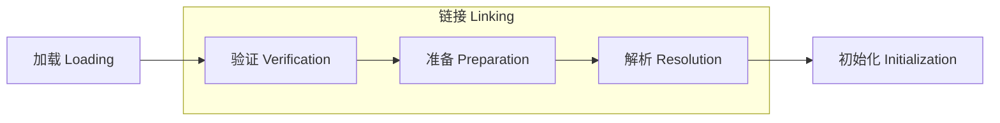
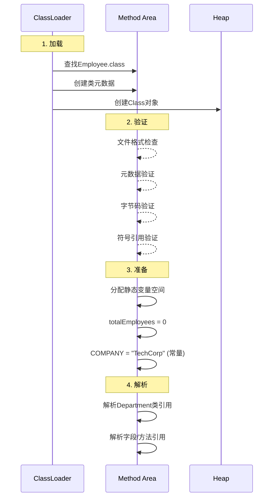

在Java虚拟机（JVM）中，**类加载机制**是Java程序运行的核心基础。当我们在Java程序中创建一个新对象或访问静态成员时，JVM需要经历一个精密的类加载过程。本文将深入解析类加载过程中的四个关键阶段：**加载（Loading）**、**验证（Verification）**、**准备（Preparation）** 和**解析（Resolution）**，通过具体示例揭示JVM如何将.class文件转化为可执行代码。
<!-- more -->

## 类加载全景图
在深入各阶段前，先了解整个类加载流程：



今天我们将重点解析验证→准备→解析 这三个阶段，这些阶段共同构成**链接（Linking）** 过程。

---

## 示例类代码
为便于理解，我们使用一个简单的`Employee`类作为示例：
```java
public class Employee {
    // 常量
    public static final String COMPANY = "TechCorp";
    
    // 静态变量
    public static int totalEmployees = 0;
    
    // 实例变量
    private String name;
    
    // 方法
    public void setName(String name) {
        this.name = name;
    }
    
    // 引用其他类
    public Department getDepartment() {
        return new Department();
    }
}

class Department {
    private String name = "Engineering";
}
```

---

## 阶段一：加载（Loading）
### 核心任务
查找并加载类的二进制数据（.class文件）

### 具体操作流程
1. **定位类文件**：通过全限定名（如`com/example/Employee`）查找.class文件
2. **读取字节码**：将.class文件内容读入内存
3. **创建类结构**：在方法区创建类的运行时数据结构
4. **生成Class对象**：在堆中创建对应的`java.lang.Class`实例


### 关键特点
- **类加载器层级**：Bootstrap → Extension → Application → Custom
- **数据来源**：JAR文件、网络、动态生成等
- **结果**：方法区存储类元数据，堆中生成`Employee.class`对象

> 📌 **重要提示**：加载阶段完成后，JVM已掌握类的基本结构信息，但此时类还**不能直接使用**。

---

## 阶段二：验证（Verification）
### 核心任务
确保加载的类符合JVM规范且不会危害虚拟机安全

### 四层验证机制
1. **文件格式验证** - 检查字节码文件结构
   ```java
   // 检查魔数CAFEBABE（合法.class文件开头）
   0xCAFEBABE
   ```
   
2. **元数据验证** - 语义检查
   ```java
   // 检查示例：
   - 是否继承了final类？ → 非法
   - 非抽象类是否实现所有接口方法？ → 必须实现
   ```

3. **字节码验证** - 程序逻辑检查
   ```java
   public void setName(String name) {
       // 验证：
       // 1. 操作数栈类型匹配 ✔
       // 2. 跳转指令不会跳出方法 ✔
       this.name = name;
   }
   ```

4. **符号引用验证** - 常量池检查
   ```java
   return new Department(); // 验证Department类是否存在且可访问
   ```

### 验证失败示例
```java
public class Invalid {
    public void jump() {
        goto 100;  // 无效字节码指令 → 验证失败
    }
}
```

> ⚠️ **性能提示**：验证阶段可能消耗类加载总时间的30%-50%，现代JVM使用**栈映射帧（StackMapTable）** 优化此过程。

---

## 阶段三：准备（Preparation）
### 核心任务
为**类变量（静态变量）** 分配内存并设置初始值

### 内存分配规则
| 变量类型          | 初始值      |
|-------------------|-------------|
| `int`/`short`     | 0           |
| `long`            | 0L          |
| `float`           | 0.0f        |
| `double`          | 0.0d        |
| `char`            | '\u0000'    |
| `boolean`         | false       |
| **引用类型**      | **null**    |

### 示例处理
```java
// 普通静态变量 → 零值初始化
public static int totalEmployees = 0;  // 准备阶段赋值为0

// 常量（final static）→ 直接赋真实值
public static final String COMPANY = "TechCorp"; // 准备阶段赋值为"TechCorp"
```

> 🔍 **关键区别**：普通静态变量在准备阶段初始化为**零值**，而常量直接赋予**真实值**。

---

## 阶段四：解析（Resolution）
### 核心任务
将常量池中的**符号引用**转换为**直接引用**

### 三种核心解析
1. **类/接口解析**
   ```java
   // 符号引用：Department
   // 转换为直接引用：方法区中Department类的内存指针
   return new Department();
   ```

2. **字段解析**
   ```java
   // 字段：Department.name
   // 转换为：字段在内存中的偏移量
   private String name = "Engineering";
   ```

3. **方法解析**
   ```java
   // 方法：Employee.setName()
   // 转换为：方法在方法表中的实际入口地址
   public void setName(String name) { ... }
   ```

### 解析过程示例
```java
常量池条目（符号引用）：
  #7 = Class        #25   // Department
  #8 = Methodref    #7.#26 // Department.<init>()
  
解析后：
  直接引用指向：
    - Department类在方法区的位置
    - 构造函数的代码入口地址
```

> ⏱️ **延迟解析**：现代JVM通常采用**延迟解析**策略，直到符号引用首次使用时才执行解析。

---

## 完整流程图示


---

## 技术要点总结
| 阶段   | 核心任务                          | 是否触发类加载 | 线程安全 | 耗时占比 |
|--------|----------------------------------|----------------|----------|----------|
| 加载   | 创建Class对象/方法区结构          | 是             | ❌       | 10%-20%  |
| 验证   | 字节码安全性检查                  | 否             | ✔       | 30%-50%  |
| 准备   | 静态变量零值初始化                | 否             | ✔       | 5%-10%   |
| 解析   | 符号引用→直接引用                 | 可能           | ✔       | 10%-30%  |

**关键特性**：

1. **解析触发加载**：解析阶段可能触发其他类的加载（如解析`Department`时）

2. **常量特殊处理**：final常量在准备阶段直接赋值

3. **线程安全**：除加载阶段外，其他阶段都是线程安全的

4. **性能优化**：JIT编译器会优化高频调用的解析结果

---

## 结语
理解JVM的类加载机制对于**性能优化**、**内存管理**和**安全加固**至关重要。通过深入分析加载、验证、准备、解析四个阶段，我们不仅能看到JVM如何保障程序的正确执行，也能理解为何Java能在保持安全性的同时实现"一次编写，到处运行"的承诺。

> 当你在Java中写下`new Employee()`时，背后正是这些精密配合的加载阶段在默默工作，将静态的字节码转化为动态的执行能力。这正是Java虚拟机工程艺术的完美体现！