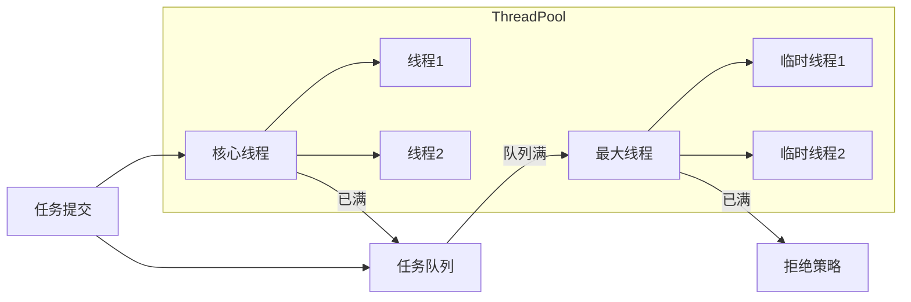
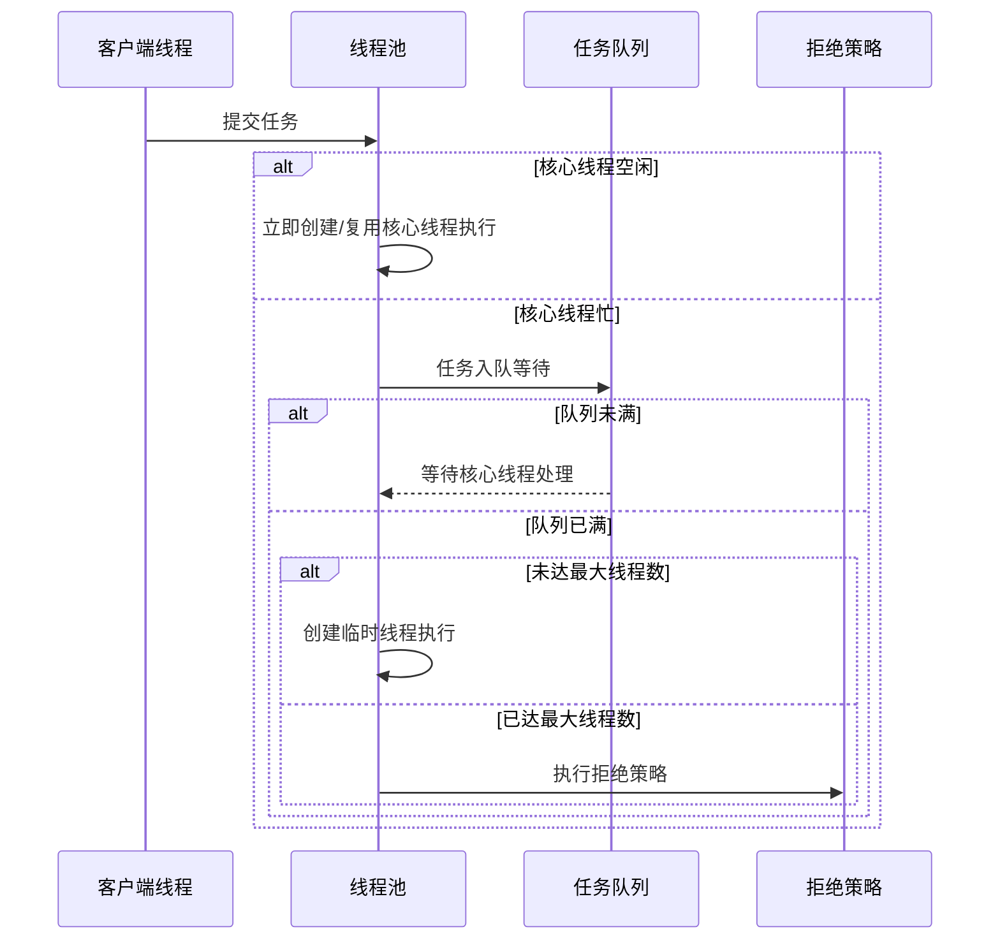
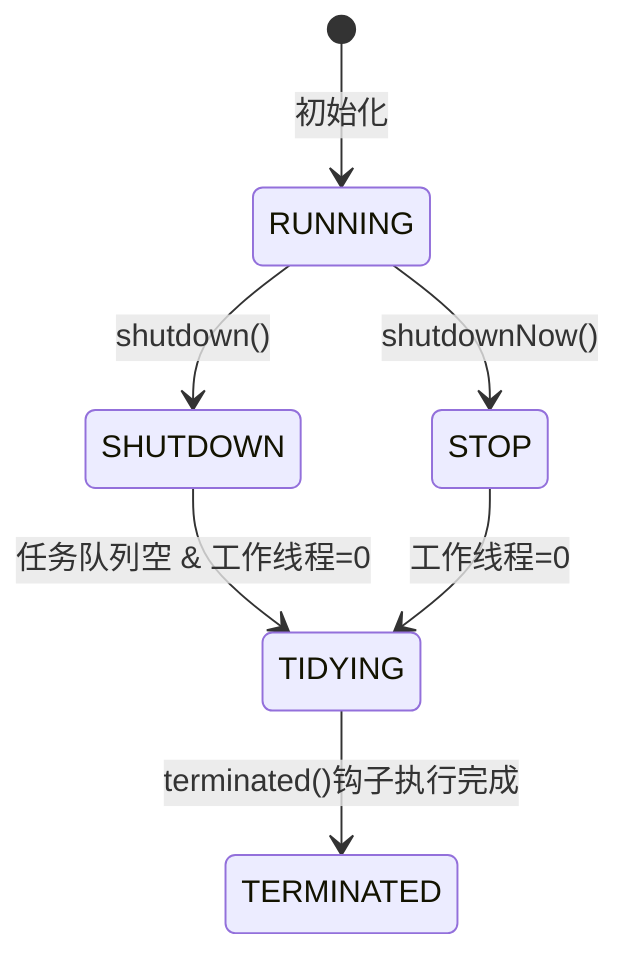

本文将带你从源码角度深度解析 线程池的运行机制：从 ThreadPoolExecutor 的核心参数、任务调度流程，到状态机管理与工作线程生命周期，再到生产实践中的参数计算、监控指标、优雅关闭与常见陷阱。读完后，你不仅能彻底理解线程池的底层逻辑，还能在实际项目中设计出高效、稳定、可扩展的并发架构。
<!-- more -->

## 核心架构图解  


---

## 一、线程池核心组件  
### **`ThreadPoolExecutor` 构造参数**  
```java
new ThreadPoolExecutor(
    int corePoolSize,     // 核心线程数 (常驻员工)
    int maximumPoolSize,  // 最大线程数 (含临时工)
    long keepAliveTime,   // 临时线程空闲存活时间
    TimeUnit unit,        // 时间单位
    BlockingQueue<Runnable> workQueue, // 任务队列 (候客区)
    RejectedExecutionHandler handler   // 拒绝策略 (满员处理方案)
)
```
#### 核心参数解析  
下面把 ThreadPoolExecutor 构造器的每个参数讲清楚：它控制了线程何时创建/复用、任务何时排队/拒绝，以及线程的名字、优先级与异常处理。

##### 1. `corePoolSize`（核心线程数）
- **定义**：线程池常驻的线程数；有任务时优先创建/复用核心线程来执行。
- **何时生效**：提交任务时，如果运行中的线程数 < corePoolSize，会立即创建新线程执行（不进队列）。
- **细节&陷阱**：
    - 默认核心线程不会超时退出（除非开启 `allowCoreThreadTimeOut(true)`）。
    - 可用 `prestartAllCoreThreads()` 预启动核心线程，减少首批任务的冷启动延迟。
- **经验**：
    - CPU 密集：≈ CPU 核数（或核数 + 1）。
    - IO 密集：可适当更大（见文末“估算公式”）。

##### 2. `maximumPoolSize`（最大线程数）
- **定义**：线程池允许的最大线程总数（核心 + 非核心）。
- **何时扩容**：只有当 1. 运行中线程数 ≥ corePoolSize 且 2. 向队列入队失败（队列已满） 才会尝试再创建非核心线程，直到 `maximumPoolSize`。
- **关键联动**：如果你使用无界队列（如默认的 `LinkedBlockingQueue`），任务几乎不会“入队失败”，于是永远达不到 `maximumPoolSize`，扩容失效。
- **经验**：与队列容量、任务类型一起权衡；过大易导致上下文切换变多、反而降吞吐。

##### 3. `keepAliveTime`（空闲存活时间）
- **定义**：非核心线程空闲多久会被回收；单位由 `unit` 决定。
- **对核心线程**：默认不回收，若调用 `allowCoreThreadTimeOut(true)`，核心线程也会按该时间回收（队列空闲场景下整体降到 0）。
- **权衡**：
    - 小：释放快，省资源，但抖动频繁（“建-灭-建”）。
    - 大：保活久，抖动小，但占资源。
- **常见设置**：10s~120s；业务高低峰明显时可适当缩短以便“退潮”。

##### 4. `unit`（时间单位）
- **定义**：`keepAliveTime` 的时间单位（秒、毫秒、纳秒等）。
- **建议**：用 `TimeUnit.SECONDS`/`MILLISECONDS` 易读好调参。

##### 5. `workQueue`（任务阻塞队列）
决定了“满了再扩容，还是先扩容再排队”的行为以及总体内存/延迟特性。


| **队列实现**              | **特性**                              | **适用场景**              |
|--------------------------|--------------------------------------|--------------------------|
| `SynchronousQueue`       | 无容量队列，直接传递任务               | `newCachedThreadPool`    |
| `LinkedBlockingQueue`    | 无界队列 (默认容量 Integer.MAX_VALUE) | `newFixedThreadPool`     |
| `ArrayBlockingQueue`     | 有界队列 (固定容量)                   | 需要流量控制的场景         |
| `PriorityBlockingQueue`  | 带优先级的无界队列                    | 任务优先级调度            |
| `DelayedWorkQueue`       | 延迟队列                              | `newScheduledThreadPool` |

##### 6. `threadFactory`（线程工厂）
- **作用**：自定义线程的名称、优先级、是否守护线程、异常处理器、线程组、上下文类加载器等。
- **为什么重要**：
    - **可读性**：统一命名便于日志/监控定位（如 "order-pool-1"）。
    - **运维性**：设置 `UncaughtExceptionHandler` 捕获任务里漏掉的异常。
    - **资源管理**：设置 `daemon`（守护）与否，避免进程无法退出。

##### 7. `RejectedExecutionHandler`（拒绝策略）
- **定义**：当线程池和队列都满了，新任务提交时的处理策略。
- **作用**：避免任务丢失、系统雪崩。
- **自定义**：实现 `RejectedExecutionHandler` 接口，根据业务场景定制拒绝策略。

| **策略类**                     | **行为**                               | **类比现实**               |
|-------------------------------|---------------------------------------|--------------------------|
| `AbortPolicy` (默认)         | 抛 `RejectedExecutionException`       | 餐厅满员，拒绝新顾客       |
| `CallerRunsPolicy`           | 用提交任务的线程执行任务                | 经理亲自上阵服务          |
| `DiscardPolicy`              | 静默丢弃新任务                         | 新顾客悄悄离开            |
| `DiscardOldestPolicy`        | 丢弃队列最老任务，尝试提交新任务        | 让等最久的顾客离开         |

---

## 二、线程池工作流程  


### 状态流转关键点：  
1. 核心线程优先处理任务  
2. 任务入队等待（队列满时触发扩容）  
3. 临时线程处理新任务（超时后回收）  
4. 全满时执行拒绝策略  

---

## 三、线程池底层源码解析  
### 1. 任务执行入口 `execute()`  
```java
public void execute(Runnable command) {
    if (command == null) throw new NullPointerException();
    
    int c = ctl.get(); // 获取控制状态（含线程数+运行状态）
    
    // 阶段1：核心线程处理
    if (workerCountOf(c) < corePoolSize) {
        if (addWorker(command, true)) // 创建核心线程
            return;
        c = ctl.get();
    }
    
    // 阶段2：任务入队
    if (isRunning(c) && workQueue.offer(command)) {
        int recheck = ctl.get();
        if (!isRunning(recheck) && remove(command))
            reject(command); // 双重检查
        else if (workerCountOf(recheck) == 0)
            addWorker(null, false); // 保障至少一个线程
    }
    
    // 阶段3：创建临时线程
    else if (!addWorker(command, false))
        reject(command); // 执行拒绝策略
}
```

### 2. 工作线程生命周期 `runWorker()`  
```java
final void runWorker(Worker w) {
    Thread wt = Thread.currentThread();
    Runnable task = w.firstTask;
    w.firstTask = null;
    w.unlock(); // 允许中断
    
    boolean completedAbruptly = true;
    try {
        // 循环获取任务（核心逻辑）
        while (task != null || (task = getTask()) != null) {
            w.lock(); // 任务执行加锁
            if (runStateAtLeast(ctl.get(), STOP) ||
                (Thread.interrupted() && 
                 runStateAtLeast(ctl.get(), STOP)))
                wt.interrupt();
            
            try {
                beforeExecute(wt, task); // 钩子方法
                task.run();              // 执行任务
                afterExecute(task, null); // 钩子方法
            } finally {
                task = null;
                w.completedTasks++;
                w.unlock();
            }
        }
        completedAbruptly = false;
    } finally {
        processWorkerExit(w, completedAbruptly); // 清理线程
    }
}
```

### 3. 任务获取 `getTask()`  
```java
private Runnable getTask() {
    boolean timedOut = false; // 上次poll是否超时

    for (;;) {
        int c = ctl.get();
        
        // 检查线程池状态
        if (runStateAtLeast(c, SHUTDOWN) && ...)
            return null;
        
        int wc = workerCountOf(c);
        
        // 判断是否允许超时回收
        boolean timed = allowCoreThreadTimeOut || wc > corePoolSize;
        
        // 超时控制：临时线程空闲超时回收
        if ((wc > maximumPoolSize || (timed && timedOut))
            && (wc > 1 || workQueue.isEmpty())) {
            if (compareAndDecrementWorkerCount(c))
                return null;
            continue;
        }

        try {
            // 从队列取任务（核心/临时线程区别）
            Runnable r = timed ?
                workQueue.poll(keepAliveTime, TimeUnit.NANOSECONDS) :
                workQueue.take(); // 阻塞直到有任务
            if (r != null)
                return r;
            timedOut = true; // poll超时标记
        } catch (InterruptedException retry) {
            timedOut = false;
        }
    }
}
```

---

## 四、线程池状态机  


| **状态**      | 特性                                                                 |
|--------------|---------------------------------------------------------------------|
| **RUNNING**  | 接受新任务，处理排队任务                                              |
| **SHUTDOWN** | 不接受新任务，处理排队任务 (`shutdown()`)                             |
| **STOP**     | 不接受新任务，不处理排队任务，中断进行中任务 (`shutdownNow()`)         |
| **TIDYING**  | 所有任务终止，workerCount=0，运行`terminated()`钩子                   |
| **TERMINATED**| `terminated()`执行完毕                                              |

---

## 五、生产环境最佳实践  
### 1. 线程池参数计算公式  
**CPU 密集型**：  
```  
核心线程数 = CPU核数 + 1  
最大线程数 = CPU核数 * 2  
队列容量 = 100~1000  
```  

**I/O 密集型**：  
```  
核心线程数 = CPU核数 * 2  
最大线程数 = CPU核数 / (1 - 阻塞系数)  // 阻塞系数≈0.8~0.9  
队列容量 = 200~2000  
```  

> **示例**：8核CPU处理Web请求（I/O密集型）  
> 核心线程=16, 最大线程=8/(1-0.9)=80, 队列=1000

### 2. 监控关键指标  
```java
ThreadPoolExecutor pool = ...;

// 注册监控
Metrics.gauge("pool.active.threads", pool::getActiveCount);
Metrics.gauge("pool.queue.size", () -> pool.getQueue().size());
Metrics.gauge("pool.completed.tasks", pool::getCompletedTaskCount);
```

### 3. 优雅关闭方案  
```java
// 1. 停止接收新任务
pool.shutdown(); 

try {
    // 2. 等待已有任务完成
    if (!pool.awaitTermination(60, TimeUnit.SECONDS)) {
        // 3. 强制取消任务
        List<Runnable> unfinished = pool.shutdownNow(); 
        // 记录未完成任务
        log.warn("强制关闭，丢弃任务: {}", unfinished.size());
        
        // 4. 再次等待
        if (!pool.awaitTermination(60, TimeUnit.SECONDS))
            log.error("线程池未完全关闭");
    }
} catch (InterruptedException ex) {
    pool.shutdownNow();
    Thread.currentThread().interrupt();
}
```

### 4. 自定义增强策略  
```java
public class ResilientThreadPool extends ThreadPoolExecutor {
    
    // 记录任务开始时间
    protected void beforeExecute(Thread t, Runnable r) {
        super.beforeExecute(t, r);
        t.setAttribute("startTime", System.nanoTime());
    }
    
    // 监控任务耗时
    protected void afterExecute(Runnable r, Throwable t) {
        long time = System.nanoTime() - t.getAttribute("startTime");
        if (time > TimeUnit.SECONDS.toNanos(5)) {
            log.warn("任务执行超时: {}ms", time/1_000_000);
        }
        super.afterExecute(r, t);
    }
    
    // 自定义拒绝策略：动态扩容
    protected void rejectedExecution(Runnable r, ThreadPoolExecutor e) {
        if (e.getPoolSize() < e.getMaximumPoolSize()) {
            e.setMaximumPoolSize(e.getMaximumPoolSize() + 5); // 扩容
            e.execute(r); // 重试提交
        } else {
            new Thread(r).start(); // 降级：临时线程执行
        }
    }
}
```

---

## 六、常见陷阱与解决方案  
| **陷阱**                  | **现象**                     | **解决方案**                  |
|--------------------------|-----------------------------|------------------------------|
| **无界队列导致OOM**       | 任务堆积耗尽内存              | 使用 `ArrayBlockingQueue`     |
| **核心线程数过大**        | CPU过度切换，性能下降         | 按公式计算合理值              |
| **未捕获异常**            | 任务静默失败                  | 设置 `UncaughtExceptionHandler` |
| **线程泄漏**              | 线程数持续增长不释放          | 检查 `getTask()` 逻辑         |
| **死锁**                  | 线程互相等待资源              | 避免嵌套提交任务到同一线程池    |
| **上下文切换开销**        | CPU sys占用高                | 减少线程数，用异步I/O         |

---

## 七、虚拟线程（Loom 项目）前瞻  
```java
// Java 19+ 虚拟线程使用
try (var executor = Executors.newVirtualThreadPerTaskExecutor()) {
    IntStream.range(0, 10_000).forEach(i -> {
        executor.submit(() -> {
            Thread.sleep(Duration.ofSeconds(1));
            return i;
        });
    });
} // 自动关闭

// 与传统线程池对比
```

| **特性**         | 传统线程池             | 虚拟线程                |
|------------------|-----------------------|------------------------|
| 线程开销         | ~1MB/线程             | ~几百字节               |
| 创建数量         | 千级                  | 百万级                 |
| 阻塞代价         | 浪费系统线程资源        | 近乎零代价              |
| 调度机制         | OS 内核调度            | JVM 用户模式调度        |
| 适用场景         | CPU密集型             | I/O密集型               |

---

## 终极总结：线程池设计哲学  
1. **资源复用**：避免频繁创建销毁线程（成本≈1ms/线程）  
2. **流量整形**：通过队列缓冲突发流量  
3. **弹性伸缩**：动态调整线程数量应对负载  
4. **故障隔离**：不同业务使用独立线程池  
5. **优雅降级**：拒绝策略保障系统韧性  

> 🚀 **黄金法则**：  
> - CPU密集型：小池化（线程数≈CPU核心）  
> - I/O密集型：大池化+队列缓冲  
> - 混合型：`(线程数 = CPU核数 * 目标CPU利用率 * (1 + 等待时间/计算时间))`