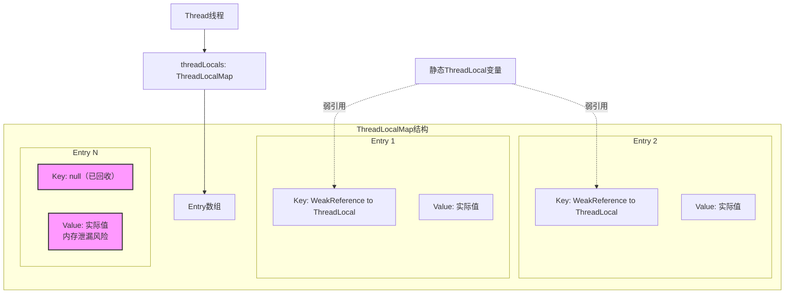

你是否也曾在项目中使用ThreadLocal却对它的内部机制一知半解？是否遇到过莫名其妙的内存泄漏问题却找不到根源？ThreadLocal作为Java并发编程中的重要工具，既能优雅地解决线程隔离问题，也可能在不规范使用时埋下性能隐患。

从SimpleDateFormat的线程安全包装，到数据库连接管理，再到用户会话传递，ThreadLocal的应用无处不在。但它为什么要用弱引用作为key？内存泄漏又是如何发生的？怎样才能安全地使用它？本文将从底层原理出发，深入剖析ThreadLocal的工作机制，揭示内存泄漏的本质原因，并总结一套切实可行的最佳实践。无论你是Java初学者还是有经验的开发者，相信这篇文章都能帮你彻底掌握ThreadLocal，让它成为你编程工具箱中的得力助手。
<!-- more -->

## 什么是ThreadLocal？

ThreadLocal是Java中用于实现线程局部变量的重要工具。它为每个使用该变量的线程提供独立的变量副本，实现了**线程隔离**，避免了多线程环境下的竞争条件。

## ThreadLocal的底层实现原理

### 存储结构
每个Thread线程内部都有一个`ThreadLocalMap`，这是一个定制化的哈希表，用于存储线程的局部变量。

```java
// Thread类中的关键字段
class Thread {
    ThreadLocal.ThreadLocalMap threadLocals = null;
    // ...
}

static class ThreadLocalMap {
    static class Entry extends WeakReference<ThreadLocal<?>> {
        Object value;
    }
}
```

### 数据存储方式
下图展示了ThreadLocal的内部存储结构：



- **Key**：ThreadLocal对象的弱引用
- **Value**：线程局部变量的实际值（强引用）
- **数据结构**：数组 + 线性探测法解决哈希冲突

### 核心操作机制
当调用`ThreadLocal.set()`和`ThreadLocal.get()`方法时：

```java
public void set(T value) {
    Thread t = Thread.currentThread();
    ThreadLocalMap map = getMap(t); // 获取当前线程的ThreadLocalMap
    if (map != null) {
        map.set(this, value); // 以当前ThreadLocal实例为key存储值
    } else {
        createMap(t, value); // 创建新的ThreadLocalMap
    }
}
```

## 为什么key要使用弱引用？

### 内存泄漏风险分析
在线程池场景中，线程会被重复使用，从而导致以下引用链长期存在：

```
Thread → ThreadLocalMap → Entry → Key (ThreadLocal) → ThreadLocal对象
```

如果Key使用强引用，即使业务代码中将ThreadLocal对象设置为null，由于这条引用链的存在，ThreadLocal对象也无法被GC回收，导致内存泄漏。

### 弱引用的作用
将Key设置为弱引用后，当ThreadLocal对象没有其他强引用时（即业务代码中设置为null后），在下一次GC时，Key会被自动回收，Entry中的Key字段变为null。

```java
static class Entry extends WeakReference<ThreadLocal<?>> {
    Object value;
    Entry(ThreadLocal<?> k, Object v) {
        super(k); // key作为弱引用
        value = v; // value作为强引用
    }
}
```

## 内存泄漏问题详解

### Key被回收后的情况
虽然Key被回收后变为null，但Value仍然被Entry强引用，而Entry又被ThreadLocalMap强引用，导致Value无法被回收。

### 清理机制与expungeStaleEntry方法

ThreadLocal内部通过`expungeStaleEntry`方法清理无效Entry（key为null的Entry）。这个方法在以下时机被调用：

1. **直接调用**：在`set()`、`get()`、`remove()`方法中显式调用
2. **间接调用**：通过`cleanSomeSlots()`和`rehash()`方法调用
3. **扩容时**：在调整表大小时会先清理所有stale entries

#### expungeStaleEntry方法的作用

`expungeStaleEntry`方法是ThreadLocalMap清理无效Entry的核心方法，其主要功能是：

1. **清理特定位置的无效Entry**（key为null的Entry）
2. **重新哈希后续的Entry**以确保哈希表的完整性
3. **返回下一个可能包含stale entry的索引位置**

#### 方法实现原理

```java
private int expungeStaleEntry(int staleSlot) {
    Entry[] tab = table;
    int len = tab.length;

    // 1. 清理当前staleSlot位置的Entry
    tab[staleSlot].value = null;  // 释放value引用，避免内存泄漏
    tab[staleSlot] = null;        // 将Entry本身置为null
    size--;                       // 更新大小计数器

    // 2. 重新哈希后续的Entry，直到遇到null槽位
    Entry e;
    int i;
    for (i = nextIndex(staleSlot, len); 
         (e = tab[i]) != null; 
         i = nextIndex(i, len)) {
        
        ThreadLocal<?> k = e.get();  // 获取key的引用
        
        // 2.1 如果key为null，清理这个Entry
        if (k == null) {
            e.value = null;  // 释放value引用
            tab[i] = null;   // 清理Entry
            size--;          // 更新大小
        } 
        // 2.2 如果key不为null，重新计算哈希位置
        else {
            int h = k.threadLocalHashCode & (len - 1);
            
            // 如果当前位置不是计算出的哈希位置，需要重新放置
            if (h != i) {
                tab[i] = null;  // 清空当前位置

                // 线性探测找到新的位置
                while (tab[h] != null)
                    h = nextIndex(h, len);
                tab[h] = e;     // 将Entry放到新位置
            }
        }
    }
    return i;  // 返回下一个可能包含stale entry的位置
}
```

### 为什么value不是弱引用？
如果value也使用弱引用，可能会在业务代码还需要使用时被意外回收，导致程序错误。

## 避免内存泄漏的最佳实践

### 1. 总是调用remove()
使用完ThreadLocal后，必须调用`remove()`方法清理entry。

```java
try {
    threadLocal.set("value");
    // 业务逻辑
} finally {
    threadLocal.remove(); // 必须清理
}
```

### 2. 使用static final修饰
将ThreadLocal声明为static final，避免重复创建：

```java
private static final ThreadLocal<SimpleDateFormat> DATE_FORMATTER = 
    ThreadLocal.withInitial(() -> new SimpleDateFormat("yyyy-MM-dd"));
```

### 3. 避免使用线程池+ThreadLocal的复杂场景
在简单场景下手动管理ThreadLocal的生命周期。

## ThreadLocal与锁的对比

| 特性 | ThreadLocal | 锁机制 |
|------|------------|--------|
| **解决思路** | 数据副本，空间换时间 | 互斥访问，时间换空间 |
| **性能** | 无竞争，高性能 | 有竞争，性能开销大 |
| **适用场景** | 线程隔离数据 | 共享资源保护 |
| **内存占用** | 每个线程一份副本 | 只占一份资源 |

## 实际应用场景

1. **数据库连接管理**：每个线程独立的数据库连接
2. **用户会话信息**：在Web应用中存储用户身份信息
3. **日期格式化**：SimpleDateFormat非线程安全，可用ThreadLocal包装
4. **全局参数传递**：避免在方法参数中层层传递

## 总结

ThreadLocal通过为每个线程创建变量副本来实现线程隔离，是解决线程安全问题的有效方案。但其使用需要注意：

1. **Key使用弱引用**是为了避免ThreadLocal对象的内存泄漏
2. **必须调用remove()**是为了避免value的内存泄漏
3. **理解清理机制**特别是`expungeStaleEntry`方法的工作原理，有助于正确使用和调试

虽然ThreadLocal提供了自动清理机制，但开发者仍然应该显式调用`remove()`方法，因为：

1. 自动清理只在后续操作时触发
2. 如果线程不再使用ThreadLocal，无效Entry可能长期存在
3. 显式清理可以立即释放资源，而不是等待后续操作

正确使用ThreadLocal可以提高程序性能并简化代码设计，但滥用或不当使用会导致内存泄漏问题。在实际开发中，应根据具体需求谨慎选择使用ThreadLocal还是其他同步机制。