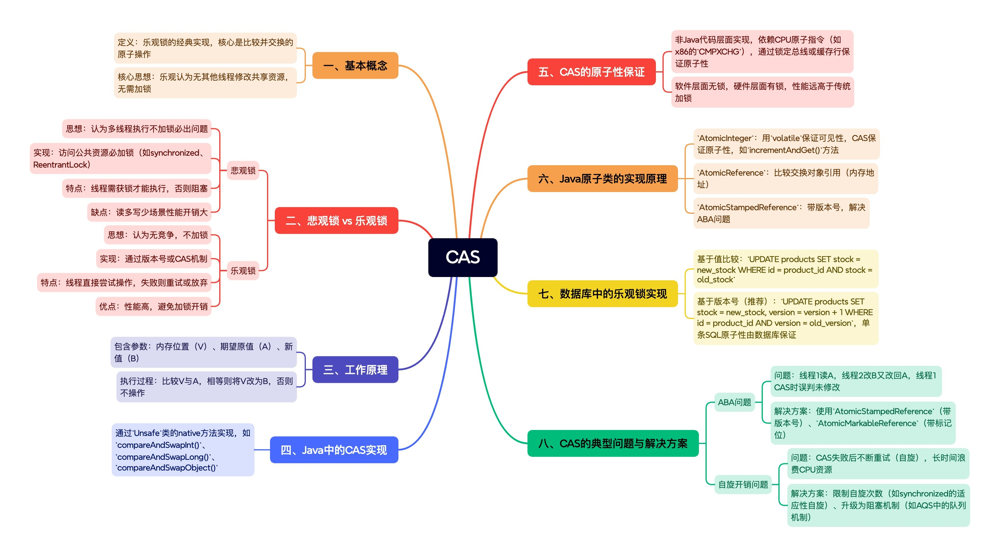

你是否曾好奇，像JDK中`AtomicInteger`这样的并发工具，为何能在不加锁的情况下安全地处理多线程竞争？其核心奥秘正是一种名为**CAS（比较并交换）** 的硬件级原子操作。它不仅颠覆了“同步必加锁”的传统思维，更是构建高性能并发系统的基石。本文将为你彻底解析CAS的工作原理，揭示其如何通过一条CPU指令实现高效的无锁同步，并深入探讨其著名的ABA问题与解决方案，带你从本质上理解现代并发编程的精妙之处。
<!-- more -->



## 什么是CAS？

CAS（Compare And Swap，比较并交换）是乐观锁的一种经典实现。它的核心思想是：**乐观地认为没有其他线程会同时修改共享资源**，因此不需要加锁，而是通过比较并交换的原子操作来保证数据一致性。

## 悲观锁 vs 乐观锁

### 悲观锁

- **思想**：悲观地认为如果不严格加锁，多线程执行一定会出问题
- **实现**：每次访问公共资源都必须加锁（如synchronized、ReentrantLock）
- **特点**：线程必须获得锁后才能执行，否则阻塞等待
- **缺点**：性能开销大，特别是在读多写少的场景

### 乐观锁

- **思想**：乐观地认为没有竞争，因此不加锁
- **实现**：通过版本号或CAS机制实现
- **特点**：线程直接尝试操作，如果失败则重试或放弃
- **优点**：性能高，避免了加锁的开销

## CAS工作原理

CAS操作包含三个参数：

- **内存位置（V）**
- **期望原值（A）**
- **新值（B）**

**执行过程**：

1. 比较内存位置V的值与期望原值A
2. 如果相等，将内存位置V的值修改为新值B
3. 如果不相等，不做任何操作

### 生动比喻：会议室预订系统

- 会议室门口有一个**数字状态牌**，显示 `0` 表示会议室空闲，显示 `1` 表示已预订。
- 两个员工（**线程A**和**线程B**）同时想要预订这间会议室（**访问共享资源**）。

**预订流程（CAS操作）如下：**

1.  **查看状态（Compare）**：两位员工都看到状态牌显示 `0`（**期望原值 A**），认为会议室空闲。
2.  **尝试预订（Swap）**：

    *   员工A动作更快，他立刻走上前，**比较**状态牌当前值是否还是他刚才看到的 `0`。
    *   发现确实是 `0`，于是他成功地将状态牌**交换**为 `1`（**新值 B**），预订成功。

3.  **竞争失败**：

    *   员工B随后也走上前，准备将自己的 `0` 换成 `1`。
    *   但他**比较**后发现，状态牌的当前值 (`1`) 与他的期望值 (`0`) **不匹配**。
    *   这表示资源已经被修改（会议室已被预订），他的操作失败。他可以选择稍后重试（自旋）或放弃。


## Java中的CAS实现

在Java中，CAS通过`Unsafe`类提供的方法实现：

```java
// AtomicInteger中的CAS实现
public final boolean compareAndSet(int expect, int update) {
    return unsafe.compareAndSwapInt(this, valueOffset, expect, update);
}
```

主要方法包括：

- `compareAndSwapInt()`：用于int类型
- `compareAndSwapLong()`：用于long类型  
- `compareAndSwapObject()`：用于对象引用

## CAS的原子性保证

CAS操作需要保证原子性，但这并非由Java代码层面实现：

1. **Java层面**：通过native方法调用C++实现
2. **硬件层面**：依赖CPU的原子指令（如x86架构的`CMPXCHG`）
3. **实现方式**：通过锁定总线或缓存行保证原子性

### CAS真的是无锁吗？
从不同层次看：

- **软件层面**：无锁（没有使用操作系统mutex）
- **硬件层面**：有锁（通过锁定总线实现原子性）

但无论如何，CAS的性能远高于传统的加锁方式。

## Java原子类的实现原理

### AtomicInteger
```java
public class AtomicInteger {
    private volatile int value; // volatile保证可见性
    
    public final int incrementAndGet() {
        return unsafe.getAndAddInt(this, valueOffset, 1) + 1;
    }
}
```

- **volatile**：保证值的可见性
- **CAS**：保证原子性

### AtomicReference
比较并交换的是**对象引用**（内存地址），而非对象内容。

### AtomicStampedReference
解决ABA问题的方案：

- 不仅比较值，还比较版本号
- 版本号一直递增，避免ABA问题

## 数据库中的乐观锁实现

在数据库层面也可以使用CAS思想实现乐观锁：

### 基于值比较
```sql
UPDATE products 
SET stock = new_stock 
WHERE id = product_id AND stock = old_stock
```

### 基于版本号（推荐）
```sql
UPDATE products 
SET stock = new_stock, version = version + 1
WHERE id = product_id AND version = old_version
```

**注意**：单条SQL的原子性由数据库保证，不需要额外考虑。

## CAS的典型问题与解决方案

### 1. ABA问题
**问题描述**：

- 线程1读取值为A
- 线程2将值改为B，然后又改回A
- 线程1进行CAS操作，发现值还是A，认为没有被修改过

**解决方案**：

- 使用`AtomicStampedReference`（带版本号）
- 使用`AtomicMarkableReference`（带标记位）

### 2. 自旋开销问题
**问题描述**：

- CAS失败后会不断重试（自旋）
- 长时间自旋会浪费CPU资源

**解决方案**：

- 限制自旋次数（如synchronized的适应性自旋）
- 升级为阻塞机制（如AQS中的队列机制）

## 实战应用场景

### 1. 计数器
```java
AtomicInteger counter = new AtomicInteger(0);
counter.incrementAndGet(); // 原子性递增
```

### 2. 状态标记
```java
AtomicBoolean isRunning = new AtomicBoolean(true);
if (isRunning.compareAndSet(true, false)) {
    // 成功停止服务
}
```

### 3. 非阻塞算法
实现无锁队列、无锁栈等并发数据结构。

## 总结

CAS是并发编程中的重要机制，它具有以下特点：

1. **高性能**：避免了传统锁的开销
2. **乐观思想**：假设竞争很少，先操作再冲突检测
3. **硬件支持**：依赖CPU原子指令保证原子性
4. **适用场景**：读多写少、竞争不激烈的场景

但CAS也不是银弹，它存在ABA问题、自旋开销等局限性。在实际开发中，需要根据具体场景选择合适的技术：

- 低竞争场景：优先考虑CAS和乐观锁
- 高竞争场景：可能需要使用传统锁机制
- 复杂操作：考虑使用AQS等高级并发工具

理解CAS的原理和实现方式，是掌握Java并发编程的重要一步，也是面试中经常考察的关键知识点。