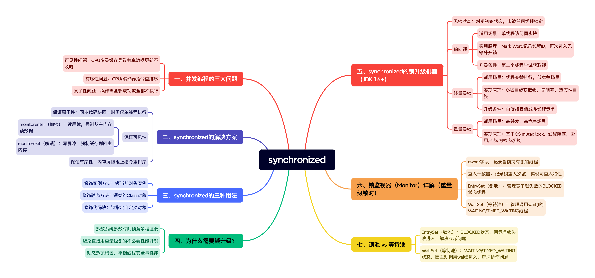

synchronized作为Java中最基本的同步机制，经过多年的发展和优化，已经成为一个高效、可靠的线程同步工具。理解其底层原理和锁升级机制，不仅有助于编写更高效的并发代码，也是Java开发者面试和进阶的必备知识。

从无锁到偏向锁，再到轻量级锁和重量级锁的升级过程，体现了Java团队对性能优化的不懈追求：在保证线程安全的前提下，根据实际竞争情况动态调整策略，达到性能的最优平衡。
<!-- more -->



## 一、并发编程的三大问题

在深入了解synchronized之前，我们需要先理解并发编程中的三个核心问题：

### 1. 可见性问题
由于CPU的多级缓存架构（L1、L2为核心私有，L3共享），当一个线程修改了共享数据后，其他线程可能无法立即看到最新的值，导致数据不一致。

### 2. 有序性问题
CPU和编译器为了优化性能，可能会对指令进行重排序，导致代码执行顺序与编写顺序不一致。

### 3. 原子性问题
一系列操作要么全部执行成功，要么全部不执行，不存在中间状态。

## 二、synchronized的解决方案

synchronized关键字通过以下方式解决上述问题：

### 1. 保证原子性
synchronized确保同步代码块在同一时间只能被一个线程执行，实现了操作的原子性。

### 2. 保证可见性
通过内存屏障实现：

- **monitorenter**（加锁）：使用读屏障，强制从主内存重新读取数据
- **monitorexit**（解锁）：使用写屏障，强制将CPU缓存刷新到主内存

### 3. 保证有序性
通过内存屏障防止指令重排序，确保代码执行的有序性。

## 三、synchronized的三种用法

```java
// 1. 修饰实例方法 - 锁当前对象实例
public synchronized void instanceMethod() {
    // 同步代码
}

// 2. 修饰静态方法 - 锁类的Class对象
public static synchronized void staticMethod() {
    // 同步代码
}

// 3. 修饰代码块 - 锁指定对象
public void method() {
    synchronized(lockObject) {
        // 同步代码
    }
}
```

## 四、synchronized的锁升级机制

JDK 1.6对synchronized进行了重大优化，引入了锁升级机制，根据竞争激烈程度逐步升级：

### 1. 无锁状态
初始状态，对象未被任何线程锁定。

### 2. 偏向锁
**适用场景**：只有一个线程访问同步块的场景。

**实现原理**：

- 在对象头Mark Word中记录线程ID
- 同一线程再次进入时无需额外同步操作
- 性能极高，几乎没有开销

**升级条件**：当第二个线程尝试获取锁时，偏向锁升级为轻量级锁。

### 3. 轻量级锁
**适用场景**：线程交替执行，竞争程度较低的场景。

**实现原理**：

- 采用CAS自旋方式尝试获取锁
- 线程不会阻塞，减少用户态到内核态的切换
- 适应性自旋：自旋时间由前一次的自旋时间决定

**升级条件**：自旋超过一定次数或多个线程竞争时，升级为重量级锁。

### 4. 重量级锁
**适用场景**：高并发、高竞争的场景。

**实现原理**：

- 基于操作系统的mutex lock实现
- 未获取锁的线程会被阻塞
- 涉及用户态到内核态的切换，开销较大

## 五、为什么需要锁升级？

锁升级的核心目的是**在保证线程安全的前提下，尽可能提高性能**：

1. **绝大多数系统在大多数时间锁竞争较低**：统计表明，大部分系统在多数时间内只有少量线程竞争锁
2. **避免不必要的性能开销**：直接使用重量级锁会导致大量不必要的用户态/内核态切换
3. **适应不同场景**：根据实际竞争情况动态调整锁策略，达到最佳性能平衡

## 六、锁监视器（Monitor）详解

当升级到重量级锁时，对象头的Mark Word会指向一个锁监视器（Monitor），它包含以下关键字段：

### 1. owner字段
记录当前持有锁的线程。

### 2. 重入计数器
记录锁的重入次数，实现可重入特性。

### 3. EntrySet（锁池）
管理竞争锁失败的线程（BLOCKED状态）。

### 4. WaitSet（等待池）
管理调用wait()方法后等待的线程（WAITING/TIMED_WAITING状态）。

## 七、锁池 vs 等待池

| 特性 | EntrySet（锁池） | WaitSet（等待池） |
|------|------------------|-------------------|
| **线程状态** | BLOCKED | WAITING/TIMED_WAITING |
| **进入原因** | 竞争锁失败 | 主动调用wait() |
| **目标** | 尽快获取锁执行任务 | 等待特定条件满足 |
| **问题类型** | 锁的互斥问题 | 线程间协作问题 |

## 八、实战建议

1. **尽量减小同步范围**：只同步必要的代码块
2. **合理选择锁对象**：避免使用字符串常量等可能被共享的对象作为锁
3. **考虑使用更高并发工具**：在复杂场景下，考虑使用ReentrantLock、StampedLock等
4. **监控锁竞争情况**：使用JMX等工具监控锁竞争情况，优化同步策略