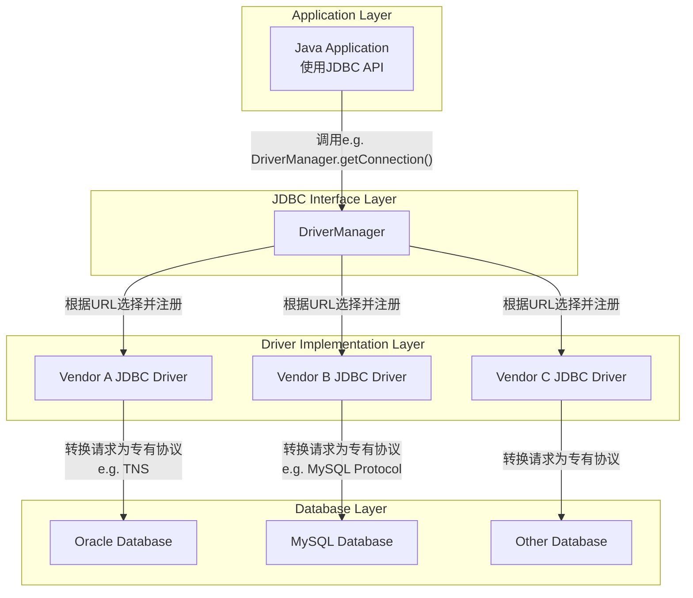

本文将带你深入Java数据库连接（JDBC）的核心机制，揭示从应用程序代码到数据库网络通信的完整过程。
<!-- more -->

## 一、JDBC架构设计与工作原理

JDBC（Java Database Connectivity）是Java语言中规范客户端如何访问数据库的应用程序接口（API）。它的核心设计理念是**面向接口编程**，提供了数据库访问的统一规范，而具体实现则由各数据库厂商提供的驱动完成。

### JDBC的分层架构

JDBC采用典型的分层架构设计，其核心组件与协作关系如下图所示：



这种架构的优势在于**应用程序与数据库解耦**：开发者只需编写一套代码，通过更换不同的驱动，即可操作不同的数据库。

## 二、核心组件深度解析

### 1. DriverManager：驱动管理中枢

DriverManager是JDBC架构的"大脑"，负责管理和注册多个数据库驱动，并根据连接请求的URL选择返回合适的Connection对象。

**驱动注册机制演变**：

- **JDBC 4.0之前**：需要显式加载驱动类
  ```java
  Class.forName("com.mysql.cj.jdbc.Driver");
  ```
- **JDBC 4.0+**：基于SPI（Service Provider Interface）机制自动注册，无需手动加载

### 2. Driver：数据库协议的"翻译官"

Driver是数据库厂商提供的具体实现类，负责将JDBC API调用转换为特定数据库的网络协议格式。

**JDBC驱动的四种类型**：

| 类型 | 名称 | 描述 | 使用场景 |
|------|------|------|----------|
| Type 1 | JDBC-ODBC桥接驱动 | 通过ODBC连接数据库 | 已淘汰 |
| Type 2 | 本地API部分Java驱动 | 使用数据库客户端库 | 逐渐减少 |
| Type 3 | 网络协议全部Java驱动 | 通过中间件转换请求 | 特殊场景 |
| Type 4 | 本地协议全部Java驱动 | 直接转换数据库协议 | **主流选择** |

### 3. Connection：数据库会话的抽象

Connection代表一个与数据库的会话，封装了TCP/IP Socket连接和认证信息。

**连接建立过程**：

1. 解析URL，识别数据库类型和位置
2. 建立TCP Socket连接（三次握手）
3. 进行身份认证（验证用户名和密码）
4. 数据库服务器创建会话上下文

**关键注意点**：创建物理连接是极其昂贵的操作，涉及网络往返和资源分配，这也是连接池技术存在的根本原因。

### 4. Statement vs PreparedStatement：SQL执行单元

**Statement**：用于执行静态SQL语句
```java
Statement stmt = conn.createStatement();
ResultSet rs = stmt.executeQuery("SELECT * FROM users");
// 存在SQL注入风险：SELECT * FROM users WHERE name = '' OR '1'='1'
```

**PreparedStatement**：用于执行预编译SQL（**首选方式**）
```java
PreparedStatement ps = conn.prepareStatement("SELECT * FROM users WHERE id = ?");
ps.setInt(1, 10); // 安全设置参数
ResultSet rs = ps.executeQuery();
```

**PreparedStatement的核心优势**：

1. **安全性**：彻底防止SQL注入攻击
2. **性能**：预编译一次，多次执行，减少数据库解析优化开销
3. **可读性**：代码更清晰易维护

### 5. ResultSet：数据游标控制器

ResultSet是一个具有游标的对象，用于遍历查询结果集。

**数据获取机制**：

- 并不一次性加载所有数据到内存
- 通过分批获取（Fetch）机制动态从数据库服务器获取数据
- 支持向前和双向滚动（取决于创建参数）

## 三、完整连接流程深度剖析

以下面代码为例，深入分析底层执行过程：

```java
// 建立连接
Connection conn = DriverManager.getConnection(
    "jdbc:mysql://localhost:3306/mydb?user=root&password=123456");

// 创建预编译语句
PreparedStatement ps = conn.prepareStatement("SELECT * FROM users WHERE id = ?");
ps.setInt(1, 10);

// 执行查询
ResultSet rs = ps.executeQuery();

// 处理结果
while (rs.next()) {
    System.out.println(rs.getString("name"));
}

// 释放资源
rs.close();
ps.close();
conn.close();
```

### 底层执行步骤详解：

#### 1. 驱动注册与选择

   - DriverManager解析URL，识别mysql协议
   - 找到匹配的MySQL驱动，调用其connect()方法

#### 2. 物理连接建立

   - 驱动解析主机名、端口号和数据库名
   - 建立到localhost:3306的TCP Socket连接
   - 进行MySQL握手协议和身份认证
   - 认证成功，MySQL服务器创建连接线程

#### 3. 语句预编译与执行

   - 驱动发送SQL模板到服务器进行预编译
   - 服务器解析、优化SQL，生成执行计划，返回语句ID
   - 执行时，驱动发送语句ID和参数值到服务器
   - 服务器使用预编译计划执行查询

#### 4. 结果集处理

   - 服务器执行查询，生成结果集
   - 驱动分批获取数据（非一次性加载）
   - 每次调用rs.next()可能触发网络请求获取下一批数据

#### 5. 资源释放

   - rs.close(): 释放服务器端结果集资源
   - ps.close(): 释放服务器端语句资源
   - conn.close(): **最关键的一步**，关闭TCP Socket连接，释放服务器端线程资源

## 四、高性能实践：连接池技术

由于创建物理连接极其昂贵，生产环境必须使用连接池。

### 连接池工作原理：

1. **初始化**：应用启动时创建固定数量的数据库连接
2. **连接获取**：应用从池中借用空闲连接
3. **连接归还**：调用close()方法实际是归还到连接池
4. **连接管理**：池管理器负责验证连接有效性、处理闲置连接等

### 流行连接池对比：

| 连接池 | 特点 | 适用场景 |
|--------|------|----------|
| HikariCP | **高性能**、轻量级、Spring Boot默认 | 高并发、微服务架构 |
| Apache DBCP | 成熟稳定、功能全面 | 传统企业应用 |
| C3P0 | 历史悠久、功能丰富 | 遗留系统 |

### Spring Boot中配置HikariCP示例：

```yaml
spring:
  datasource:
    url: jdbc:mysql://localhost:3306/mydb
    username: root
    password: 123456
    hikari:
      maximum-pool-size: 20 # 最大连接数
      minimum-idle: 5 # 最小空闲连接数
      idle-timeout: 30000 # 空闲连接超时时间(ms)
      connection-timeout: 20000 # 连接超时时间(ms)
      max-lifetime: 1800000 # 连接最大生命周期(ms)
```

## 五、常见问题与优化策略

### 1. 连接泄漏问题
**症状**：应用运行时间越长，数据库连接越多，最终导致连接耗尽。

**解决方案**：

- 确保finally块中关闭资源或使用try-with-resources
- 使用连接池的泄漏检测功能
```java
// 推荐使用try-with-resources自动关闭资源
try (Connection conn = dataSource.getConnection();
     PreparedStatement ps = conn.prepareStatement(sql);
     ResultSet rs = ps.executeQuery()) {
    // 处理结果集
}
```

### 2. 性能优化策略
- **使用PreparedStatement**避免重复解析SQL
- **合理设置批处理**大小进行批量操作
- **优化查询**，减少网络传输数据量
- **使用合适的连接池参数**

### 3. 监控与诊断
- 启用连接池的监控指标
- 使用JDBC性能分析工具（如p6spy）
- 监控数据库服务器连接状态

## 六、总结

JDBC作为Java数据库访问的基石，其设计精巧而高效。理解其底层原理对于编写高性能、安全的数据访问代码至关重要：

1. **JDBC采用分层架构**，通过统一API屏蔽数据库差异
2. **连接建立是昂贵操作**，需要连接池进行管理
3. **PreparedStatement是首选**，兼顾性能与安全
4. **ResultSet采用分批获取**，避免内存溢出
5. **资源必须显式释放**，防止连接泄漏

随着微服务和云原生架构的普及，对数据库访问性能和安全的要求越来越高。深入理解JDBC原理，结合现代连接池技术，是构建高性能Java应用的必备技能。