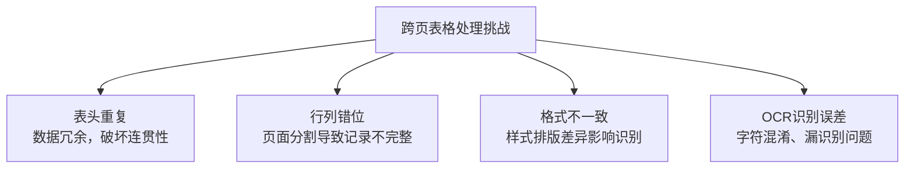

在检索增强生成（Retrieval-Augmented Generation, RAG）系统的构建中，非结构化文档（如PDF、Word）中的**表格**是高质量知识的重要载体。它们往往包含了浓缩的、结构化的关键信息。然而，当表格跨越两页或多页时，传统的文本提取技术会遭遇滑铁卢，导致检索到的信息碎片化、不完整，甚至错误，严重影响了后续大模型生成答案的准确性和可靠性。

本文通过讲解MinerU的表格处理机制，深入探讨跨页表格处理的核心挑战、关键技术方案及在RAG中的完整应用流程，旨在解决这一"表格困境"。
<!-- more -->

## 一、核心挑战：为何跨页表格如此棘手？

跨页表格的处理绝非简单的文本拼接，其主要面临四大挑战：



### 1. 表头重复 (Header Repetition)
跨页表格的每一页通常都包含相同的表头，以实现单页的可读性。但这导致了数据冗余，直接破坏了表格的整体连贯性。在RAG中，这会使检索结果包含大量重复无用信息，干扰模型判断。

### 2. 行列错位 (Row/Column Misalignment)
由于分页的限制，一个完整的行或列可能被硬生生切割。例如，某一行的一半在第一页末尾，另一半在第二页开头。如果简单按页提取，这条记录就会"身首异处"，完整性被彻底破坏。

### 3. 格式不一致 (Formatting Inconsistency)
不同页面中的同一表格，可能在字体、字号、列宽、行高甚至边框样式上存在细微差异。这种不一致性降低了机器对表格结构判断的准确性，进而影响数据提取。

### 4. OCR识别误差 (OCR Errors)
对于扫描版PDF或图片中的表格，光学字符识别（OCR）是必经步骤。然而，OCR易受印刷质量、版面复杂度和字体影响，出现字符混淆（如'1'和'l'）、漏识别等问题，直接影响最终数据的准确性。

**示例表格（跨页混乱情况）**:

| 案件编号 | 案件名称               | 当事人姓名       | ... |
|----------|------------------------|------------------|-----|
| LA2023001 | 合同纠纷案             | 张伟             | ... |
| LA2023002 | 知识产权侵权案         | 李娜             | ... |
| ...       | ...                    | ...              | ... |
| *(下一页)* |                        |                  |     |
| **案件编号** | **案件名称**       | **当事人姓名**   | ... |
| LA2023003 | 刑事盗窃案             | 王强             | ... |
| ...       | ...                    | ...              | ... |

## 二、关键技术方案：如何实现精准的表格重建？

应对上述挑战，需要一套融合了计算机视觉与自然语言处理的技术方案。

### 1. 表格结构识别（Table Structure Recognition, TSR）

TSR是一切工作的基础，其目标是精准识别表格的物理和逻辑结构。

- **核心识别元素**:
    - **行(Row)与列(Column)**：确定数据的基本网格布局。
    - **表头(Header)**：识别列的名称，是理解每列数据含义的关键。
    - **合并单元格(Merged Cells)**：正确检测跨行或跨列的单元格，避免解析时出现错位。

### 2. 跨页表格合并策略（Cross-Page Merge Strategy）

这是解决跨页问题的核心，通常采用"三步法"：

1.  **表头一致性检测**：通过**文本匹配**或更高级的**语义向量相似度**计算，判断不同页面的表头是否为同一表格的重复表头。
2.  **表格位置分析（Bounding Box）**：利用边界框技术分析表格在页面中的坐标位置，判断相邻页面的表格在垂直或水平方向上是否连续，排除无关表格的干扰。
3.  **自动拼接与去重**：确认属于同一表格后，按行顺序进行拼接，并**自动删除重复的表头行**，只保留一个有效表头，形成完整表格。

### 3. 结构化输出（Structured Output）

合并后的完整表格必须转换为机器可读、下游RAG流程可用的格式。

- **JSON**：最常用的结构化数据格式，便于程序进行筛选、统计和自动化处理。
- **Markdown**：兼具良好的可读性和结构性，非常适合与LLM配合使用，可直接嵌入提示词（Prompt）中。

**结构化输出示例（JSON）**:
```json
{
  "table_name": "法律案件信息表",
  "headers": ["案件编号", "案件名称", "当事人姓名", "案件类型", "立案日期", "金额(万元)", "备注", "律师姓名"],
  "data": [
    {"案件编号": "LA2023001", "案件名称": "合同纠纷案", "当事人姓名": "张伟", ...},
    {"案件编号": "LA2023002", "案件名称": "知识产权侵权案", "当事人姓名": "李娜", ...},
    // ... 其他行数据
  ]
}
```

## 三、他山之石： MinerU 处理流程
MinerU是一款将PDF转化为机器可读格式的工具（如markdown、json），可以很方便地抽取为任意格式，MinerU诞生于书生-浦语的预训练过程中。
          
### MinerU 表格处理机制详解

MinerU 采用了一套完整的表格处理流水线，能够高效地识别、分类、结构化各种类型的表格，并支持跨页表格合并。以下是详细的处理流程：

#### 一、表格分类系统

MinerU 首先使用表格分类模型区分表格类型，为后续采用不同的识别策略提供依据：

```python
# MinerU-master/mineru/model/table/cls/paddle_table_cls.py
class PaddleTableClsModel:
    def __init__(self):
        # 加载ONNX格式的表格分类模型
        self.sess = onnxruntime.InferenceSession(
            os.path.join(auto_download_and_get_model_root_path(ModelPath.paddle_table_cls), ModelPath.paddle_table_cls)
        )
        # 模型支持两种分类：有线表格和无线表格
        self.labels = [AtomicModel.WiredTable, AtomicModel.WirelessTable]

    def predict(self, input_img):
        # 预处理图像（尺寸调整、归一化等）
        x = self.preprocess(np_img)
        # 模型推理
        result = self.sess.run(None, {"x": x})
        # 获取分类结果和置信度
        idx = np.argmax(result)
        conf = float(np.max(result))
        return self.labels[idx], conf
```

分类模型会将表格分为两类：

- **有线表格**：具有明显表格线的传统表格
- **无线表格**：依靠文本对齐和间距来表示结构的表格

#### 二、表格识别与结构化

根据分类结果，MinerU 会使用不同的模型进行表格识别和结构化：

##### 1. 有线表格识别

对于有线表格，MinerU 使用基于 UNet 的模型进行识别：

```python
# MinerU-master/mineru/model/table/rec/unet_table/main.py
class WiredTableRecognition:
    def __call__(self, img: InputType, ocr_result=None, **kwargs):
        # 加载图像
        img = self.load_img(img)
        # 使用UNet模型提取表格结构
        polygons, rotated_polygons = self.table_structure(img, **kwargs)
        # 恢复表格结构（行列信息）
        table_res, logi_points = self.table_recover(rotated_polygons, row_threshold, col_threshold)
        # 匹配OCR结果到表格单元格
        cell_box_det_map, not_match_orc_boxes = match_ocr_cell(ocr_result, polygons)
        # 处理空白单元格
        cell_box_det_map = self.fill_blank_rec(img, polygons, cell_box_det_map)
        # 生成HTML格式的表格
        pred_html = plot_html_table(logi_points, cell_box_det_map)
        # 返回表格识别结果
        return WiredTableOutput(pred_html, polygons, logi_points, elapse)
```

##### 2. 无线表格识别

对于无线表格，MinerU 使用 slanet_plus 模型进行识别：

```python
# MinerU-master/mineru/model/table/rec/slanet_plus/main.py
class RapidTable:
    def predict(self, img: np.ndarray, ocr_result=None):
        # 从OCR结果提取文本框和识别文本
        dt_boxes, rec_res = self.get_boxes_recs(ocr_result, h, w)
        # 使用table_structure模型处理表格结构
        pred_structures, cell_bboxes, _ = self.table_structure.process(copy.deepcopy(img))
        # 适配模型输出的box缩放还原
        cell_bboxes = self.adapt_slanet_plus(img, cell_bboxes)
        # 使用表格匹配器将OCR结果与表格结构匹配
        pred_html = self.table_matcher(pred_structures, cell_bboxes, dt_boxes, rec_res)
        # 返回表格识别结果
        return RapidTableOutput(pred_html, cell_bboxes, logic_points, elapse)
```

#### 三、表格数据结构表示

MinerU 使用清晰的数据结构来表示表格信息：

```python
# MinerU-master/mineru/utils/format_utils.py
class TableCell(BaseModel):
    # 合并单元格属性
    row_span: int = 1
    col_span: int = 1
    # 单元格位置信息
    start_row_offset_idx: int
    end_row_offset_idx: int
    start_col_offset_idx: int
    end_col_offset_idx: int
    # 单元格内容
    text: str
    # 表头标识
    column_header: bool = False
    row_header: bool = False
    row_section: bool = False

class TableData(BaseModel):
    # 表格单元格列表
    table_cells: List[TableCell] = []
    # 表格行列数
    num_rows: int = 0
    num_cols: int = 0
    
    # 计算属性：生成表格网格表示
    @computed_field  
    @property
    def grid(self) -> List[List[TableCell]]:
        # 初始化空表格网格
        table_data = [[TableCell(text="", start_row_offset_idx=i, ...) for j in range(self.num_cols)] for i in range(self.num_rows)]
        # 填充实际单元格内容
        for cell in self.table_cells:
            # 处理合并单元格等复杂情况
            # ...
        return table_data
```

#### 四、跨页表格合并

MinerU 支持跨页表格合并功能，能够智能识别并合并跨越多页的表格：

```python
#MinerU-master/mineru/utils/table_merge.py
def can_merge_tables(current_table_block, previous_table_block):
    # 检查表格是否有caption和footnote（影响合并决策）
    if any(block["type"] == BlockType.TABLE_CAPTION for block in current_table_block["blocks"]):
        return False, None, None, None, None
    
    # 获取两个表格的HTML内容
    current_html = ""
    previous_html = ""
    # ...
    
    # 检查表格宽度差异（宽度差异过大则不能合并）
    if abs(table1_width - table2_width) / min(table1_width, table2_width) >= 0.1:
        return False, None, None, None, None
    
    # 解析HTML并检查表格结构
    # ...

# 执行表格合并操作
# 将第二个表格的行添加到第一个表格中
# 保留表头，合并内容行
```

表格合并的判断依据包括：

- 表格宽度相似度（差异小于10%）
- 表头结构和内容匹配度
- 表格是否包含标题或脚注

#### 五、表格处理完整流程

综合以上信息，MinerU 的表格处理流程可以概括为：

1. **表格检测与分类**：识别文档中的表格区域，并分类为有线或无线表格
2. **OCR文本识别**：提取表格中的文字内容
3. **表格结构化**：根据表格类型选择合适的模型进行结构化处理，生成HTML格式
4. **跨页表格合并**：检测并合并跨越多页的表格
5. **表格数据格式化**：转换为标准化的表格数据结构，支持后续处理和导出


## 四、在RAG中的完整应用流程

一个鲁棒的、能处理跨页表格的RAG文档解析流程，可归纳为以下五个步骤：


### 1. 布局预测 (Layout Prediction)
首先对PDF文档进行整体布局分析，识别出文本、表格、图片等不同区域，精准定位表格所在范围。

### 2. 文档格式检测 (MFD Predict)
判断文档是可编辑文本型PDF还是扫描图片型PDF，以决定是否需要启动OCR引擎。

### 3. OCR处理 (OCR Processing)
针对扫描件或图片，调用OCR引擎提取文字信息。优秀的工具具备环境自适应能力，在CPU环境下会自动切换为轻量化模型（如`ch_lite`），以平衡速度与精度。

### 4. 表格预测 (Table Prediction)
综合前三步的所有信息（布局、格式、文字），最终预测出表格的完整结构（行、列、合并单元格等）。

### 5. 结构化输出 (Structured Output)
将识别后的表格数据转换为机器可读的标准格式（JSON/Markdown），供RAG系统下游使用。


## 五、总结与核心价值

将跨页表格自动化处理技术融入RAG管道，带来了显著的价值提升：

1.  **丰富RAG知识源**：PDF和图片中的表格不再是"信息黑洞"，而是被转化为**高质量、结构化的知识片段**，极大丰富了RAG系统的知识库来源和密度。

2.  **提升答案准确性**：完整且准确的表格数据确保了检索到的上下文信息是可靠的，从而直接提高了大模型生成答案的准确性和专业性。

3.  **增强溯源能力**：此类技术通常能保留数据在原始文档中的位置信息，增强了RAG的**溯源（Citation）能力**，让模型生成的答案更有据可查，值得信赖。

4.  **实现端到端自动化**：从文档上传到知识库 Ready，整个过程无需人工干预表格处理，实现了大规模文档处理的自动化，降低了成本。

通过攻克跨页表格处理的难题，RAG系统得以更好地利用人类积累的大量文档资产，构建更加智能、可靠的知识问答和应用系统。