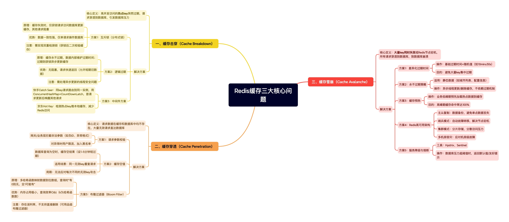

在互联网高并发系统中，缓存是提高系统性能的重要手段。Redis作为最流行的内存数据库，被广泛用于缓存场景。然而在使用过程中，我们经常会遇到缓存击穿、缓存穿透和缓存雪崩这三大经典问题。本文将深入分析这三种问题的成因，并给出多种解决方案，从基础方法到企业级实践。
<!-- more -->

## 一、缓存击穿（Cache Breakdown）

### 问题定义
缓存击穿是指一个**高并发访问的热点key**突然过期失效，导致大量的请求直接穿透到数据库，给数据库带来巨大压力甚至使其崩溃。

### 解决方案

#### 1. 互斥锁（分布式锁）
**实现原理**：当缓存失效时，多个请求同时访问，只有拿到锁的请求才能访问数据库更新缓存，其他请求阻塞等待。

**优势**：

- 数据一致性强
- 保证只有一个请求访问数据库

**劣势**：

- 存在阻塞等待，性能有一定影响
- 需要实现双重检测锁机制（获取锁后再次检查缓存）

#### 2. 逻辑过期
**实现原理**：缓存设置为永不过期，但在数据内部维护一个过期时间字段。请求到来时判断数据是否逻辑过期，过期则获取锁并异步更新缓存。

**优势**：

- 无需阻塞等待，性能更好
- 所有请求都能快速返回数据（可能是稍旧的数据）

**劣势**：

- 数据一致性较差
- 实现复杂度较高

#### 3. 中间件解决方案
**快手 Catch Seer**：

- 通过一致性哈希将相同key的请求路由到同一个Catch Seer实例
- 实例内部维护一个ConcurrentHashMap，value为CountDownLatch
- 第一个缓存miss的请求负责更新缓存，其他请求被阻塞等待
- 缓存更新完成后通过CountDownLatch唤醒所有等待请求

**京东 Hot Key**：

- 通过检测热点key，将其推送到本地缓存
- 避免大量请求访问Redis，减轻压力
- 适合热点key非常集中的场景

## 二、缓存穿透（Cache Penetration）

### 问题定义
缓存穿透是指请求的数据在**数据库和缓存中都不存在**，导致请求直接访问数据库，可能对数据库造成压力。

### 解决方案

#### 1. 请求参数校验
- 在API网关或业务层对请求参数进行合法性校验
- 拦截明显非法的请求（如ID为负数、非正常格式）
- 对异常用户或IP进行限流或加入黑名单

#### 2. 缓存空值
- 对于数据库查询为空的结果，也进行缓存
- 设置较短的过期时间（如1-5分钟）
- 防止同一key的重复攻击

**局限性**：对于每次请求的key都不同的攻击效果有限

#### 3. 布隆过滤器（Bloom Filter）
**实现原理**：

- 使用多个哈希函数将数据映射到一个位数组中
- 写入数据时，将对应位置设为1
- 查询时，如果所有哈希位置都为1，则数据可能存在；如果有任一位为0，则数据肯定不存在

**优势**：

- 内存占用极小
- 查询效率极高（O(k)，k为哈希函数数量）

**劣势**：

- 存在误判率（但不会漏判）
- 不支持删除操作（可使用Counting Bloom Filter解决）
- 数据库删除数据时无法同步更新

## 三、缓存雪崩（Cache Avalanche）

### 问题定义
缓存雪崩是指在同一时间有**大量key同时失效**，或者Redis节点宕机，导致所有请求直接访问数据库，造成数据库压力激增甚至崩溃。

### 解决方案

#### 1. 差异化过期时间
- 在基础过期时间上增加随机值
- 避免大量key在同一时间点失效
- 简单有效，适用于大多数场景

#### 2. 永不过期策略
- 对几乎不变化的数据（如城市列表、配置信息）不设置过期时间
- 通过异步方式更新或删除缓存
- 需要额外的缓存更新机制

#### 3. 缓存预热
- 在业务低峰期预先加载热点数据
- 保证高峰期到来时缓存中有数据
- 需要预测热点数据能力

#### 4. Redis高可用架构
- 主从复制：保证数据备份
- 哨兵模式：实现自动故障转移
- 集群模式：分散压力，提高可用性
- 多机房容灾：应对机房级别故障

#### 5. 服务降级与熔断
- 当检测到数据库压力过大时，启动降级策略
- 返回默认值或友好提示，保护后端系统
- 使用Hystrix、Sentinel等熔断框架

## 总结对比

| 问题类型 | 根本原因 | 核心解决方案 |
|---------|---------|------------|
| 缓存击穿 | 热点key突然失效 | 互斥锁、逻辑过期、中间件方案 |
| 缓存穿透 | 查询不存在的数据 | 参数校验、缓存空值、布隆过滤器 |
| 缓存雪崩 | 大量key同时失效/Redis宕机 | 差异化过期、永不过期、缓存预热、高可用 |

## 实践建议

1. **综合使用多种方案**：根据业务场景组合使用上述方案
2. **监控与预警**：建立完善的监控体系，及时发现潜在问题
3. **压测与演练**：定期进行压力测试和故障演练，验证系统容错能力
4. **分层防护**：在网关层、应用层、缓存层和数据层分别设置防护措施

通过合理运用这些解决方案，可以极大提高系统的稳定性和可用性，为业务发展提供坚实的技术保障。