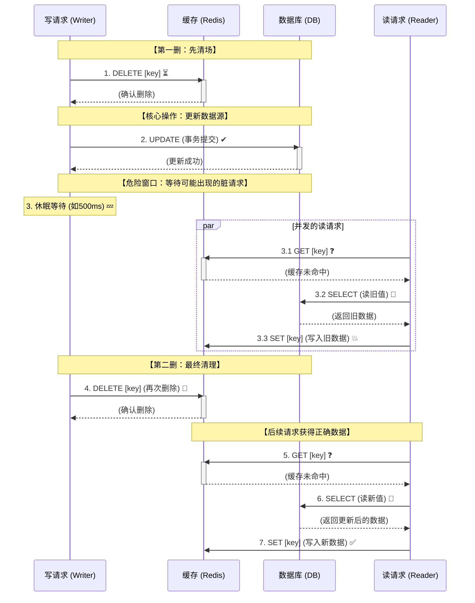

在构建高并发、高性能系统的道路上，缓存技术是我们手中最锋利的武器之一。然而，引入缓存的同时，一个棘手的问题也随之而来：如何保证缓存（如 Redis）与数据库（如 MySQL）之间的数据一致性？ 这个问题没有完美的银弹答案，本质上是一种基于业务场景在一致性、性能、复杂度三者间的精妙权衡。

本文将深入剖析缓存一致性问题的根源，详细对比多种主流解决方案，并为你提供清晰的选型指南。
<!-- more -->

## 一、 问题根源：为什么会出现不一致？

不一致的本质在于：**我们无法对一个分布式系统（缓存+数据库）进行一个原子性的更新操作**。无论先更新哪个，在更新另一个之前，系统都处于不一致状态。如果此时发生并发操作或失败，不一致就会被放大。

---

## 二、 常见策略分析与对比

### 1. Cache-Aside (旁路缓存) - 最常用、最稳健的策略

这是最基础的模式，你的申请暂存设计就用了这个模式。它只规定读和写的流程。

*   **读流程 (Read)**
    1.  读缓存，命中则返回。
    2.  未命中则读数据库。
    3.  将数据库数据写入缓存。

*   **写流程 (Update/Delete)**
    1.  **更新数据库**。
    2.  **删除缓存**。

**为什么是“删除缓存”而不是“更新缓存”？**

这是关键点！直接更新缓存的问题在于：

*   **性能浪费**：如果后续不再读取，这次更新就是浪费。
*   **并发问题**：如果两个写操作一先一后更新数据库，但更新缓存的顺序可能是反的（比如网络延迟），导致缓存中是旧的脏数据。

**优点**：

*   简单易懂，对缓存层的侵入性最小。
*   绝大多数场景下表现足够好。

**缺点**：

*   **不一致窗口期**：在步骤1和2之间，如果有读请求，会读到旧缓存并回填，导致缓存一直是旧数据。这个时间窗口通常很短（几毫秒）。
*   **缓存穿透风险**：如果缓存删除后，数据库尚未更新完，大量请求可能穿透到数据库。

### 2. Write-Through (穿透写)

应用层将缓存作为主要数据源。所有写操作都先写到缓存，再由缓存组件**同步地**去更新数据库。

*   **写流程**

    1.  更新缓存。
    2.  缓存组件同步更新数据库。

**优点**：

*   能保证强一致性（缓存和数据库同时成功或失败）。
*   读性能极高（缓存永远是最新值）。

**缺点**：

*   **性能瓶颈**：每个写操作都涉及缓存和数据库两次写，延迟高。
*   **缓存利用率低**：写入的数据可能不会被频繁读取，浪费缓存资源。
*   对缓存组件要求高，需要其支持此功能（一些商业缓存支持）。

### 3. Write-Behind (异步写，也叫Write-Back)

Write-Through 的异步版本。应用写缓存后立即返回，缓存组件**异步地、批量地**将数据更新到数据库。

*   **写流程**

    1.  更新缓存。
    2.  立即返回成功。
    3.  缓存组件异步批量更新数据库。

**优点**：

*   写性能极高（I/O 操作被异步化、批量化）。
*   对数据库压力小。

**缺点**：

*   **有数据丢失风险**：如果缓存宕机，尚未刷盘的数据就丢失了。
*   **实现复杂**：需要跟踪脏数据、实现可靠的异步刷盘机制。
*   **弱一致性**：数据库和缓存会在一个时间段内不一致。

---

## 三、 应对高并发与深度问题的进阶方案

### 1. 延迟双删 (Delayed Double Delete) - 优化 Cache-Aside

用于解决 Cache-Aside 在“先更新数据库，再删除缓存”后，在删除动作完成前有读请求带来的不一致。

*   **写流程**

    1.  删除缓存。
    2.  更新数据库。
    3.  **提交事务后，休眠一个特定时间（如500ms，取决于业务读耗时）**。
    4.  再次删除缓存。

**为什么？** 

第三步的休眠是为了等待可能发生的“在步骤2之后、步骤1的删除生效之前”那个读请求完成（它会把旧数据写入缓存）。步骤4的再次删除就是为了清理这个可能的脏缓存。

**缺点**：降低写吞吐量，休眠时间难以确定。

### 2. 订阅数据库 Binlog (如 Canal + MQ) - 最终一致性利器

这是最可靠、对业务代码侵入性最小的最终一致性方案。

*   **工作原理**：

    1.  业务代码正常更新数据库。
    2.  数据库的变更记录会被写入 **Binlog**。
    3.  一个中间件（如阿里的 **Canal**）伪装成数据库的从库，**订阅并解析 Binlog**。
    4.  Canal 将变更信息发送到消息队列（如 **RocketMQ/Kafka**）。
    5.  一个独立的消费者服务消费 MQ 消息，**删除或更新** Redis 中对应的缓存。

**优点**：

*   **业务代码极度简洁**：业务方只关心数据库操作，完全不知晓缓存的存在。
*   **高性能**：异步化，不影响主流程。
*   **高可靠**：基于 Binlog 是顺序的，MQ 能保证至少消费一次，可以很好地保证最终一致性。

**缺点**：

*   **系统复杂性最高**：引入了 Canal、MQ 等多个组件，运维成本高。
*   **延迟**：属于最终一致性，同步延迟取决于 Binlog 解析和 MQ 消费速度。

---

## 四、 总结与选择建议

没有完美的银弹，只有最适合场景的策略。

| 策略 | 一致性强度 | 性能 | 复杂度 | 适用场景 |
| :--- | :--- | :--- | :--- | :--- |
| **Cache-Aside (删缓存)** | 最终一致性 | **高** | **低** | **绝大多数业务场景**。如：用户信息、商品信息、文章内容。 |
| **Write-Through** | 强一致性 | 中 | 中 | 写入后立即要读的场景，且可以接受写性能损耗。 |
| **Write-Behind** | 弱一致性 | **极高(写)** | 高 | 写入吞吐量极大，能容忍数据丢失风险的场景。如：计数、点赞。 |
| **延迟双删** | 优化最终一致性 | 中 | 中 | 对缓存一致性要求稍高，且能预估读耗时的 Cache-Aside 场景。 |
| **订阅 Binlog** | 最终一致性 | 高 | **极高** | **大规模、高并发系统**。对业务代码洁癖、希望彻底解耦。 |