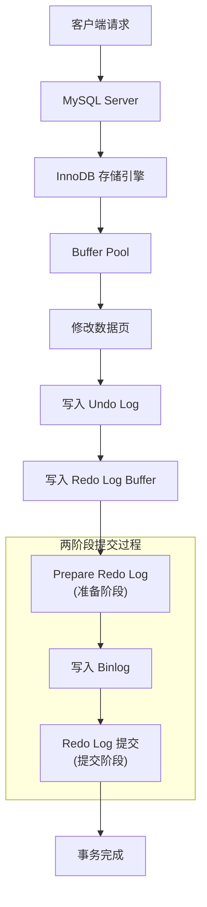

在数据库系统中，日志是实现事务特性、保证数据安全和高可用的核心机制。MySQL 通过三大日志Undo Log、Redo Log 和 Binlog协同工作，构建了一个强大而可靠的数据管理系统。本文将深入解析这三大日志的工作原理及其在 MySQL 中的重要角色。
<!-- more -->



## 一、Undo Log：实现事务回滚与多版本控制

### 什么是 Undo Log？

Undo Log（回滚日志）是 InnoDB 存储引擎特有的日志，用于记录数据修改前的状态。每当对数据进行修改时，MySQL 会将旧数据备份到 Undo Log 中。

### Undo Log 的作用

#### 1. 保证事务原子性

事务的原子性要求一系列操作要么全部成功，要么全部失败。Undo Log 通过保存数据修改前的版本，使得在事务失败或执行回滚时能够将数据恢复到修改前的状态。

```sql
START TRANSACTION;
UPDATE accounts SET balance = balance - 100 WHERE user_id = 'A';
-- 此时旧值被存入 Undo Log
UPDATE accounts SET balance = balance + 100 WHERE user_id = 'B';
-- 如果此处失败，使用 Undo Log 回滚第一个 UPDATE
COMMIT; 
```

#### 2. 实现 MVCC（多版本并发控制）

InnoDB 通过 Undo Log 构建数据版本链，配合 Read View 机制实现非锁定读。这使读操作不会阻塞写操作，大大提高了并发性能。

### Undo Log 的工作原理

InnoDB 为每行数据添加了两个隐藏字段：
- `DB_TRX_ID`：最近一次修改该行数据的事务 ID
- `DB_ROLL_PTR`：回滚指针，指向 Undo Log 中的上一个版本

这些字段形成了数据版本链，使得不同事务能看到数据在不同时间点的状态视图。

## 二、Buffer Pool 与 Redo Log：提升性能与保证持久性

### 为什么需要 Buffer Pool？

直接读写磁盘速度很慢，MySQL 引入了 Buffer Pool（缓冲池）作为内存缓存。数据以页（通常为 16KB）为单位进行读写，利用**空间局部性原理**（访问一个数据很可能访问其附近数据）提高效率。

### Redo Log 的作用与原理

#### 为什么需要 Redo Log？

虽然 Buffer Pool 提高了性能，但内存中的数据在宕机时会丢失。为保证事务的持久性（Durability），MySQL 引入了 Redo Log（重做日志）。

#### Redo Log 的工作机制

1. **物理日志**：Redo Log 记录的是数据页的物理修改，而不是逻辑操作
2. **顺序写入**：Redo Log 是追加写入的，相比随机写入数据页，顺序 IO 效率更高
3. **崩溃恢复**：宕机后重启时，MySQL 通过 Redo Log 重做已提交但未刷盘的操作

#### Redo Log 刷盘策略

通过 `innodb_flush_log_at_trx_commit` 参数控制：

- **0**：每秒写入并刷盘一次（性能好，可能丢失1秒数据）
- **1**：每次事务提交都刷盘（最安全，性能较差）
- **2**：每次事务提交写入操作系统缓存，每秒刷盘一次（平衡安全与性能）

## 三、Binlog：实现数据备份与主从复制

### 什么是 Binlog？

Binlog（二进制日志）是 MySQL Server 层的日志，记录所有对数据库的修改操作（无论是哪种存储引擎）。

### Binlog 的作用

1. **主从复制**：从库通过读取主库的 Binlog 重放操作，保持数据一致
2. **数据恢复**：结合定期全量备份，可以通过 Binlog 进行时间点恢复
3. **数据审计**：通过解析 Binlog 可以追踪数据变更历史

### Binlog 与 Redo Log 的区别

| 特性 | Redo Log | Binlog |
|------|---------|--------|
| 层次 | InnoDB 引擎层 | MySQL Server 层 |
| 类型 | 物理日志 | 逻辑日志（类似 SQL 语句） |
| 用途 | 崩溃恢复 | 主从复制、数据恢复 |
| 写入方式 | 循环写入 | 追加写入 |

## 四、两阶段提交：保证 Redo Log 与 Binlog 的一致性

### 为什么需要两阶段提交？

为了保证数据一致性，必须确保 Redo Log 和 Binlog 同时存在或同时不存在对应事务的记录。两阶段提交解决了这个问题。

### 两阶段提交流程

1. **Prepare 阶段**：
   - 写入 Redo Log 并标记为 prepare 状态
   - 确保 Redo Log 持久化

2. **Commit 阶段**：
   - 写入 Binlog
   - 将 Redo Log 标记为 commit 状态

### 异常处理机制

- **Prepare 阶段失败**：回滚事务
- **Binlog 写入失败**：根据 Redo Log 的 prepare 状态回滚事务
- **Commit 阶段失败**：即使 Redo Log 还是 prepare 状态，但只要 Binlog 完整，事务仍然会被提交

## 总结

MySQL 的三大日志各司其职，协同工作：

1. **Undo Log**：保证事务原子性和 MVCC
2. **Redo Log**：保证事务持久性和崩溃恢复能力
3. **Binlog**：实现主从复制和数据恢复功能

通过两阶段提交协议，MySQL 确保了 Redo Log 和 Binlog 的一致性，构建了一个既高效又可靠的数据管理系统。

理解这三大日志的工作原理，对于设计高可用架构、进行性能优化和处理数据故障都至关重要。无论是数据库开发还是运维，这都是必须掌握的核心知识。