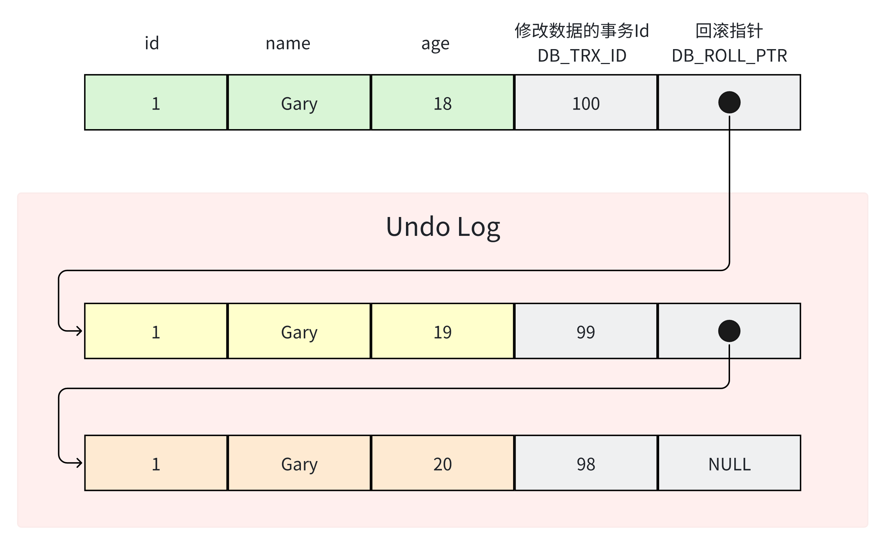
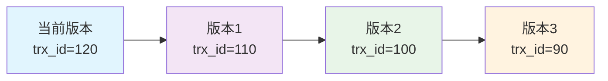
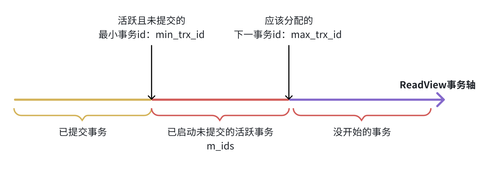
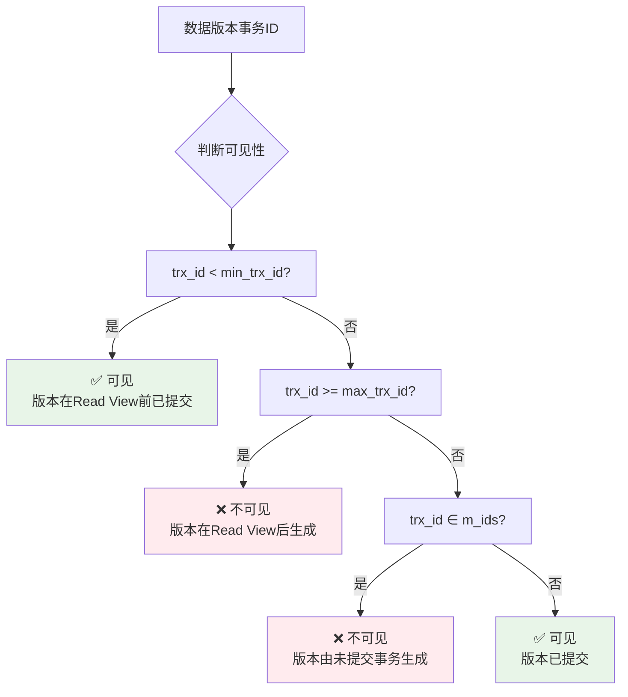

在现代数据库系统中，多版本并发控制（MVCC）是实现高性能事务处理的核心技术之一。与传统的锁机制相比，MVCC通过维护数据的多个版本，允许读操作不阻塞写操作，写操作也不阻塞读操作，从而大幅提升了数据库的并发性能。本文将深入解析MySQL中MVCC的实现原理，帮助读者彻底理解这一重要机制。
<!-- more -->

## 什么是MVCC？

MVCC（Multi-Version Concurrency Control）即多版本并发控制，是一种用于解决数据库读写冲突的无锁并发控制技术。它的核心思想是为每条数据维护多个历史版本，使不同的事务能够看到数据在不同时间点的状态视图。

### MVCC要解决什么问题？

在没有MVCC的情况下，数据库通常使用锁机制来保证事务的隔离性，但这会导致以下问题：

- 读操作会阻塞写操作
- 写操作会阻塞读操作
- 并发性能受限

MVCC通过以下方式解决这些问题：

1. 每个写操作创建数据的新版本，而不是直接覆盖旧数据
2. 读操作可以访问特定时间点的数据快照
3. 读写操作不再相互阻塞

## MVCC的实现机制



### 1. 隐藏字段

InnoDB为每行数据添加了三个隐藏字段：

- `DB_TRX_ID`：6字节，记录最近一次修改该行数据的事务ID
- `DB_ROLL_PTR`：7字节，回滚指针，指向该行数据的前一个版本
- `DB_ROW_ID`：6字节，行ID，用于生成聚簇索引（如果没有设置主键且该表没有唯一非空索引）


### 2. undo log版本链

每次对数据进行修改时，MySQL都会在undo log中记录修改前的数据镜像，并通过回滚指针将这些版本连接成一个链表：



### 3. Read View：可见性判断的关键



Read View是MVCC机制的核心组件，用于决定某个数据版本对当前事务是否可见。它包含四个重要字段：

- `creator_trx_id`：创建该Read View的事务ID
- `m_ids`：创建Read View时，活跃（未提交）的事务ID集合
- `min_trx_id`：创建Read View时，活跃事务中的最小事务ID
- `max_trx_id`：创建Read View时，系统应该分配给下一个事务的ID



### 4. 可见性判断规则

对于某个数据版本，根据其事务ID（DB_TRX_ID）与Read View的比较，决定是否可见：

1. **如果 DB_TRX_ID < min_trx_id**：说明该版本在Read View创建前已提交，**可见**
2. **如果 DB_TRX_ID > max_trx_id**：说明该版本在Read View创建后才生成，**不可见**
3. **如果 min_trx_id ≤ DB_TRX_ID ≤ max_trx_id**：
   - 如果 DB_TRX_ID 在 m_ids 中，说明该版本由未提交的事务生成，**不可见**
   - 如果 DB_TRX_ID 不在 m_ids 中，说明该版本已提交，**可见**

## 不同隔离级别的MVCC实现

### 1. 读未提交（Read Uncommitted）
不真正使用MVCC，直接读取最新数据，可能读到未提交的修改。

### 2. 读已提交（Read Committed）
每次SELECT语句都会生成一个新的Read View，确保只能读到已提交的数据。

```sql
-- 示例：事务A的执行过程
START TRANSACTION;
-- 第一次查询，生成Read View1
SELECT * FROM table WHERE id = 1; -- 使用Read View1

-- 此时其他事务提交了修改

-- 第二次查询，生成新的Read View2
SELECT * FROM table WHERE id = 1; -- 使用Read View2，可能看到不同的结果
COMMIT;
```

### 3. 可重复读（Repeatable Read）
在第一次SELECT时生成Read View，后续所有查询都复用这个Read View。

```sql
-- 示例：事务A的执行过程
START TRANSACTION;
-- 第一次查询，生成Read View
SELECT * FROM table WHERE id = 1; -- 生成并保存Read View

-- 此时其他事务提交了修改

-- 第二次查询，复用之前的Read View
SELECT * FROM table WHERE id = 1; -- 使用相同的Read View，结果与第一次一致
COMMIT;
```

### 4. 串行化（Serializable）
不使用MVCC，直接使用加锁方式实现完全串行化执行。

## 当前读 vs. 快照读

### 快照读（Snapshot Read）
普通的SELECT语句，基于MVCC读取数据的历史版本，不加锁。

```sql
SELECT * FROM table WHERE condition;
```

### 当前读（Current Read）
读取数据的最新版本，需要加锁以保证数据一致性。

```sql
SELECT * FROM table WHERE condition FOR UPDATE; -- 加排他锁
SELECT * FROM table WHERE condition LOCK IN SHARE MODE; -- 加共享锁
-- 所有的INSERT、UPDATE、DELETE操作都是当前读
```

## 幻读问题及解决方案

### 什么是幻读？
在同一事务中，多次执行相同的查询，返回的结果集行数不一致（由于其他事务插入了新数据）。

### MVCC如何解决幻读？
1. **快照读**：通过Read View的可见性判断，避免看到其他事务新插入的数据
2. **当前读**：通过Next-Key Lock（记录锁+间隙锁）防止其他事务插入新数据

### Next-Key Lock机制
Next-Key Lock是InnoDB解决幻读的关键技术，它锁定一个范围而不仅仅是单个记录：

```sql
-- 示例：锁定id在10到20之间的范围
SELECT * FROM table WHERE id > 10 AND id < 20 FOR UPDATE;
```

这会锁定：
1. id=10的记录（如果存在）
2. 10到20之间的间隙（防止插入）
3. id=20的记录（如果存在）

### 极端情况下的幻读问题

即使在可重复读隔离级别下，某些极端情况仍可能出现幻读：

```sql
-- 事务A
START TRANSACTION;
-- 快照读：查询不到id=1的数据
SELECT * FROM table WHERE id = 1;

-- 事务B插入id=1的数据并提交
INSERT INTO table (id, data) VALUES (1, 'test');
COMMIT;

-- 事务A尝试插入id=1的数据，但失败（唯一约束冲突）
INSERT INTO table (id, data) VALUES (1, 'test'); -- 错误：Duplicate entry
```

这种情况下，虽然查询不到数据，但插入时发现数据已存在，产生了幻读现象。

### 解决方案

1. **使用SELECT FOR UPDATE**：在查询时加锁，防止其他事务插入
2. **使用串行化隔离级别**：完全避免并发问题，但性能代价高
3. **应用层控制**：在业务逻辑中添加必要的检查和控制

## 实践建议

1. **合理选择隔离级别**：大多数场景下，可重复读是平衡性能和数据一致性的最佳选择
2. **避免长事务**：长事务会保留大量undo log，影响性能
3. **谨慎使用SELECT FOR UPDATE**：只在必要时使用，避免过度加锁
4. **监控锁竞争**：定期检查数据库的锁状态，及时发现和解决锁竞争问题

## 总结

MVCC是MySQL实现高性能并发控制的核心技术，它通过维护数据的多个版本和Read View机制，实现了读写操作的非阻塞执行。理解MVCC的工作原理对于设计高并发应用和进行数据库性能优化至关重要。

虽然MVCC能够解决大部分的并发问题，但在极端情况下仍可能出现幻读现象。通过合理使用锁机制和选择适当的隔离级别，可以在性能和数据一致性之间找到最佳平衡点。

掌握MVCC机制不仅有助于更好地理解数据库的内部工作原理，也能够帮助开发人员编写出更高效、更可靠的数据库应用程序。