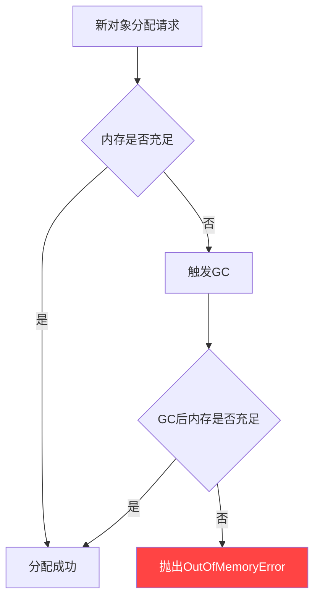
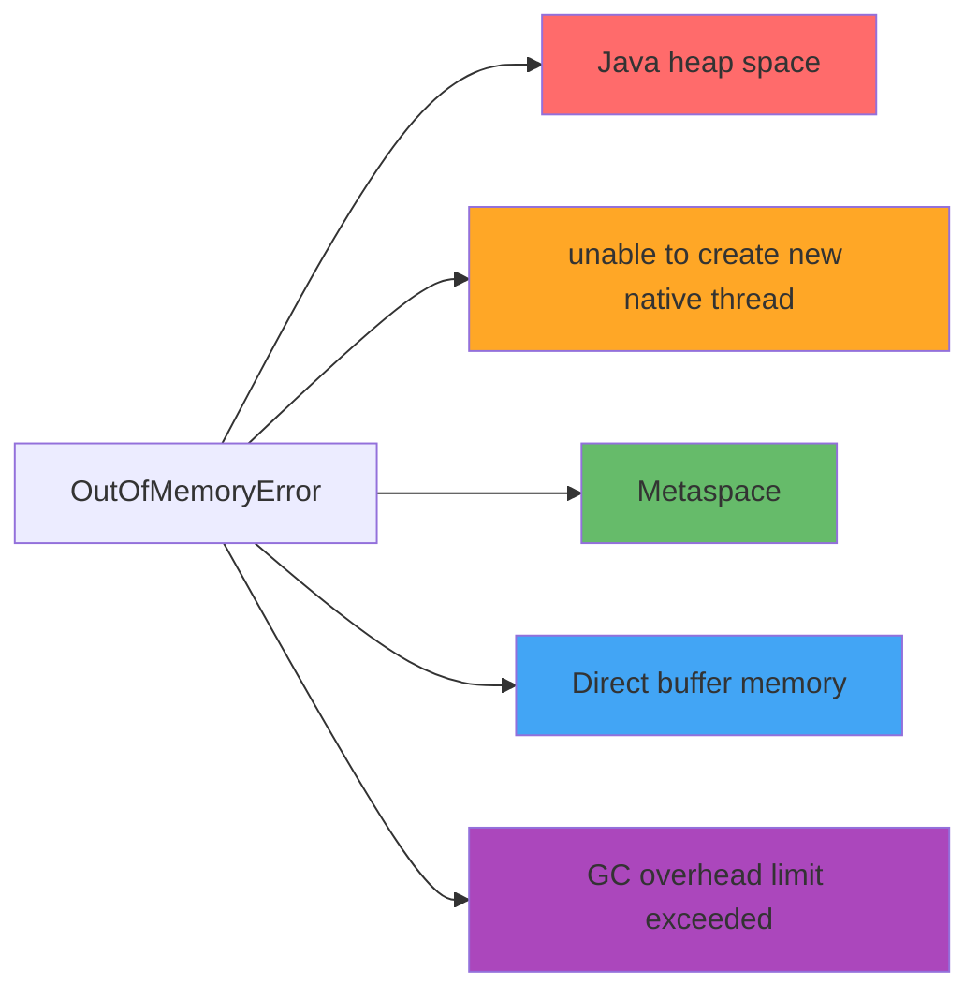
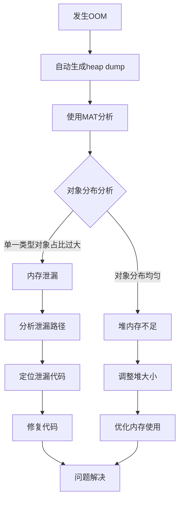
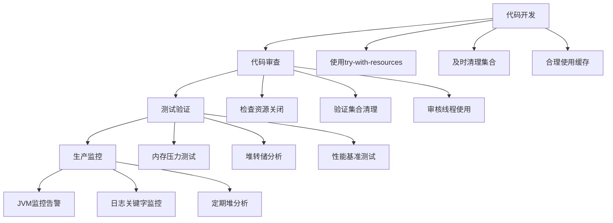

`OutOfMemoryError`（简称 OOM）是 Java 应用中最严重的内存问题之一。当 JVM 内存耗尽，垃圾回收器无法回收足够内存来满足新对象分配时，就会抛出这个错误。
<!-- more -->

## 💥 什么是 OOM？为什么它如此危险？




## 🔍 五种常见的 OOM 错误类型



### 1. **Java heap space** - 堆内存溢出
### 2. **unable to create new native thread** - 线程创建失败
### 3. **Metaspace** - 元空间溢出
### 4. **Direct buffer memory** - 直接内存溢出
### 5. **GC overhead limit exceeded** - GC开销过大

## 🚀 通用排查手段

### 3.1 问题发现 - 建立预警机制

#### 3.1.1 日志监控
```bash
# 使用 Filebeat 监控日志关键字
filebeat.inputs:
- type: log
  paths:
    - /var/log/app/*.log
  include_lines: ['java.lang.OutOfMemoryError']
```

#### 3.1.2 JVM 自动退出配置
```java
// 启动参数配置
-XX:+ExitOnOutOfMemoryError
// 当 OOM 发生时自动退出，便于健康检测和自动重启
```

#### 3.1.3 Jstat 实时监控
```bash
# 每秒监控一次 JVM 内存状态
jstat -gcutil $pid 1000

# 输出示例：
#  S0     S1     E      O      M     CCS    YGC     YGCT    FGC    FGCT     GCT
#  0.00  75.00  50.00  100.00 88.24  66.67    15    0.120     3    0.450    0.570
#  ↑重点关注：O列(老年代)持续100% + FGC频繁增长
```

### 3.2 问题止血 - 紧急应对策略

```java
// 生产环境必备配置
-XX:+HeapDumpOnOutOfMemoryError
-XX:HeapDumpPath=/tmp/oom_dump.hprof
-XX:+ExitOnOutOfMemoryError
```

**止血策略**：

1. ✅ 自动生成堆转储文件
2. ✅ 自动停止故障实例
3. ✅ 依赖 K8s 健康检查自动重启
4. ✅ 确保业务具备故障转移和幂等性

## 🔧 各类型 OOM 解决方案

### 4.1 🧵 unable to create new native thread

**问题原因**：

- 操作系统线程数达到上限
- Native 内存不足
- 线程泄漏

**解决方案**：
```bash
# 检查系统线程限制
ulimit -u

# 查看 Java 进程线程数
ps -eLf | grep java | wc -l

# 修改线程数限制
echo "* soft nproc 65535" >> /etc/security/limits.conf
```

### 4.2 📚 Metaspace

**问题原因**：

- 动态生成大量类（如：CGLib、反射）
- 元空间配置过小

**解决方案**：

```java
// JVM 参数调整
-XX:MaxMetaspaceSize=256m
-XX:MetaspaceSize=128m

// 监控元空间使用
jstat -gcutil $pid | awk '{print $5}'
```

### 4.3 💾 Direct buffer memory

**问题原因**：

- 直接内存使用超出默认 64MB 限制
- 常见于 NIO、Netty 等场景

**解决方案**：
```java
// 调整直接内存大小
-XX:MaxDirectMemorySize=256m

// 代码层面确保 ByteBuffer 正确释放
try (ByteBuffer buffer = ByteBuffer.allocateDirect(size)) {
    // 使用 buffer
} // 自动清理
```

### 4.4 ⚡ GC overhead limit exceeded

**问题原因**：

- 98% 的时间都在进行 GC
- GC 回收效率极低

**解决方案**：
```java
// 调整堆大小
-Xmx4g -Xms4g

// 或者关闭该检查（不推荐）
-XX:-UseGCOverheadLimit

// 更好的方案：分析内存泄漏
```

## 🕵️ Java heap space 深度分析

### 5.1 堆转储分析流程



### 5.2 Eclipse MAT 使用指南

**安装 MAT**：

- 下载地址：https://www.eclipse.org/mat/
- 支持分析大型堆转储文件（需足够内存）

**关键分析步骤**：

1. **概览分析** - 查看内存占用总体情况
2. **直方图** - 按类统计对象数量和大小
3. **支配树** - 找到保持对象存活的关键引用
4. **路径到GC根** - 分析对象为什么不能被回收

### 5.3 常见内存泄漏模式

#### 5.3.1 ThreadLocal 未清理
```java
public class UserContext {
    private static final ThreadLocal<User> currentUser = new ThreadLocal<>();
    
    // ❌ 错误用法：忘记清理
    public static void setUser(User user) {
        currentUser.set(user);
    }
    
    // ✅ 正确用法：使用后清理
    public static void clear() {
        currentUser.remove();
    }
    
    // ✅ 使用 try-finally 确保清理
    public void processRequest(Request request) {
        try {
            setUser(request.getUser());
            // 业务处理
        } finally {
            clear();
        }
    }
}
```

#### 5.3.2 大数据量查询未分页
```java
// ❌ 错误：一次性加载全部数据
@Repository
public class UserRepository {
    public List<User> findAllUsers() {
        return jdbcTemplate.query("SELECT * FROM users", userMapper);
        // 当 users 表有百万数据时，直接OOM
    }
}

// ✅ 正确：使用分页查询
public Page<User> findUsers(Pageable pageable) {
    String sql = "SELECT * FROM users LIMIT ? OFFSET ?";
    return jdbcTemplate.query(sql, userMapper, 
        pageable.getPageSize(), pageable.getOffset());
}
```

#### 5.3.3 集合数据累积
```java
// ❌ 错误：定时任务中集合不断累积
@Component
public class StatisticsTask {
    private List<Data> cache = new ArrayList<>();
    
    @Scheduled(fixedRate = 5000)
    public void collectData() {
        Data newData = fetchData();
        cache.add(newData);  // 永远不会清理
        
        if (cache.size() > 10000) {
            processAndClear();  // 应该在这里清理
        }
    }
    
    // ✅ 修复：及时清理
    private void processAndClear() {
        // 处理数据
        processData(cache);
        // 清理缓存
        cache.clear();
    }
}
```

#### 5.3.4 监控标签爆炸
```java
// ❌ 错误：使用不可控字段作为标签
@Component
public class MetricsService {
    private Counter requestCounter;
    
    public void init() {
        requestCounter = Counter.builder("http_requests")
            .tag("user_id", "")  // 用户ID会无限增长
            .register(meterRegistry);
    }
    
    public void recordRequest(String userId) {
        requestCounter.increment();
    }
}

// ✅ 正确：使用有限取值的标签
public void init() {
    requestCounter = Counter.builder("http_requests")
        .tag("status", "")      // 状态码：有限取值
        .tag("method", "")      // HTTP方法：有限取值  
        .register(meterRegistry);
}
```

## 🛠️ 问题规避策略

### 6.1 内存泄漏预防清单



### 6.2 JVM 参数优化推荐

```bash
# 生产环境推荐配置
java -server \
  -Xmx4g -Xms4g \                    # 堆大小
  -XX:MaxMetaspaceSize=256m \        # 元空间
  -XX:MaxDirectMemorySize=256m \     # 直接内存
  -XX:+UseG1GC \                     # GC算法
  -XX:MaxGCPauseMillis=200 \         # 最大GC停顿
  -XX:+HeapDumpOnOutOfMemoryError \  # OOM时dump
  -XX:HeapDumpPath=/tmp/heapdump.hprof \
  -XX:+ExitOnOutOfMemoryError \      # OOM时退出
  -jar your-application.jar
```

### 6.3 监控体系建立

```yaml
# Prometheus 监控配置示例
groups:
- name: jvm_monitor
  rules:
  - alert: JVMOOMImminent
    expr: jvm_memory_bytes_used / jvm_memory_bytes_max > 0.9
    for: 2m
    labels:
      severity: critical
    annotations:
      summary: "JVM内存使用率超过90%"
      
  - alert: HighFGC
    expr: increase(jvm_gc_collection_seconds_count{gc="G1 Old Generation"}[5m]) > 10
    labels:
      severity: warning
    annotations:
      summary: "5分钟内Full GC次数超过10次"
```

## 📊 实战排查案例

### 案例：电商系统大促期间 OOM

**现象**：

- 大促期间订单服务频繁 OOM
- 错误信息：`java.lang.OutOfMemoryError: Java heap space`

**排查过程**：

1. 配置自动堆转储
2. 使用 MAT 分析发现 `ConcurrentHashMap` 占用 70% 内存
3. 定位到商品缓存未设置过期时间
4. 缓存数据无限增长导致 OOM

**解决方案**：
```java
// ❌ 原有代码：无过期时间
private Map<Long, Product> productCache = new ConcurrentHashMap<>();

// ✅ 修复后：使用Guava Cache带过期时间
private LoadingCache<Long, Product> productCache = CacheBuilder.newBuilder()
    .maximumSize(10000)
    .expireAfterWrite(10, TimeUnit.MINUTES)
    .build(new CacheLoader<Long, Product>() {
        public Product load(Long key) {
            return productService.getById(key);
        }
    });
```

## 🎯 总结

OOM 问题排查是一个系统工程，需要建立完整的监控、预警、分析和修复闭环：

### 🔄 完整闭环流程


### 💡 核心要点
1. **预防优于治疗** - 在编码阶段避免常见内存陷阱
2. **监控不可或缺** - 建立完善的 JVM 监控体系
3. **工具熟练使用** - 掌握 MAT、jstat 等分析工具
4. **自动化处理** - 配置自动 dump 和重启机制
5. **持续优化** - 定期进行内存使用分析和优化


---
**📚 扩展阅读**：

- [Eclipse MAT 官方文档](https://www.eclipse.org/mat/)
- [Oracle JVM 故障诊断指南](https://docs.oracle.com/javase/8/docs/technotes/guides/troubleshoot/)
- [美团技术团队 - Spring Boot引起的“堆外内存泄漏”排查及经验总结](https://tech.meituan.com/2019/01/03/spring-boot-native-memory-leak.html)