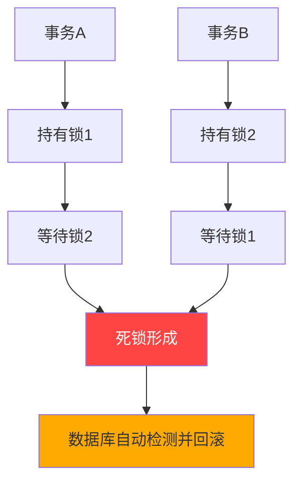
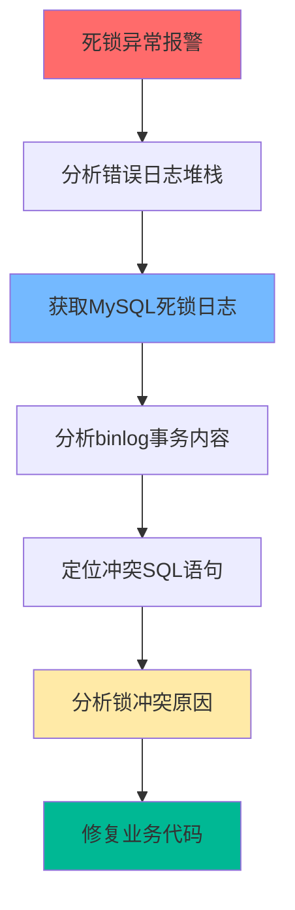
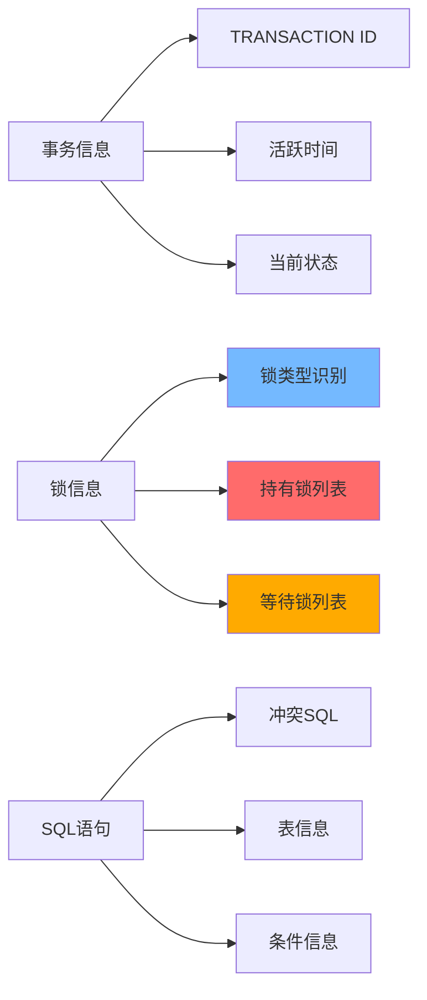
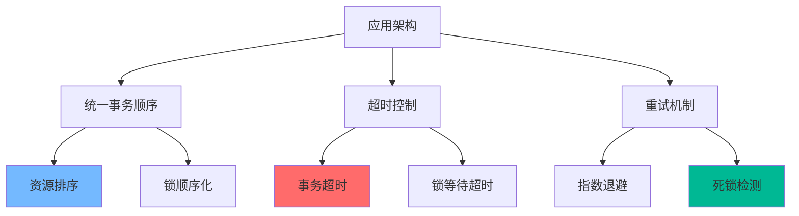
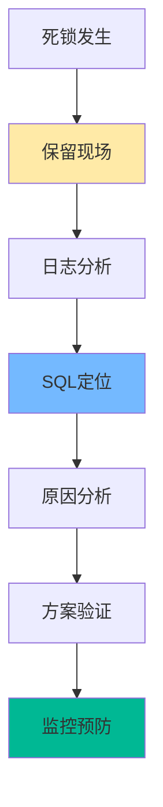

数据库死锁是指两个或多个事务互相等待对方持有的锁资源，导致所有事务都无法继续执行的状态。与应用程序死锁不同，数据库死锁具有**偶发性、难以复现、需要专业知识分析**的特点。
<!-- more -->

## 💥 什么是数据库死锁？为什么它如此棘手？

数据库死锁是指两个或多个事务互相等待对方持有的锁资源，导致所有事务都无法继续执行的状态。与应用程序死锁不同，数据库死锁具有**偶发性、难以复现、需要专业知识分析**的特点。



## 🚨 死锁排查标准作业流程（SOP）

建立标准化的排查流程，是快速解决死锁问题的关键。



## 🔍 死锁日志的获取与配置

### 1. 实时获取死锁信息

**方法一：查看最近一次死锁**
```sql
SHOW ENGINE INNODB STATUS;
```

**方法二：开启InnoDB监控（推荐）**
```sql
-- 开启标准监控
SET GLOBAL innodb_status_output = ON;

-- 开启锁监控  
SET GLOBAL innodb_status_output_locks = ON;

-- 开启死锁日志记录到错误日志
SET GLOBAL innodb_print_all_deadlocks = ON;
```

**方法三：配置持久化监控**
```sql
-- 在my.cnf中配置，重启生效
[mysqld]
innodb_status_output = ON
innodb_status_output_locks = ON
innodb_print_all_deadlocks = ON
```

### 2. 监控脚本自动化

```bash
#!/bin/bash
# 死锁监控脚本

MYSQL_HOST="localhost"
MYSQL_USER="monitor"
MYSQL_PASS="password"
ERROR_LOG="/var/log/mysql/error.log"

# 检查最近死锁
check_recent_deadlock() {
    mysql -h$MYSQL_HOST -u$MYSQL_USER -p$MYSQL_PASS -e "SHOW ENGINE INNODB STATUS\G" | \
    grep -A 50 "LATEST DETECTED DEADLOCK"
}

# 监控错误日志中的死锁
monitor_error_log() {
    tail -f $ERROR_LOG | grep --line-buffered "DEADLOCK" | while read line; do
        echo "🚨 检测到死锁: $line"
        # 发送告警
        send_alert "MySQL死锁检测" "$line"
    done
}

# 发送告警函数
send_alert() {
    local subject=$1
    local message=$2
    # 邮件、钉钉、企业微信等告警集成
    echo "$(date): $subject - $message" >> /var/log/deadlock_monitor.log
}
```

## 📊 死锁日志深度解析

### 死锁日志结构详解

```
LATEST DETECTED DEADLOCK
------------------------
2024-01-15 10:57:23 0x7f8e4416a700  # 死锁发生时间
*** (1) TRANSACTION:                  # 事务一信息
TRANSACTION 2078, ACTIVE 74 sec starting index read
mysql tables in use 1, locked 1       # 使用1个表，锁定1个表
LOCK WAIT 3 lock struct(s), heap size 1136, 2 row lock(s), undo log entries 1
MySQL thread id 8, OS thread handle 123145432113152, query id 123 localhost root updating
UPDATE t SET name = 'Tom2' WHERE id = 1

*** (1) HOLDS THE LOCK(S):           # 事务一持有的锁
RECORD LOCKS space id 2 page no 4 n bits 80 index PRIMARY of table `test`.`t` trx id 2078 lock_mode X locks rec but not gap

*** (1) WAITING FOR THIS LOCK(S):    # 事务一等待的锁  
RECORD LOCKS space id 2 page no 4 n bits 80 index PRIMARY of table `test`.`t` trx id 2078 lock_mode X locks rec but not gap waiting

*** (2) TRANSACTION:                  # 事务二信息
TRANSACTION 2079, ACTIVE 65 sec starting index read
mysql tables in use 1, locked 1
3 lock struct(s), heap size 1136, 2 row lock(s), undo log entries 1
MySQL thread id 9, OS thread handle 123145432379392, query id 124 localhost root updating
UPDATE t SET name = 'Teddy1' WHERE id = 2

*** (2) HOLDS THE LOCK(S):           # 事务二持有的锁
RECORD LOCKS space id 2 page no 4 n bits 80 index PRIMARY of table `test`.`t` trx id 2079 lock_mode X locks rec but not gap

*** (2) WAITING FOR THIS LOCK(S):    # 事务二等待的锁
RECORD LOCKS space id 2 page no 4 n bits 80 index PRIMARY of table `test`.`t` trx id 2079 lock_mode X locks rec but not gap waiting

*** WE ROLL BACK TRANSACTION (1)     # 回滚的事务
```

### 关键信息解读指南



#### 锁类型识别表
| 锁类型 | 死锁日志标识 | 说明 |
|--------|-------------|------|
| **记录锁** | `lock_mode X locks rec but not gap` | 锁定单条记录 |
| **间隙锁** | `lock_mode X locks gap before rec` | 锁定记录间隙 |
| **Next-Key锁** | `lock_mode X` | 记录锁+间隙锁 |
| **插入意向锁** | `lock_mode X locks gap before rec insert intention` | 插入操作使用的锁 |

## 🔎 Binlog日志分析实战

### 1. 获取Binlog日志

```bash
# 远程获取binlog日志
mysqlbinlog -h127.0.0.1 -u root -p --read-from-remote-server \
    binlog.000001 --base64-output=decode-rows -v > binlog_analysis.log

# 本地分析binlog
mysqlbinlog --base64-output=decode-rows -v binlog.000001 > transaction_analysis.log
```

### 2. Binlog日志分析示例

```sql
# 在binlog中找到的事务信息
# at 123456
#240115 10:57:18 server id 1  end_log_pos 123987 CRC32 0xabcd1234
# Query thread_id=8 exec_time=0 error_code=0
BEGIN

# at 123987  
#240115 10:57:19 server id 1  end_log_pos 124123 CRC32 0xefgh5678
# Table_map: `test`.`t` mapped to number 17
# at 124123
#240115 10:57:20 server id 1  end_log_pos 124256 CRC32 0ijkl9012
# Update_rows: table id 17 flags: STMT_END_F
### UPDATE `test`.`t`
### WHERE
###   @1=1 /* INT meta=0 nullable=0 is_null=0 */
###   @2='Tom1' /* VARSTRING(60) meta=60 nullable=1 is_null=0 */
### SET
###   @1=1 /* INT meta=0 nullable=0 is_null=0 */
###   @2='Tom2' /* VARSTRING(60) meta=60 nullable=1 is_null=0 */

# at 124256
#240115 10:57:21 server id 1  end_log_pos 124345 CRC32 0mnop3456
COMMIT
```

### 3. 自动化分析脚本

```bash
#!/bin/bash
# Binlog死锁事务分析脚本

BINLOG_FILE=$1
DEADLOCK_TIME=$2  # 死锁发生时间，格式：2024-01-15 10:57:23

analyze_deadlock_transactions() {
    echo "分析死锁时间: $DEADLOCK_TIME"
    echo "Binlog文件: $BINLOG_FILE"
    echo "=" * 50
    
    # 转换时间格式用于搜索
    SEARCH_TIME=$(echo $DEADLOCK_TIME | sed 's/ /\\\\ /g')
    
    # 提取死锁前后的事务
    mysqlbinlog --base64-output=decode-rows -v "$BINLOG_FILE" | \
    awk -v deadlock_time="$DEADLOCK_TIME" '
    BEGIN { found=0; transaction=0 }
    /^#.*/ {
        if (index($0, deadlock_time) > 0) {
            found=1
            print "🚨 发现死锁相关事务:"
            print "时间: " deadlock_time
        }
        if (found && /BEGIN/) {
            transaction=1
            print "--- 事务开始 ---"
        }
        if (transaction) {
            print $0
        }
        if (found && /COMMIT/) {
            transaction=0
            print "--- 事务结束 ---"
            found=0
        }
    }'
}
```

## 🛠️ 常见死锁场景与解决方案

### 场景1：不同顺序更新相同记录

**死锁代码示例**：
```sql
-- 事务A执行顺序
BEGIN;
UPDATE accounts SET balance = balance - 100 WHERE id = 1;  -- 锁定id=1
UPDATE accounts SET balance = balance + 100 WHERE id = 2;  -- 等待id=2的锁

-- 事务B执行顺序  
BEGIN;
UPDATE accounts SET balance = balance - 50 WHERE id = 2;   -- 锁定id=2
UPDATE accounts SET balance = balance + 50 WHERE id = 1;   -- 等待id=1的锁
```

**解决方案**：
```sql
-- 统一更新顺序：按id排序更新
CREATE PROCEDURE transfer_funds(
    IN from_account INT, 
    IN to_account INT, 
    IN amount DECIMAL
)
BEGIN
    DECLARE min_id INT;
    DECLARE max_id INT;
    
    SET min_id = LEAST(from_account, to_account);
    SET max_id = GREATEST(from_account, to_account);
    
    START TRANSACTION;
    
    -- 始终按id顺序更新
    UPDATE accounts SET balance = balance - amount WHERE id = min_id;
    UPDATE accounts SET balance = balance + amount WHERE id = max_id;
    
    COMMIT;
END;
```

### 场景2：Gap锁冲突

**死锁代码示例**：
```sql
-- 事务A
SELECT * FROM orders WHERE amount > 100 FOR UPDATE;  -- 获取gap锁
INSERT INTO orders (amount) VALUES (150);           -- 等待插入意向锁

-- 事务B
SELECT * FROM orders WHERE amount > 100 FOR UPDATE;  -- 获取gap锁  
INSERT INTO orders (amount) VALUES (200);           -- 等待插入意向锁
```

**解决方案**：
```sql
-- 方案1：使用更精确的查询条件
SELECT * FROM orders WHERE amount BETWEEN 100 AND 200 FOR UPDATE;

-- 方案2：降低隔离级别（需评估业务影响）
SET SESSION TRANSACTION ISOLATION LEVEL READ COMMITTED;

-- 方案3：使用乐观锁
ALTER TABLE orders ADD COLUMN version INT DEFAULT 0;

-- 更新时检查版本
UPDATE orders 
SET amount = 150, version = version + 1 
WHERE id = 1 AND version = @old_version;
```

### 场景3：索引缺失导致的表锁升级

**问题代码**：
```sql
-- 没有合适的索引，导致锁升级
UPDATE users SET status = 'inactive' WHERE email LIKE '%@old-company.com';
```

**解决方案**：
```sql
-- 添加合适的索引
ALTER TABLE users ADD INDEX idx_email_status (email, status);

-- 分批更新，减少锁竞争
UPDATE users SET status = 'inactive' 
WHERE email LIKE '%@old-company.com' 
AND id BETWEEN 1 AND 1000;

UPDATE users SET status = 'inactive' 
WHERE email LIKE '%@old-company.com' 
AND id BETWEEN 1001 AND 2000;
```

## 📈 死锁预防最佳实践

### 1. 应用层设计规范

```java
// 统一的事务顺序管理
@Service
public class OrderService {
    
    @Transactional
    public void processOrder(OrderRequest request) {
        // 按照固定顺序处理资源
        List<Long> resourceIds = Arrays.asList(
            request.getAccountId(), 
            request.getProductId()
        );
        Collections.sort(resourceIds);  // 统一排序
        
        for (Long id : resourceIds) {
            processResource(id, request);
        }
    }
    
    // 使用超时机制
    @Transactional(timeout = 30)  // 30秒超时
    public void updateWithTimeout() {
        // 业务逻辑
    }
}
```

### 2. 数据库设计优化

```sql
-- 合理的索引设计
CREATE INDEX idx_account_transfer ON accounts(id, balance);
CREATE INDEX idx_order_amount ON orders(amount, status);

-- 避免长事务
SET SESSION autocommit = 1;
SET SESSION innodb_lock_wait_timeout = 10;  -- 锁等待超时10秒

-- 监控长事务
SELECT * FROM information_schema.innodb_trx 
WHERE TIME_TO_SEC(TIMEDIFF(NOW(), trx_started)) > 60;
```

### 3. 架构层面预防



## 🔧 高级排查工具与技巧

### 1. 性能Schema死锁分析

```sql
-- 启用性能schema监控
UPDATE performance_schema.setup_consumers 
SET ENABLED = 'YES' 
WHERE NAME LIKE 'events_transactions%';

-- 查看当前锁信息
SELECT * FROM performance_schema.data_locks;
SELECT * FROM performance_schema.data_lock_waits;

-- 分析锁等待链
SELECT 
    r.trx_id AS waiting_trx_id,
    r.trx_mysql_thread_id AS waiting_thread,
    b.trx_id AS blocking_trx_id,
    b.trx_mysql_thread_id AS blocking_thread
FROM information_schema.innodb_lock_waits w
INNER JOIN information_schema.innodb_trx b ON b.trx_id = w.blocking_trx_id
INNER JOIN information_schema.innodb_trx r ON r.trx_id = w.requesting_trx_id;
```

### 2. 实时死锁监控面板

```sql
-- 创建死锁监控视图
CREATE VIEW deadlock_monitor AS
SELECT 
    d.*,
    t.*,
    p.*
FROM information_schema.innodb_metrics d
LEFT JOIN information_schema.innodb_trx t ON 1=1
LEFT JOIN performance_schema.threads p ON 1=1
WHERE d.NAME LIKE '%deadlock%'
   OR d.NAME LIKE '%lock%';
```

## 🎯 排查总结与经验分享

### 排查心法



### 核心要点总结

#### 🛡️ 预防优于治疗
   - 统一的事务顺序
   - 合理的索引设计
   - 适当的超时设置

#### 🔧 工具熟练使用
   - 掌握死锁日志分析方法
   - 熟练使用binlog分析工具
   - 理解不同锁类型的特征

#### 📊 数据驱动分析
   - 基于日志而非猜测
   - 重现事务执行顺序
   - 验证修复方案有效性

#### 🚀 持续改进文化
   - 建立死锁排查SOP
   - 分享排查经验
   - 优化系统架构

> 💡 **经验之谈**：数据库死锁往往在特定业务场景下才会出现，建立完善的监控体系和标准化的排查流程，比解决单个死锁问题更重要。