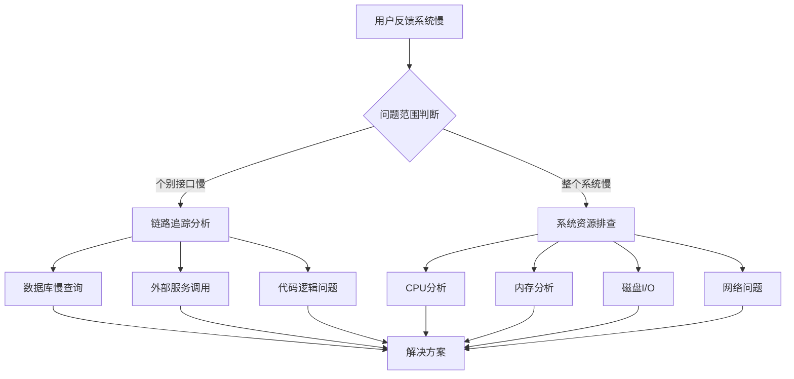
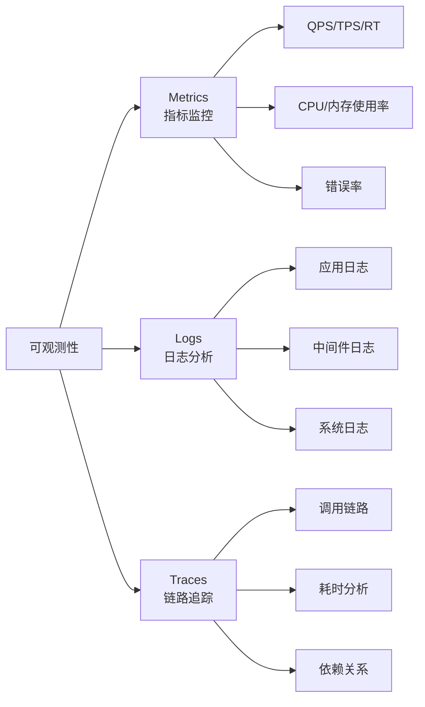
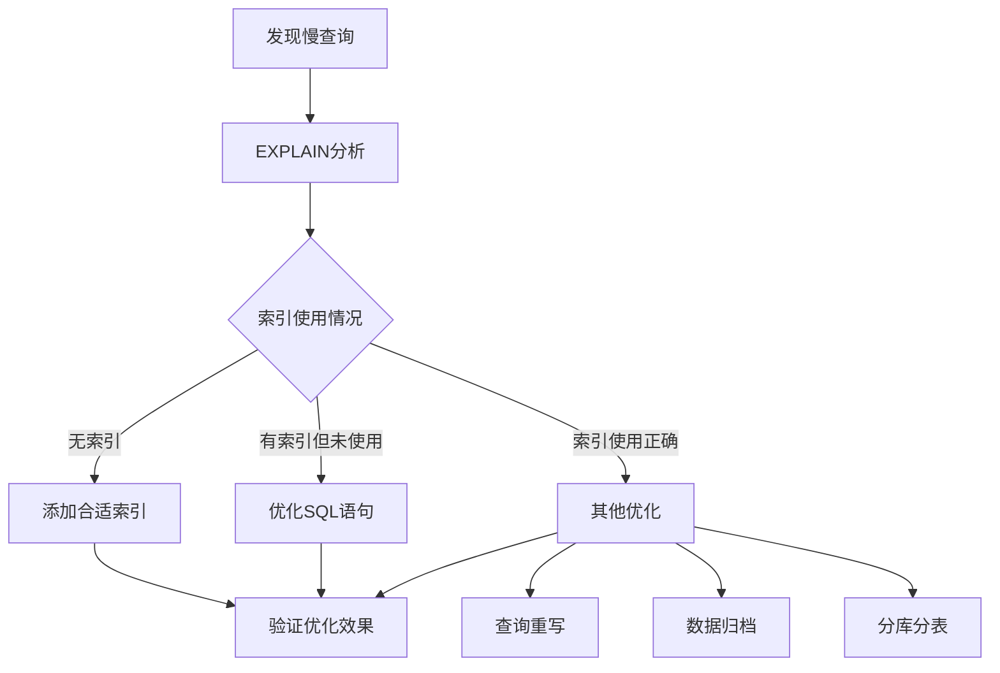
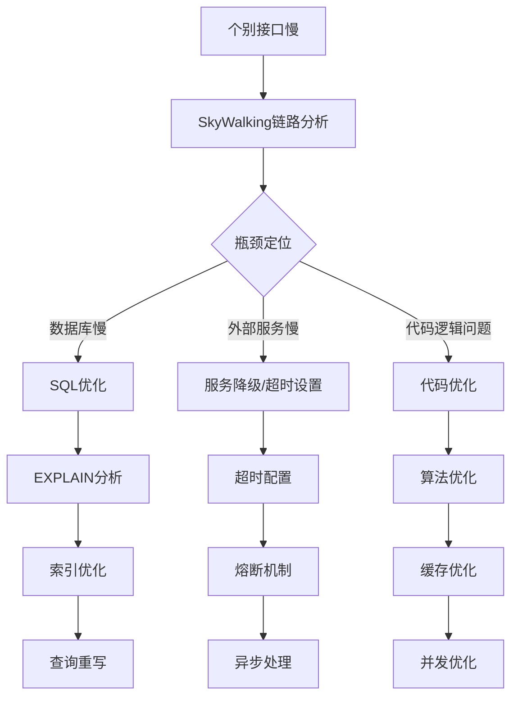
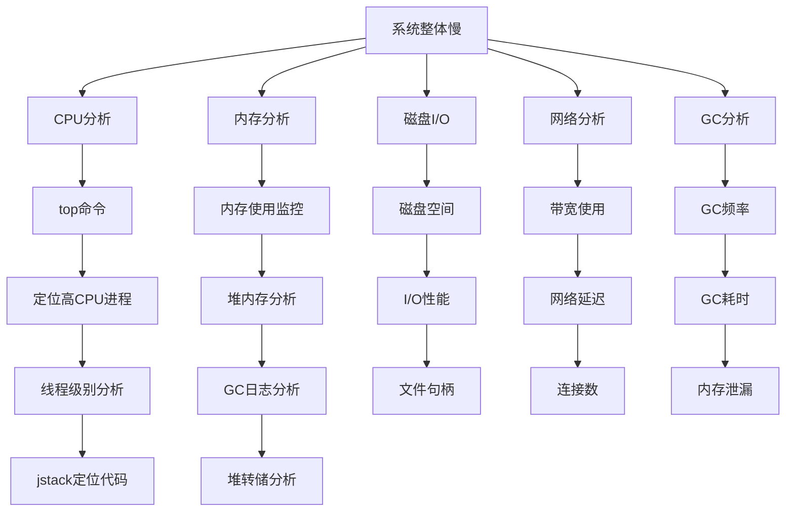
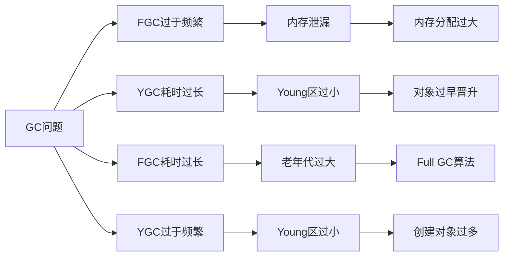
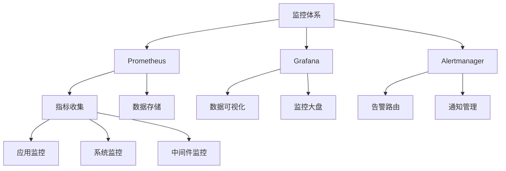
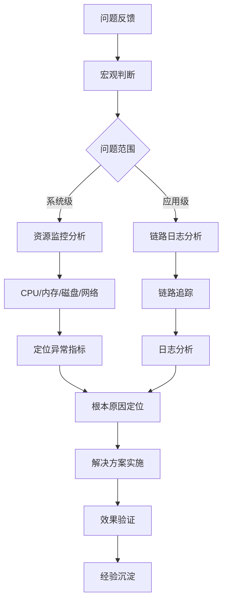

作为开发人员，最头疼的就是接到用户反馈"系统好慢"、"页面打不开"。面对这种模糊的问题描述，如何快速定位并解决？本文将带你建立完整的线上问题排查体系。
<!-- more -->

## 🎯 问题来了：用户反馈系统卡顿，怎么办？



## 📊 第一步：快速判断问题范围

### 是个别接口慢还是整个系统慢？

**🔍 个别接口慢的典型特征**：

- ✅ 只有特定功能操作缓慢
- ✅ 其他功能响应正常  
- ✅ 特定用户或特定数据操作时出现

**🌐 整个系统慢的典型特征**：

- ❌ 大部分页面打开都很慢
- ❌ 多个用户同时反馈问题
- ❌ 系统监控告警集中出现

## 👁️ 第二步：建立监控体系 - 问题发现的"火眼金睛"

### 2.1 可观测性三大支柱

现代分布式系统必须建立完善的可观测性体系：



**📈 Metrics（指标监控）**

- 系统性能：请求成功率、吞吐量(QPS/TPS)、响应时间(RT)
- 资源使用：CPU、内存、磁盘、网络使用率
- 业务指标：订单创建成功率、支付成功率等

**📝 Logs（日志分析）**

- 应用日志：错误堆栈、业务异常记录
- 中间件日志：数据库慢查询、Redis超时等
- 系统日志：操作系统级异常信息

**🔗 Traces（链路追踪）**

- 请求完整调用链路
- 每个环节的耗时分析
- 服务间依赖关系

### 2.2 关键性能指标基准

| 行业 | 响应时间标准 | 处理能力(TPS) | 错误率要求 |
|------|-------------|--------------|------------|
| 🛒 互联网电商 | 500ms以下 | 10,000-1,000,000 | ≤0.6% |
| 🏦 金融行业 | 1-3秒以下 | 1,000-50,000 | ≤0.6% |
| 🏭 制造业 | 3-5秒以下 | 10-5,000 | ≤0.6% |

## 🗄️ 第三步：数据库问题排查 - 最常见的"罪魁祸首"

### 3.1 开启慢查询日志

```sql
-- 🚀 临时开启（无需重启）
SET GLOBAL slow_query_log = 'ON';
SET GLOBAL slow_query_log_file = '/var/log/mysql/slow.log';
SET GLOBAL long_query_time = 2;  -- 超过2秒的记录

-- 💾 永久开启（修改my.cnf）
[mysqld]
slow_query_log = ON
slow_query_log_file = /var/log/mysql/slow.log
long_query_time = 2
```

### 3.2 慢查询分析流程



## 🕵️ 第四步：使用链路追踪 - 请求的"行车记录仪"

当接口逻辑复杂（查数据库、调外部服务、发消息等），传统排查方法效率低下。

**SkyWalking实战效果**：

```
🌐 用户请求 (总耗时: 1.2s)
├── 🔗 网关处理 (15ms)
├── 🏗️ 业务服务A (800ms)
│   ├── 💾 MySQL查询 (650ms)
│   ├── 🔴 Redis查询 (50ms) 
│   └── ⚡ 业务逻辑 (100ms)
├── 🔗 外部服务调用 (300ms)
└── 📨 消息发送 (85ms)
```

## 🔧 第五步：深入问题排查

### 5.1 个别接口响应慢排查流程



### 5.2 死锁问题排查与预防

**🔗 死锁产生条件**：

```
线程A: 持有锁1 → 等待锁2
线程B: 持有锁2 → 等待锁1
```

**🛠️ 排查命令**：

```bash
# 1. 查找Java进程
jps

# 2. 分析线程堆栈
jstack <pid>

# 3. 搜索死锁信息
jstack <pid> | grep -A 20 -B 5 "deadlock"
```

### 5.3 系统整体慢的全面排查体系



#### 🖥️ CPU占用过高排查实战

```bash
# 1. 找到占用CPU最高的进程
top

# 2. 查看该进程的线程情况（假设进程ID为1893）
top -Hp 1893

# 3. 将线程ID转为16进制（假设线程ID为4519）
printf %x 4519  # 输出：11a7

# 4. 查看线程堆栈定位代码
jstack 1893 | grep 11a7 -A 30
```

**🚨 CPU飙升常见原因**：

- 🔄 无限循环或递归调用
- 🗑️ 频繁的GC操作
- 📝 复杂的正则表达式
- 💾 大量的序列化操作
- 🧵 线程上下文切换频繁

#### 💾 内存问题排查

```bash
# 1. 生成堆转储文件（生产环境慎用）
jmap -dump:format=b,file=heap.hprof <pid>

# 2. 使用MAT分析内存泄漏
```

#### 🗃️ 垃圾回收问题分类



**📊 GC监控命令**：
```bash
# 实时监控GC情况
jstat -gcutil <pid> 1000

# 输出说明：
# S0/S1: Survivor区使用率
# E: Eden区使用率  
# O: 老年代使用率
# YGC/YGCT: Young GC次数和耗时
# FGC/FGCT: Full GC次数和耗时
```

## 🛡️ 第六步：预防优于治疗 - 建立常态化监控

### 推荐监控工具栈：



**🔔 告警策略配置**：

- ⏰ 设置合理的阈值（如：CPU持续>80%）
- 🎯 关键业务指标异常告警
- 📱 建立多通道通知（邮件、短信、钉钉）
- 👥 建立值班响应机制

## 🧠 排查心法：从宏观到微观



1. **🎯 先整体后局部**：先判断是整个系统问题还是个别功能问题
2. **🌐 先外部后内部**：先排查网络、负载均衡等外部因素  
3. **💻 先应用后系统**：先检查应用日志，再查系统资源
4. **📊 有监控不盲猜**：依赖数据而不是直觉

## 📋 排查清单：快速参考

| 问题类型 | 首要检查 | 关键命令 | 工具推荐 |
|---------|----------|----------|----------|
| 🔗 链路缓慢 | SkyWalking | trace分析 | SkyWalking/Zipkin |
| 🗄️ 数据库慢 | 慢查询日志 | EXPLAIN | MySQL Workbench |
| 🖥️ CPU高 | 进程线程分析 | top, jstack | Arthas |
| 💾 内存泄漏 | 堆内存分析 | jmap, jstat | MAT, JProfiler |
| 🗃️ GC问题 | GC日志 | jstat, GC日志 | GCeasy |
| 🌐 网络问题 | 带宽延迟 | ping, netstat | Wireshark |

## 🎉 总结

线上问题排查就像"破案"，需要：

- 🕵️ **完整的线索收集**（日志、监控、追踪）
- 🔍 **系统的分析思路**（从外到内、从整体到局部）  
- 🛠️ **合适的工具使用**（jstack、jmap、SkyWalking等）
- 📊 **数据的客观判断**（依赖监控数据而非主观感受）

> 💡 **记住**：最好的故障排查是没有故障发生。建立完善的监控预警体系，在用户反馈前发现问题、解决问题，这才是工程能力的真正体现。