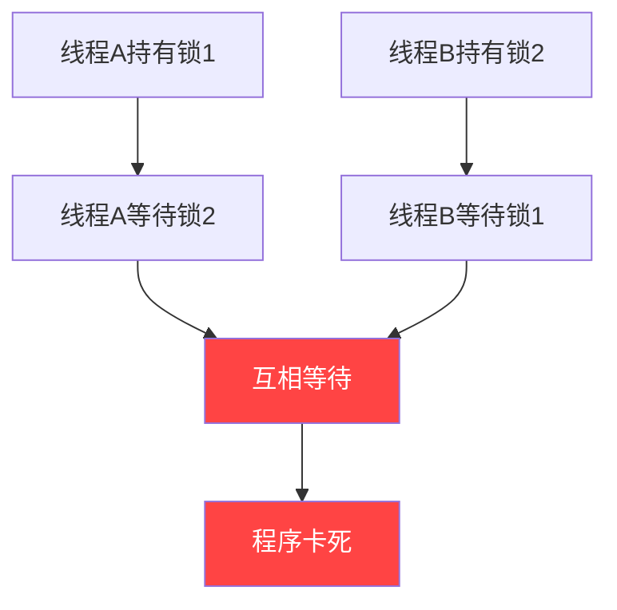
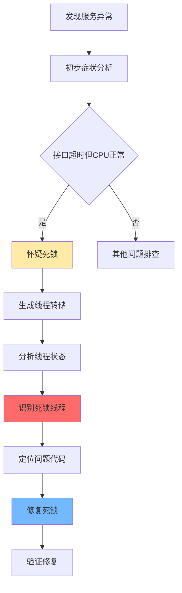
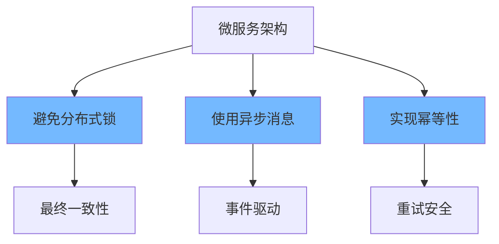
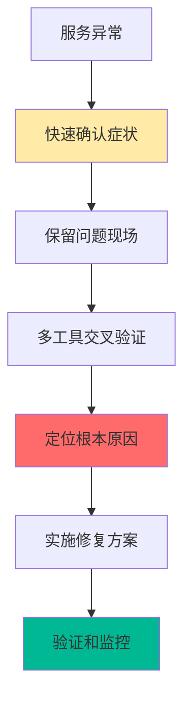

**死锁**是指两个或多个线程互相等待对方持有的资源，导致所有线程都无法继续执行的状态。在线生产环境中，死锁会导致服务**部分或完全不可用**，且通常**不会自动恢复**。
<!-- more -->

## 💥 什么是死锁？为什么它如此危险？



## 🔍 死锁的四个必要条件

1. **互斥条件**：资源不能被共享，只能由一个线程使用
2. **请求与保持条件**：线程持有资源的同时请求其他资源
3. **不可剥夺条件**：资源只能由持有线程主动释放
4. **循环等待条件**：多个线程形成环形等待链

## 🚨 如何发现死锁？

### 监控告警 - 第一道防线

**死锁的典型症状**：

- ✅ 服务接口超时率突然上升
- ✅ 线程池活跃线程数异常增高
- ✅ CPU使用率正常但吞吐量下降
- ✅ 应用日志中出现线程阻塞警告

### 健康检查脚本

```bash
#!/bin/bash
# 死锁检测脚本
APP_PID=$(jps -l | grep your-app | awk '{print $1}')

if [ -z "$APP_PID" ]; then
    echo "应用未运行"
    exit 1
fi

# 检查线程状态
THREAD_DUMP=$(jstack $APP_PID)
BLOCKED_THREADS=$(echo "$THREAD_DUMP" | grep -c "BLOCKED")
DEADLOCK_INFO=$(echo "$THREAD_DUMP" | grep -A 10 "deadlock")

if [ -n "$DEADLOCK_INFO" ]; then
    echo "🔴 检测到死锁！"
    echo "$DEADLOCK_INFO"
    # 发送告警
    send_alert "检测到死锁" "$DEADLOCK_INFO"
fi

if [ $BLOCKED_THREADS -gt 20 ]; then
    echo "🟡 检测到大量阻塞线程: $BLOCKED_THREADS"
fi
```

## 🕵️ 死锁排查实战

### 完整排查流程



### 步骤1：生成线程转储（Thread Dump）

```bash
# 方法1：使用jstack命令
jstack -l <PID> > thread_dump_$(date +%Y%m%d_%H%M%S).log

# 方法2：使用jcmd命令
jcmd <PID> Thread.print > thread_dump.log

# 方法3：向进程发送信号（Linux）
kill -3 <PID>

# 方法4：使用Arthas
thread -b > deadlock_threads.log
```

### 步骤2：分析线程转储

#### 查找死锁信息

在线程转储文件中搜索死锁相关信息：

```bash
# 查找死锁标记
grep -i "deadlock" thread_dump.log

# 查找阻塞的线程
grep -B 5 -A 15 "BLOCKED" thread_dump.log

# 查找等待锁的线程
grep -B 5 -A 15 "waiting to lock" thread_dump.log
```

#### 死锁分析示例

**典型的死锁线程转储**：
```
Found one Java-level deadlock:
=============================
"Thread-1":
  waiting to lock monitor 0x000000076adab1c0 (object 0x000000076b5bf1c0, a java.lang.Object),
  which is held by "Thread-0"
"Thread-0":
  waiting to lock monitor 0x000000076adab1d0 (object 0x000000076b5bf1d0, a java.lang.Object),
  which is held by "Thread-1"

Java stack information for the threads listed above:
===================================================
"Thread-1":
        at com.example.DeadLockExample.methodB(DeadLockExample.java:30)
        - waiting to lock <0x000000076b5bf1c0> (a java.lang.Object)
        - locked <0x000000076b5bf1d0> (a java.lang.Object)
        at com.example.DeadLockExample.runThread1(DeadLockExample.java:45)
"Thread-0":
        at com.example.DeadLockExample.methodA(DeadLockExample.java:15)
        - waiting to lock <0x000000076b5bf1d0> (a java.lang.Object)
        - locked <0x000000076b5bf1c0> (a java.lang.Object)
        at com.example.DeadLockExample.runThread0(DeadLockExample.java:40)
```

### 步骤3：使用可视化工具分析

#### JConsole / JVisualVM

```bash
# 启动JConsole
jconsole <PID>

# 启动JVisualVM  
jvisualvm
```

在JConsole中：
1. 切换到"线程"标签页
2. 点击"检测死锁"按钮
3. 查看死锁的详细信息

#### Arthas（推荐用于生产环境）

```bash
# 启动Arthas
java -jar arthas-boot.jar

# 检测死锁
thread -b

# 查看所有线程状态
thread

# 查看特定线程的堆栈
thread <线程ID>
```

## 🔧 死锁代码案例与分析

### 案例1：经典的循环等待死锁

```java
public class ClassicDeadlock {
    private final Object lockA = new Object();
    private final Object lockB = new Object();
    
    public void method1() {
        synchronized (lockA) {
            System.out.println(Thread.currentThread().getName() + " 获取 lockA");
            try { Thread.sleep(100); } catch (InterruptedException e) {}
            
            synchronized (lockB) {  // 🚨 等待lockB
                System.out.println(Thread.currentThread().getName() + " 获取 lockB");
            }
        }
    }
    
    public void method2() {
        synchronized (lockB) {
            System.out.println(Thread.currentThread().getName() + " 获取 lockB");
            try { Thread.sleep(100); } catch (InterruptedException e) {}
            
            synchronized (lockA) {  // 🚨 等待lockA
                System.out.println(Thread.currentThread().getName() + " 获取 lockA");
            }
        }
    }
    
    public static void main(String[] args) {
        ClassicDeadlock demo = new ClassicDeadlock();
        
        new Thread(demo::method1, "Thread-1").start();
        new Thread(demo::method2, "Thread-2").start();
    }
}
```

### 案例2：数据库事务死锁

```java
@Service
public class OrderService {
    
    @Transactional
    public void transferMoney(Long fromAccountId, Long toAccountId, BigDecimal amount) {
        // 🚨 可能发生数据库死锁
        Account fromAccount = accountRepository.findById(fromAccountId)
                            .orElseThrow(() -> new AccountNotFoundException(fromAccountId));
        Account toAccount = accountRepository.findById(toAccountId)
                          .orElseThrow(() -> new AccountNotFoundException(toAccountId));
        
        fromAccount.debit(amount);
        toAccount.credit(amount);
        
        accountRepository.save(fromAccount);
        accountRepository.save(toAccount);  // 不同的事务顺序可能导致死锁
    }
}
```

## 🛠️ 死锁解决方案

### 方案1：锁顺序化

```java
public class LockOrderingSolution {
    private final Object lockA = new Object();
    private final Object lockB = new Object();
    
    // 定义锁的获取顺序
    public void method1() {
        synchronized (lockA) {  // 先获取lockA
            synchronized (lockB) {  // 再获取lockB
                // 业务逻辑
            }
        }
    }
    
    public void method2() {
        synchronized (lockA) {  // 同样先获取lockA
            synchronized (lockB) {  // 再获取lockB
                // 业务逻辑
            }
        }
    }
}
```

### 方案2：使用超时机制

```java
public class TimeoutLockSolution {
    private final Lock lockA = new ReentrantLock();
    private final Lock lockB = new ReentrantLock();
    
    public boolean transferWithTimeout() {
        try {
            if (lockA.tryLock(1, TimeUnit.SECONDS)) {
                try {
                    if (lockB.tryLock(1, TimeUnit.SECONDS)) {
                        try {
                            // 业务逻辑
                            return true;
                        } finally {
                            lockB.unlock();
                        }
                    }
                } finally {
                    lockA.unlock();
                }
            }
        } catch (InterruptedException e) {
            Thread.currentThread().interrupt();
        }
        // 获取锁超时，执行回滚或重试逻辑
        rollbackOperation();
        return false;
    }
}
```

### 方案3：使用原子操作

```java
public class AtomicSolution {
    private final AtomicReference<BigDecimal> balanceA = new AtomicReference<>(BigDecimal.ZERO);
    private final AtomicReference<BigDecimal> balanceB = new AtomicReference<>(BigDecimal.ZERO);
    
    public boolean atomicTransfer(BigDecimal amount) {
        while (true) {
            BigDecimal currentA = balanceA.get();
            BigDecimal currentB = balanceB.get();
            
            if (currentA.compareTo(amount) < 0) {
                return false; // 余额不足
            }
            
            BigDecimal newA = currentA.subtract(amount);
            BigDecimal newB = currentB.add(amount);
            
            // CAS操作，避免锁
            if (balanceA.compareAndSet(currentA, newA) && 
                balanceB.compareAndSet(currentB, newB)) {
                return true;
            }
            // 重试
        }
    }
}
```

### 方案4：数据库死锁处理

```java
@Repository
public class AccountRepository {
    
    @Retryable(value = {CannotAcquireLockException.class, DeadlockLoserDataAccessException.class}, 
               maxAttempts = 3, backoff = @Backoff(delay = 100))
    @Transactional
    public void transferWithRetry(Long fromId, Long toId, BigDecimal amount) {
        // 使用数据库行锁，按固定顺序更新
        String sql = "UPDATE accounts SET balance = balance - ? WHERE id = ? AND balance >= ?";
        jdbcTemplate.update(sql, amount, Math.min(fromId, toId), amount);
        jdbcTemplate.update(sql, amount, Math.max(fromId, toId), amount);
    }
}
```

## 📋 死锁预防最佳实践

### 1. 代码开发规范

```java
// ✅ 好的实践：使用统一的锁顺序
public class LockManager {
    private static final Object FIRST_LOCK = new Object();
    private static final Object SECOND_LOCK = new Object();
    
    public void operation1() {
        synchronized (FIRST_LOCK) {
            synchronized (SECOND_LOCK) {
                // 业务逻辑
            }
        }
    }
    
    public void operation2() {
        synchronized (FIRST_LOCK) {
            synchronized (SECOND_LOCK) {
                // 业务逻辑
            }
        }
    }
}

// ✅ 使用更高层次的并发工具
public class ConcurrentService {
    private final ExecutorService executor = Executors.newFixedThreadPool(10);
    private final Phaser phaser = new Phaser();
    
    public void processConcurrently(List<Runnable> tasks) {
        tasks.forEach(task -> executor.submit(() -> {
            phaser.register();
            try {
                task.run();
            } finally {
                phaser.arriveAndDeregister();
            }
        }));
        phaser.awaitAdvance(phaser.getPhase());
    }
}
```

### 2. 架构设计建议



### 3. 监控和告警配置

**Prometheus告警规则**：
```yaml
groups:
- name: deadlock_detection
  rules:
  - alert: ThreadDeadlock
    expr: increase(jvm_threads_deadlock[5m]) > 0
    for: 1m
    labels:
      severity: critical
    annotations:
      summary: "检测到JVM线程死锁"
      
  - alert: HighBlockedThreads
    expr: jvm_threads_blocked > 10
    for: 2m
    labels:
      severity: warning
    annotations:
      summary: "阻塞线程数超过阈值"
```

## 🚀 高级排查技巧

### 使用Arthas进行实时诊断

```bash
# 1. 启动Arthas并附加到目标进程
java -jar arthas-boot.jar

# 2. 实时监控线程状态
dashboard

# 3. 检测死锁
thread -b

# 4. 监控方法调用
watch com.example.Service * '{params, target, returnObj}' -x 3

# 5. 生成火焰图分析性能
profiler start
profiler stop --format html
```

### 自动化死锁检测脚本

```bash
#!/bin/bash
# 自动化死锁检测和恢复脚本

detect_and_recover_deadlock() {
    local APP_NAME=$1
    local PID=$(jps -l | grep $APP_NAME | awk '{print $1}')
    
    if [ -z "$PID" ]; then
        echo "应用未运行"
        return 1
    fi
    
    # 检测死锁
    local DEADLOCK_INFO=$(jstack $PID | grep -A 20 "deadlock")
    
    if [ -n "$DEADLOCK_INFO" ]; then
        echo "检测到死锁，正在生成诊断信息..."
        
        # 生成完整的诊断包
        jstack $PID > /tmp/thread_dump_$PID.log
        jmap -histo:live $PID > /tmp/heap_histo_$PID.log
        
        # 发送告警
        send_alert "死锁检测" "$DEADLOCK_INFO"
        
        # 根据策略决定是否重启
        if [ "$AUTO_RECOVER" = "true" ]; then
            echo "自动恢复：重启应用"
            restart_application
        fi
        
        return 0
    else
        echo "未检测到死锁"
        return 1
    fi
}
```

## 📊 死锁排查工具箱

| 工具 | 用途 | 适用场景 |
|------|------|----------|
| `jstack` | 线程转储分析 | 基础死锁检测 |
| `jcmd` | 线程分析 | JDK7+ 推荐 |
| JConsole | 图形化监控 | 开发环境 |
| JVisualVM | 高级分析 | 性能 profiling |
| Arthas | 在线诊断 | 生产环境首选 |
| APM工具 | 全链路监控 | 分布式系统 |

## 💡 总结与经验分享

### 排查心法



> 🎯 **记住**：死锁问题不会自行解决，必须主动干预。建立完善的监控体系和排查流程，才能在死锁发生时快速定位并解决问题。