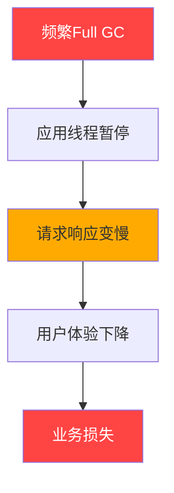
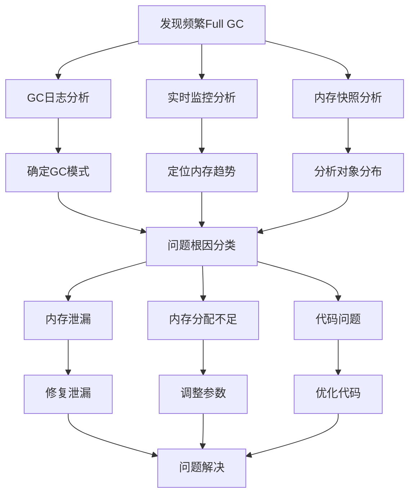
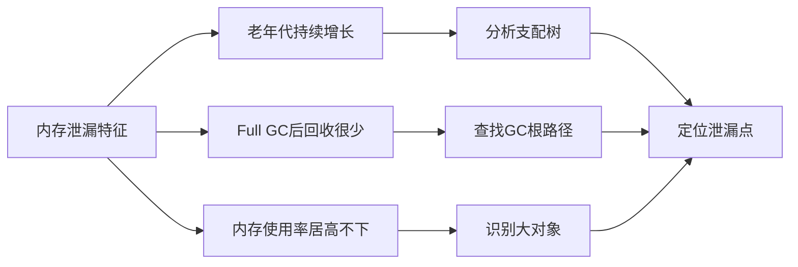
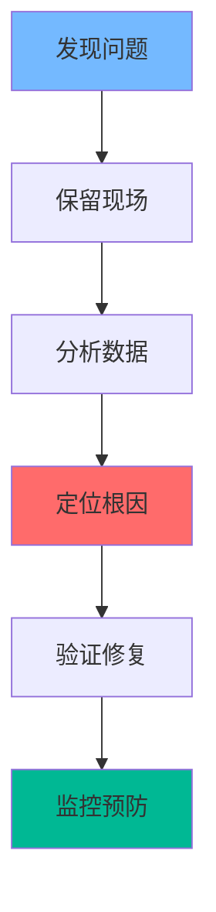

Full GC（全局垃圾回收）是JVM中**最耗时的垃圾回收操作**，它会**暂停所有应用线程**（Stop-The-World），导致服务响应变慢甚至超时。频繁的Full GC通常是系统性能问题的**红色警报**！
<!-- more -->

## 💥 问题背景：Full GC的严重性



## 🔍 问题发现：如何识别Full GC问题

### 1. 监控告警 - 第一道防线

**监控指标**：

- Full GC频率 > 1次/分钟
- Full GC耗时 > 1秒/次
- 应用响应时间(P95)突增
- 系统吞吐量下降

### 2. GC日志分析 - 必备配置

```java
// JVM启动参数 - 必须配置！
-XX:+PrintGCDetails
-XX:+PrintGCDateStamps
-XX:+PrintGCTimeStamps
-XX:+PrintGCCause
-XX:+UseGCLogFileRotation
-XX:NumberOfGCLogFiles=5
-XX:GCLogFileSize=10M
-Xloggc:/path/to/gc.log
```

### 3. 实时监控命令

```bash
# 实时查看GC情况
jstat -gcutil <pid> 1000

# 输出示例：
#  S0     S1     E      O      M     CCS    YGC     YGCT    FGC    FGCT     GCT
#  0.00   0.00  65.00  95.00  88.24  66.67    150    1.200    25    15.450   16.650
#  ↑重点关注：FGC(Full GC次数)和FGCT(Full GC总时间)快速增长
```

## 🕵️ 问题定位：系统性排查方法

### 完整排查流程



### 1. GC日志深度分析

**典型的Full GC日志**：

```
2024-01-15T10:30:00.123+0800: 12045.876: [Full GC (Allocation Failure) 
  [PSYoungGen: 0K->0K(921600K)] 
  [ParOldGen: 819200K->819190K(819200K)] 819200K->819190K(1740800K), 
  [Metaspace: 85632K->85632K(1146880K)], 1.2345678 secs]
```

**关键信息解读**：

- `Allocation Failure`：分配失败触发Full GC
- `ParOldGen: 819200K->819190K`：老年代回收前后变化很小 → 可能内存泄漏
- `1.2345678 secs`：Full GC耗时过长

### 2. JStat实时监控分析

```bash
# 持续监控，重点关注O(老年代)和FGC
watch "jstat -gcutil <pid> | awk '{print \"O:\" \$4 \" FGC:\" \$8 \" FGCT:\" \$9}'"

# 自动化监控脚本
#!/bin/bash
PID=$1
while true; do
    gc_info=$(jstat -gcutil $PID | tail -1)
    o_usage=$(echo $gc_info | awk '{print $4}')
    fgc_count=$(echo $gc_info | awk '{print $8}')
    
    if [ $(echo "$o_usage > 90" | bc) -eq 1 ] || [ $fgc_count -gt 5 ]; then
        echo "警告：内存使用率 $o_usage%, FGC: $fgc_count"
        # 自动生成堆转储
        jmap -dump:live,format=b,file=/tmp/heap_emergency.hprof $PID
        break
    fi
    sleep 30
done
```

### 3. 堆内存分析 - 生成和分析Heap Dump

```bash
# 生成堆转储文件
jmap -dump:live,format=b,file=heap.hprof <pid>

# 如果jmap不可用，使用JVM参数自动生成
-XX:+HeapDumpOnOutOfMemoryError
-XX:HeapDumpPath=/path/to/heapdumps
```

## 🔧 常见问题模式及解决方案

### 模式1：内存泄漏



**使用MAT(Memory Analyzer Tool)分析**：

1. **Leak Suspects Report** - 自动检测泄漏嫌疑
2. **Dominator Tree** - 查看支配关系，找到保持大量内存的对象
3. **Path to GC Roots** - 分析为什么对象不能被回收

**常见泄漏场景**：

```java
// 场景1：静态集合累积
public class CacheManager {
    private static Map<String, Object> cache = new HashMap<>();
    
    public void addToCache(String key, Object value) {
        cache.put(key, value);  // 永远不会移除！
    }
}

// 修复：使用有大小限制的缓存
private static Cache<String, Object> cache = CacheBuilder.newBuilder()
    .maximumSize(1000)
    .expireAfterWrite(10, TimeUnit.MINUTES)
    .build();

// 场景2：ThreadLocal未清理
public class UserContext {
    private static ThreadLocal<User> currentUser = new ThreadLocal<>();
    
    // 必须在使用后清理！
    public void cleanup() {
        currentUser.remove();
    }
}
```

### 模式2：内存分配不足

**症状**：

- 年轻代过小，对象过早晋升老年代
- 堆内存总体不足

**解决方案**：

```java
// JVM参数调整示例
-Xmx4g -Xms4g           # 堆大小
-XX:NewRatio=2          # 年轻代:老年代 = 1:2
-XX:SurvivorRatio=8     # Eden:Survivor = 8:1:1

// 或者使用G1 GC的region大小调整
-XX:+UseG1GC
-XX:G1HeapRegionSize=16m
```

### 模式3：大对象分配

**问题代码**：

```java
// 在循环中创建大对象
public void processBatch() {
    while (hasMoreData()) {
        byte[] largeBuffer = new byte[10 * 1024 * 1024]; // 10MB
        // 处理逻辑...
    } // 大对象直接进入老年代！
}

// 优化：重用缓冲区或使用堆外内存
public class BufferPool {
    private static final ThreadLocal<ByteBuffer> bufferPool = 
        ThreadLocal.withInitial(() -> ByteBuffer.allocateDirect(10 * 1024 * 1024));
    
    public void processBatch() {
        ByteBuffer buffer = bufferPool.get();
        buffer.clear();
        // 使用buffer处理数据...
    }
}
```

## 🛠️ 实战排查案例

### 案例：电商订单服务频繁Full GC

**问题现象**：

- 每分钟发生2-3次Full GC
- 每次Full GC耗时2-3秒
- 订单创建接口P99响应时间从50ms上升到2000ms

**排查过程**：

1. **GC日志分析**：
```
[Full GC (Allocation Failure) 
  [PSYoungGen: 0K->0K(764800K)] 
  [ParOldGen: 819200K->818500K(819200K)] 819200K->818500K(1584000K), 2.345 secs]
```
发现老年代回收效率极低，怀疑内存泄漏。

2. **生成Heap Dump分析**：

```bash
jmap -dump:live,format=b,file=order_service.hprof <pid>
```

3. **MAT分析结果**：

- `Order`对象占用堆内存的65%
- 通过GC根路径分析，发现静态`Map`持有所有`Order`对象引用

4. **问题代码定位**：

```java
@Component
public class OrderStatistics {
    private static Map<Long, Order> orderCache = new ConcurrentHashMap<>();
    
    @EventListener
    public void handleOrderCreate(OrderCreateEvent event) {
        // 订单创建后缓存，但从未清理！
        orderCache.put(event.getOrderId(), event.getOrder());
    }
}
```

5. **解决方案**：

```java
// 方案1：使用WeakReference避免强引用
private static Map<Long, WeakReference<Order>> orderCache = new ConcurrentHashMap<>();

// 方案2：使用Caffeine缓存设置过期时间
private static Cache<Long, Order> orderCache = Caffeine.newBuilder()
    .maximumSize(10000)
    .expireAfterWrite(1, TimeUnit.HOURS)
    .build();
```

## 📊 监控和预防体系

### 1. GC监控大盘配置

**Prometheus + Grafana监控关键指标**：
```yaml
# prometheus.yml
scrape_configs:
  - job_name: 'jvm'
    static_configs:
      - targets: ['localhost:1234']
        
# 关键告警规则
groups:
- name: JVM_GC
  rules:
  - alert: FrequentFullGC
    expr: increase(jvm_gc_collection_seconds_count{gc="G1 Old Generation"}[5m]) > 5
    for: 2m
    labels:
      severity: critical
    annotations:
      summary: "5分钟内Full GC次数超过5次"
      
  - alert: LongFullGCTime
    expr: jvm_gc_collection_seconds_sum{gc="G1 Old Generation"} / jvm_gc_collection_seconds_count{gc="G1 Old Generation"} > 1
    labels:
      severity: warning
    annotations:
      summary: "Full GC平均耗时超过1秒"
```

### 2. 健康检查与自动恢复

```bash
#!/bin/bash
# 健康检查脚本
PID=$(jps -l | grep my-app | awk '{print $1}')

if [ -z "$PID" ]; then
    exit 1
fi

# 检查最近1分钟Full GC次数
FGC_COUNT=$(jstat -gcutil $PID | tail -1 | awk '{print $8}')
if [ $FGC_COUNT -gt 10 ]; then
    # 触发告警并自动生成诊断信息
    jstack $PID > /tmp/thread_dump_$(date +%s).log
    jmap -histo:live $PID > /tmp/heap_histo_$(date +%s).log
    exit 1
fi

exit 0
```

## 🎯 高级调优技巧

### G1 GC专项优化

```java
// G1 GC推荐配置
-XX:+UseG1GC
-XX:MaxGCPauseMillis=200        # 目标暂停时间
-XX:G1HeapRegionSize=16m        # Region大小
-XX:G1NewSizePercent=30         # 年轻代最小占比
-XX:G1MaxNewSizePercent=60      # 年轻代最大占比
-XX:InitiatingHeapOccupancyPercent=45  # 启动并发GC的堆占用率
```

###  ZGC低延迟方案

```java
// 对于超大堆内存应用，考虑ZGC
-XX:+UseZGC
-XX:ZAllocationSpikeTolerance=5.0
-XX:ZCollectionInterval=120
-Xmx16g -Xms16g
```

## 📋 排查工具箱

| 工具 | 用途 | 使用场景 |
|------|------|----------|
| `jstat -gcutil` | 实时GC监控 | 问题发现和实时观察 |
| `jmap -dump` | 生成堆转储 | 内存泄漏分析 |
| Eclipse MAT | 堆转储分析 | 定位内存泄漏点 |
| `jstack` | 线程分析 | 检查GC时线程状态 |
| GC日志分析工具 | GC日志解析 | 历史问题分析 |

## 💡 总结与最佳实践

### 排查心法



### 核心要点

#### 🛡️ 预防优于治疗

   - 完善的GC日志配置
   - 建立监控告警体系
   - 定期性能压测
#### 🔧 工具熟练使用

   - 掌握jstat实时监控
   - 熟练使用MAT分析堆转储
   - 理解GC日志格式

#### 📊 数据驱动决策

   - 基于数据而非直觉
   - 建立性能基线
   - A/B测试验证优化效果

#### 🔄 持续优化文化

   - 代码审查关注性能
   - 分享排查经验
   - 建立性能知识库

> 🚀 **记住**：频繁Full GC不是单一问题，而是系统性的性能病症。通过系统化的排查方法和完善的监控体系，我们不仅能够快速解决当前问题，更能预防未来类似问题的发生。
