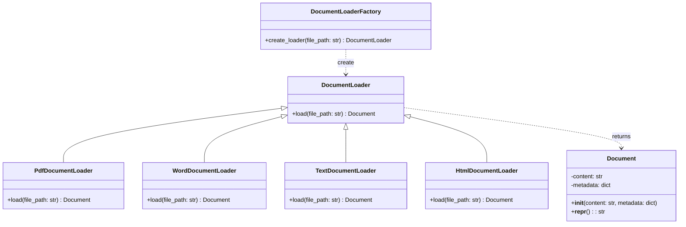
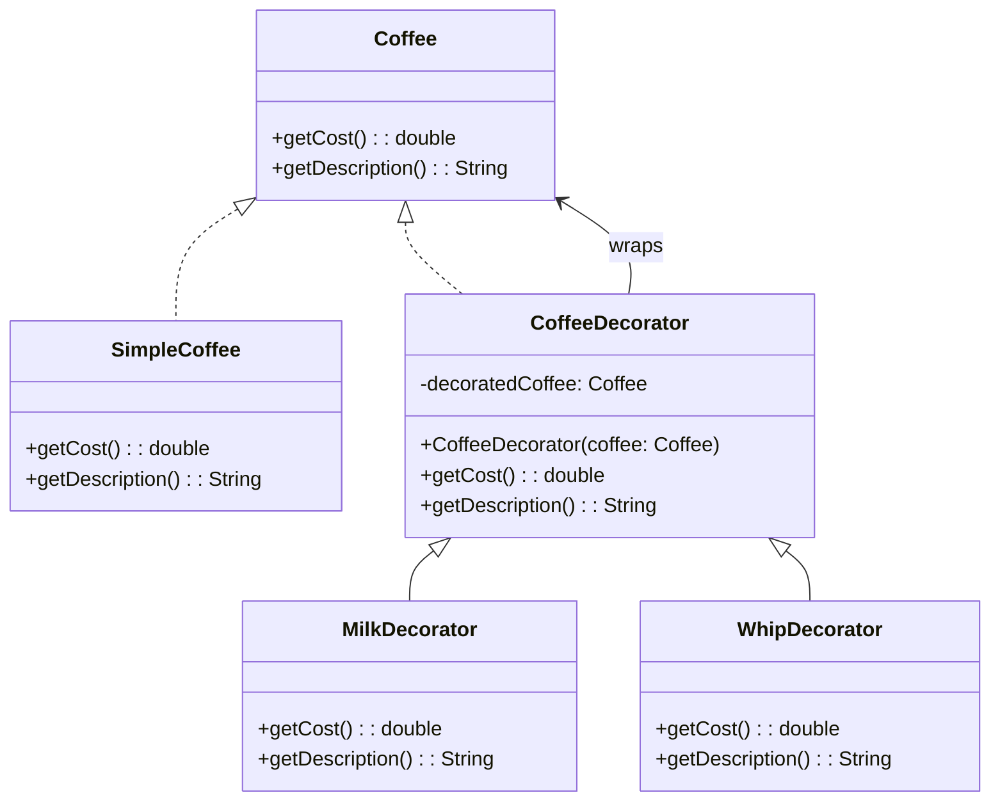
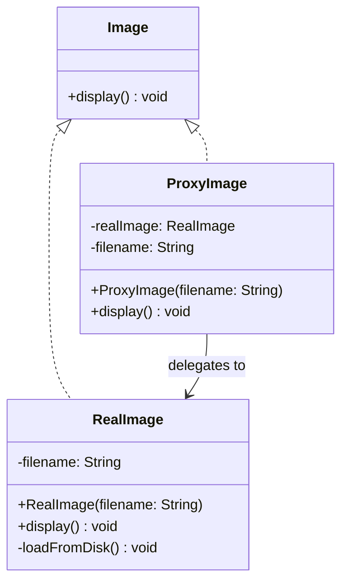

设计模式是软件设计中针对常见问题的 可复用解决方案模板 ，是 最佳实践的总结 ，能提高代码的可维护性、可扩展性和可复用性。昨天在面试蚂蚁的时候，被问到了设计模式的问题，我回答的不是很好，今天就来总结一下常见的设计模式，及其在工作中的应用。
<!-- more -->

## 一、 创建型模式 (Creational Patterns) - 关注对象创建机制

### 1. 单例模式 (Singleton Pattern)

*   **意图：** 确保一个类只有一个实例，并提供一个全局访问点。
*   **关键点：**
    *   私有化构造函数（防止外部 `new`）。
    *   提供一个静态方法（如 `getInstance()`）来获取唯一实例。
    *   在静态方法内部控制实例的创建（通常是延迟初始化）。
    *   需要考虑线程安全（尤其在多线程环境下）。
*   **工作场景举例：**
    *   **配置管理器：** 一个系统通常只需要一份全局配置信息（如数据库连接字符串、应用设置）。使用单例模式确保所有模块访问的都是同一份配置对象，避免重复加载和不一致。
    *   **日志记录器：** 应用中的日志记录通常需要集中管理，写入同一个文件或发送到同一个服务。单例模式保证日志记录器实例唯一。
    *   **数据库连接池：** 管理有限数据库连接资源的池通常只需要一个实例。
*   **伪代码示例：**

```java
public class ConfigManager {
    private static ConfigManager instance;
    private Properties configs; // 存放配置

    // 私有构造函数
    private ConfigManager() {
        loadConfigs(); // 加载配置
    }

    // 获取单例实例 (简单示例，未考虑线程安全)
    public static ConfigManager getInstance() {
        if (instance == null) {
            instance = new ConfigManager();
        }
        return instance;
    }

    public String getConfig(String key) {
        return configs.getProperty(key);
    }

    private void loadConfigs() {
        // ... 从文件或数据库加载配置
    }
}

// 使用
String dbUrl = ConfigManager.getInstance().getConfig("database.url");
```

### 2. 工厂方法模式 (Factory Method Pattern)

*   **意图：** 定义一个创建对象的接口，让其子类决定实例化哪一个具体的类。工厂模式使对象的创建过程延迟到子类。
*   **关键点：**
    *   定义一个抽象的 `Creator` 类，其中包含一个抽象的 `factoryMethod()` 用于创建产品对象。
    *   具体的 `ConcreteCreator` 子类实现 `factoryMethod()`，返回具体的 `ConcreteProduct` 对象。
    *   客户端代码通过 `Creator` 的接口调用 `factoryMethod()` 来获取产品，无需关心具体产品类。
*   **与简单工厂区别：** 简单工厂通常在一个静态方法里根据参数用 `if-else/switch` 创建不同产品，不符合开闭原则（增加新产品需修改工厂类）。工厂方法模式通过子类化解决了这个问题。
*   **工作场景举例：**
    *   **支付系统：** 有 `Payment` 接口，具体实现有 `CreditCardPayment`, `PayPalPayment`, `WeChatPayment`。定义一个抽象 `PaymentProcessor` (Creator)，其 `createPayment()` (factoryMethod) 由 `CreditCardProcessor`, `PayPalProcessor` 等子类实现，分别返回对应的支付方式对象。新增支付方式时，只需添加新的 `ConcreteProduct` 和对应的 `ConcreteCreator` 子类，无需修改现有处理器代码。
    *   **跨平台 UI 组件：** `Button` 接口，有 `WindowsButton`, `MacButton` 实现。抽象 `Dialog` (Creator) 定义 `createButton()` (factoryMethod)。`WindowsDialog` 和 `MacDialog` 子类分别实现 `createButton()` 返回对应平台的按钮。应用根据运行平台创建相应的 `Dialog` 子类。
    *   **文档处理系统：** `Document` 接口 (Product)，有 `WordDocument`, `PDFDocument` 实现。`Application` (Creator) 定义 `createDocument()` (factoryMethod)。`WordApp`, `PDFApp` 子类实现该方法创建特定类型文档。
*   **示例：**
在RAG系统中，第一步需要加载各种类型的文档（PDF、Word、HTML等）。每种文档类型需要不同的加载器实现，工厂模式完美解决这个问题：



```python
from abc import ABC, abstractmethod
import os

# 文档类 - 表示加载后的文档内容
class Document:
    def __init__(self, content: str, metadata: dict = None):
        self.content = content
        self.metadata = metadata or {}
    
    def __repr__(self):
        return f"Document(content={self.content[:50]}..., metadata={self.metadata})"

# 文档加载器接口
class DocumentLoader(ABC):
    @abstractmethod
    def load(self, file_path: str) -> Document:
        """加载文档并返回Document对象"""
        pass

# 具体加载器实现
class PdfDocumentLoader(DocumentLoader):
    def load(self, file_path: str) -> Document:
        # 实际应用中会使用PyPDF2、pdfplumber等库
        print(f"使用PDF加载器处理: {file_path}")
        # 模拟PDF加载逻辑
        content = f"PDF内容: {os.path.basename(file_path)}"
        metadata = {
            "type": "pdf",
            "pages": 10,
            "author": "PDF Author"
        }
        return Document(content, metadata)

class WordDocumentLoader(DocumentLoader):
    def load(self, file_path: str) -> Document:
        # 实际应用中会使用python-docx库
        print(f"使用Word加载器处理: {file_path}")
        # 模拟Word加载逻辑
        content = f"Word内容: {os.path.basename(file_path)}"
        metadata = {
            "type": "docx",
            "sections": 5,
            "created_by": "Word User"
        }
        return Document(content, metadata)

class TextDocumentLoader(DocumentLoader):
    def load(self, file_path: str) -> Document:
        # 实际应用中直接读取文件内容
        print(f"使用文本加载器处理: {file_path}")
        # 模拟文本加载逻辑
        with open(file_path, 'r', encoding='utf-8') as f:
            content = f.read(500)  # 只读取前500字符作为示例
        metadata = {
            "type": "txt",
            "encoding": "utf-8"
        }
        return Document(content, metadata)

class HtmlDocumentLoader(DocumentLoader):
    def load(self, file_path: str) -> Document:
        # 实际应用中会使用BeautifulSoup等库
        print(f"使用HTML加载器处理: {file_path}")
        # 模拟HTML加载逻辑
        content = f"HTML内容: {os.path.basename(file_path)}"
        metadata = {
            "type": "html",
            "tags": ["div", "p", "h1"]
        }
        return Document(content, metadata)

# 文档加载器工厂
class DocumentLoaderFactory:
    @staticmethod
    def create_loader(file_path: str) -> DocumentLoader:
        """根据文件扩展名创建对应的文档加载器"""
        # 获取文件扩展名（不带点）
        ext = os.path.splitext(file_path)[1][1:].lower()
        
        # 映射文件类型到对应的加载器
        loader_map = {
            'pdf': PdfDocumentLoader,
            'docx': WordDocumentLoader,
            'doc': WordDocumentLoader,
            'txt': TextDocumentLoader,
            'html': HtmlDocumentLoader,
            'htm': HtmlDocumentLoader
        }
        
        # 获取对应的加载器类
        loader_class = loader_map.get(ext)
        
        if loader_class:
            return loader_class()
        else:
            raise ValueError(f"不支持的文件类型: {ext}")

# RAG系统文档处理模块
class RAGDocumentProcessor:
    def __init__(self):
        self.loaded_documents = []
    
    def process_directory(self, directory_path: str):
        """处理目录中的所有文档"""
        print(f"\n开始处理目录: {directory_path}")
        
        # 遍历目录中的所有文件
        for filename in os.listdir(directory_path):
            file_path = os.path.join(directory_path, filename)
            
            # 跳过目录
            if os.path.isdir(file_path):
                continue
                
            try:
                # 使用工厂创建加载器
                loader = DocumentLoaderFactory.create_loader(file_path)
                
                # 加载文档
                document = loader.load(file_path)
                
                # 添加到已加载文档列表
                self.loaded_documents.append(document)
                
                print(f"成功加载文档: {filename}")
                print(f"元数据: {document.metadata}")
                
            except ValueError as e:
                print(f"跳过文件 {filename}: {str(e)}")
            except Exception as e:
                print(f"处理文件 {filename} 时出错: {str(e)}")
    
    def get_document_count(self) -> int:
        return len(self.loaded_documents)
    
    def show_documents(self):
        print("\n已加载文档摘要:")
        for i, doc in enumerate(self.loaded_documents, 1):
            print(f"{i}. {doc}")

# 客户端代码
if __name__ == "__main__":
    # 创建RAG处理器
    processor = RAGDocumentProcessor()
    
    # 处理文档目录
    sample_dir = "sample_docs"
    
    # 创建示例目录（实际使用时应替换为真实目录）
    os.makedirs(sample_dir, exist_ok=True)
    
    # 创建一些示例文件
    open(os.path.join(sample_dir, "report.pdf"), 'w').close()
    open(os.path.join(sample_dir, "manual.docx"), 'w').close()
    open(os.path.join(sample_dir, "notes.txt"), 'w').close()
    open(os.path.join(sample_dir, "index.html"), 'w').close()
    open(os.path.join(sample_dir, "data.csv"), 'w').close()  # 不支持的类型
    
    # 处理目录
    processor.process_directory(sample_dir)
    
    # 显示结果
    print(f"\n总共加载文档: {processor.get_document_count()}个")
    processor.show_documents()
```

## 二、 结构型模式 (Structural Patterns) - 关注类和对象的组合

### 3. 装饰器模式 (Decorator Pattern)

*   **意图：** 动态地给一个对象添加一些额外的职责。就增加功能来说，装饰器模式比生成子类更为灵活。
*   **关键点：**
    *   定义一个组件接口 (`Component`)。
    *   具体组件 (`ConcreteComponent`) 实现基础功能。
    *   抽象装饰器 (`Decorator`) 实现 `Component` 接口并持有一个 `Component` 对象的引用（通常通过构造函数注入）。
    *   具体装饰器 (`ConcreteDecorator`) 继承 `Decorator`，在调用被装饰对象的操作前后添加新行为。
    *   客户端可以透明地组合装饰器，层层包裹基础组件。
*   **工作场景举例：**
    *   **Java I/O 流：** `InputStream` (Component), `FileInputStream` (ConcreteComponent), `FilterInputStream` (Decorator), `BufferedInputStream`, `DataInputStream` (ConcreteDecorators)。你可以给一个基础文件流 `FileInputStream` 套上缓冲装饰 `BufferedInputStream` 提高效率，再套上数据装饰 `DataInputStream` 读取基本数据类型。
    *   **Web 框架中间件/拦截器：** 一个核心请求处理器 (`Handler`) 处理请求。`LoggingMiddleware`, `AuthenticationMiddleware`, `CompressionMiddleware` 等装饰器可以在请求到达核心处理器前或响应发出后添加日志记录、身份验证、压缩等通用功能。这些中间件可以灵活组合和排序。
    *   **GUI 组件：** 一个基础文本框组件 (`TextComponent`)。`ScrollableDecorator` 添加滚动条功能，`BorderDecorator` 添加边框功能。可以单独或组合使用这些装饰器。

*   **示例：**

```java
// Component
public interface Coffee {
    double getCost();
    String getDescription();
}

// Concrete Component
public class SimpleCoffee implements Coffee {
    @Override
    public double getCost() { return 2.0; }
    @Override
    public String getDescription() { return "Simple Coffee"; }
}

// Decorator (抽象装饰器)
public abstract class CoffeeDecorator implements Coffee {
    protected Coffee decoratedCoffee;

    public CoffeeDecorator(Coffee coffee) {
        this.decoratedCoffee = coffee;
    }

    @Override
    public double getCost() {
        return decoratedCoffee.getCost();
    }

    @Override
    public String getDescription() {
        return decoratedCoffee.getDescription();
    }
}

// Concrete Decorators
public class MilkDecorator extends CoffeeDecorator {
    public MilkDecorator(Coffee coffee) {
        super(coffee);
    }

    @Override
    public double getCost() {
        return super.getCost() + 0.5; // 加牛奶的钱
    }

    @Override
    public String getDescription() {
        return super.getDescription() + ", Milk";
    }
}

public class WhipDecorator extends CoffeeDecorator {
    public WhipDecorator(Coffee coffee) {
        super(coffee);
    }

    @Override
    public double getCost() {
        return super.getCost() + 0.7; // 加奶油的钱
    }

    @Override
    public String getDescription() {
        return super.getDescription() + ", Whip";
    }
}

// 客户端使用
Coffee myCoffee = new SimpleCoffee();
System.out.println(myCoffee.getDescription() + " $" + myCoffee.getCost()); // Simple Coffee $2.0

myCoffee = new MilkDecorator(myCoffee);
System.out.println(myCoffee.getDescription() + " $" + myCoffee.getCost()); // Simple Coffee, Milk $2.5

myCoffee = new WhipDecorator(myCoffee);
System.out.println(myCoffee.getDescription() + " $" + myCoffee.getCost()); // Simple Coffee, Milk, Whip $3.2
```

### 4. 代理模式（Proxy Pattern）
*   **意图：** 为其他对象提供一种代理以控制对这个对象的访问。代理模式在不改变原始对象代码的情况下，通过引入代理对象来扩展功能。
*   **关键点：**
    *   代理类和原始类实现相同的接口
    *   代理类持有原始对象的引用
    *   在访问原始对象前后可添加额外逻辑（如权限验证、延迟加载、缓存等）
    *   客户端通过代理对象间接访问原始对象
*   **常见代理类型：**
    *   **虚拟代理：** 延迟创建开销大的对象（如图片加载）
    *   **保护代理：** 控制对敏感对象的访问权限
    *   **缓存代理：** 为耗时操作提供结果缓存
    *   **远程代理：** 为远程对象提供本地代表（如RPC调用）
*   **工作场景举例：**
    *   **API访问控制：** 代理验证API调用权限，合法请求才转发给真实服务
    *   **图片懒加载：** 网页中用代理对象占位，滚动到视图时再加载真实图片
    *   **数据库查询缓存：** 代理缓存频繁查询结果，减轻数据库压力
    *   **微服务网关：** 网关作为代理处理认证、限流后再路由到具体服务
    *   **Spring AOP：** 通过动态代理实现日志记录、事务管理等横切关注点

**示例：**



```java
// 1. 定义接口
interface Image {
    void display();
}

// 2. 真实对象（开销大的图片加载）
class RealImage implements Image {
    private String filename;
    
    public RealImage(String filename) {
        this.filename = filename;
        loadFromDisk(); // 初始化时立即加载
    }
    
    private void loadFromDisk() {
        System.out.println("Loading image: " + filename);
        // 实际加载图片的耗时操作...
    }
    
    @Override
    public void display() {
        System.out.println("Displaying image: " + filename);
    }
}

// 3. 代理对象（实现延迟加载）
class ProxyImage implements Image {
    private RealImage realImage;
    private String filename;
    
    public ProxyImage(String filename) {
        this.filename = filename;
    }
    
    @Override
    public void display() {
        // 延迟初始化：首次访问时才创建真实对象
        if (realImage == null) {
            realImage = new RealImage(filename);
        }
        realImage.display();
    }
}

// 4. 客户端使用
public class Client {
    public static void main(String[] args) {
        // 创建代理（此时不会加载图片）
        Image image1 = new ProxyImage("photo1.jpg");
        Image image2 = new ProxyImage("photo2.jpg");
        
        // 实际访问时才加载图片
        image1.display(); // 输出：Loading image: photo1.jpg → Displaying image...
        image2.display(); // 输出：Loading image: photo2.jpg → Displaying image...
    }
}
```

## 三、 行为型模式 (Behavioral Patterns) - 关注对象之间的通信

### 5. 观察者模式 (Observer Pattern)

*   **意图：** 定义对象间的一种一对多的依赖关系，当一个对象的状态发生改变时，所有依赖于它的对象都得到通知并被自动更新。
*   **关键点：**
    *   **Subject (主题/被观察者)：** 维护一个观察者列表 (`Observers`)。提供注册 (`attach`) 和注销 (`detach`) 观察者的方法。当状态改变时，调用 `notifyObservers()` 方法通知所有观察者。
    *   **Observer (观察者)：** 定义一个更新接口 (`update()`)，接收主题状态变更的通知。
    *   **ConcreteSubject (具体主题)：** 存储具体状态。当状态改变时，调用父类的通知方法。
    *   **ConcreteObserver (具体观察者)：** 实现 `update()` 方法，定义在接收到通知后需要执行的具体动作（通常从 `ConcreteSubject` 获取所需状态）。
*   **工作场景举例：**
    *   **事件驱动系统/GUI 事件处理：** 按钮 (`ConcreteSubject`) 被点击（状态改变）。注册在该按钮上的点击事件监听器 (`ConcreteObserver`) 的 `update()` (或 `actionPerformed()`) 方法被自动调用执行响应代码。
    *   **消息队列/发布-订阅系统：** 消息代理 (`Subject`) 接收到新消息。所有订阅了该主题 (`Topic`) 的消费者 (`Observers`) 都会收到通知并处理消息。这是观察者模式的分布式扩展。
    *   **模型-视图-控制器 (MVC) 中的模型(Model)与视图(View)：** 数据模型 (`ConcreteSubject`) 发生变化（如数据库更新）。所有依赖于该模型的视图 (`ConcreteObserver`) 会自动刷新以显示最新数据。
    *   **用户注册通知：** 用户服务 (`ConcreteSubject`) 成功注册一个新用户。邮件服务 (`ConcreteObserver1`) 收到通知发送欢迎邮件；积分服务 (`ConcreteObserver2`) 收到通知初始化用户积分。
*   **伪代码示例：**

```java
import java.util.ArrayList;
import java.util.List;

// Subject (接口或抽象类)
public interface Subject {
    void attach(Observer observer);
    void detach(Observer observer);
    void notifyObservers();
}

// Concrete Subject
public class WeatherStation implements Subject {
    private List<Observer> observers = new ArrayList<>();
    private float temperature;

    public void setTemperature(float temperature) {
        this.temperature = temperature;
        notifyObservers(); // 温度变化，通知所有观察者
    }

    @Override
    public void attach(Observer observer) {
        observers.add(observer);
    }

    @Override
    public void detach(Observer observer) {
        observers.remove(observer);
    }

    @Override
    public void notifyObservers() {
        for (Observer observer : observers) {
            observer.update(temperature); // 通知观察者最新温度
        }
    }
}

// Observer
public interface Observer {
    void update(float temperature);
}

// Concrete Observers
public class PhoneDisplay implements Observer {
    @Override
    public void update(float temperature) {
        System.out.println("Phone Display: Current temperature is " + temperature + "°C");
    }
}

public class TVDisplay implements Observer {
    @Override
    public void update(float temperature) {
        System.out.println("TV Display: The temperature has changed to " + temperature + "°C");
    }
}

// 客户端使用
WeatherStation station = new WeatherStation();

PhoneDisplay phoneDisplay = new PhoneDisplay();
TVDisplay tvDisplay = new TVDisplay();

station.attach(phoneDisplay);
station.attach(tvDisplay);

station.setTemperature(25.5f); // 触发通知
// 输出:
// Phone Display: Current temperature is 25.5°C
// TV Display: The temperature has changed to 25.5°C

station.setTemperature(22.0f); // 再次触发通知
// 输出:
// Phone Display: Current temperature is 22.0°C
// TV Display: The temperature has changed to 22.0°C
```

### 6. 策略模式 (Strategy Pattern)

*   **意图：** 定义一系列的算法，把它们一个个封装起来，并且使它们可相互替换。策略模式使得算法可独立于使用它的客户端而变化。
*   **关键点：**
    *   **Strategy (策略)：** 定义所有支持的算法的公共接口 (`execute()` 或类似方法)。
    *   **ConcreteStrategy (具体策略)：** 实现 `Strategy` 接口，提供具体的算法实现。
    *   **Context (上下文)：** 持有一个 `Strategy` 对象的引用。通常提供一个方法（如 `setStrategy()`）让客户端设置具体策略。上下文通过策略接口调用具体策略的算法。
*   **工作场景举例：**
    *   **电商促销活动：** 有 `DiscountStrategy` 接口，具体策略如 `PercentageDiscountStrategy` (百分比折扣), `FixedAmountDiscountStrategy` (固定金额减免), `NoDiscountStrategy` (无折扣)。订单 (`Context`) 根据当前活动选择一个折扣策略 (`setStrategy()`)。计算订单总价时，订单对象调用所选策略的 `calculateDiscount(Order order)` 方法，无需关心具体折扣计算逻辑。促销活动变化时，只需新增或切换策略。
    *   **排序算法：** `SortStrategy` 接口，具体策略如 `BubbleSortStrategy`, `QuickSortStrategy`, `MergeSortStrategy`。一个数据处理器 (`Context`) 可以根据数据规模或类型动态设置排序策略。
    *   **文件压缩工具：** `CompressionStrategy` 接口，具体策略如 `ZipCompressionStrategy`, `RarCompressionStrategy`, `GzipCompressionStrategy`。压缩工具 (`Context`) 让用户选择压缩格式（即策略），然后调用相应策略的 `compress(File file)` 方法。
    *   **支付网关集成：** `PaymentGatewayStrategy` 接口，具体策略如 `PayPalGatewayStrategy`, `StripeGatewayStrategy`, `AlipayGatewayStrategy`。支付服务 (`Context`) 根据客户选择的支付方式设置对应的策略，处理支付请求时调用策略的 `processPayment(PaymentRequest request)` 方法。
*   **伪代码示例：**

```java
// Strategy
public interface SortingStrategy {
    void sort(int[] data);
}

// Concrete Strategies
public class BubbleSortStrategy implements SortingStrategy {
    @Override
    public void sort(int[] data) {
        // ...实现冒泡排序算法...
        System.out.println("Sorting using Bubble Sort");
    }
}

public class QuickSortStrategy implements SortingStrategy {
    @Override
    public void sort(int[] data) {
        // ...实现快速排序算法...
        System.out.println("Sorting using Quick Sort");
    }
}

// Context
public class Sorter {
    private SortingStrategy strategy;

    public Sorter(SortingStrategy strategy) {
        this.strategy = strategy;
    }

    public void setStrategy(SortingStrategy strategy) {
        this.strategy = strategy;
    }

    public void sortData(int[] data) {
        strategy.sort(data); // 委托给当前策略执行排序
    }
}

// 客户端使用
int[] numbers = {5, 2, 8, 1, 9};

Sorter sorter = new Sorter(new BubbleSortStrategy());
sorter.sortData(numbers); // 输出: Sorting using Bubble Sort

// 运行时动态切换策略
sorter.setStrategy(new QuickSortStrategy());
sorter.sortData(numbers); // 输出: Sorting using Quick Sort
```

## 总结

1.  **理解意图而非死记结构：** 设计模式的核心在于理解它解决什么类型的问题（意图）以及它的优缺点。UML 图是表达方式，不是目的。
2.  **组合优于继承：** 很多模式（如策略、装饰器、观察者）都体现了组合的灵活性，比深度继承层次更容易维护和扩展。
3.  **面向接口编程：** 设计模式普遍依赖接口或抽象类来定义契约，降低模块间的耦合度。
4.  **开闭原则 (OCP)：** 设计模式常常帮助实现“对扩展开放，对修改关闭”。例如，工厂方法、策略、装饰器模式都方便添加新功能而无需修改现有核心代码。
5.  **不要过度设计：** 模式是用来解决复杂问题的，如果问题很简单，强行套用模式反而会增加不必要的复杂性。**KISS (Keep It Simple, Stupid) 原则** 和 **YAGNI (You Ain't Gonna Need It) 原则** 同样重要。先写出能工作的、清晰的代码，当发现重复、僵化或难以扩展时，再考虑用合适的设计模式重构。
6.  **模式不是银弹：** 每个模式都有其适用场景和代价（如增加类数量、理解难度）。选择最合适的模式解决问题。

掌握这些核心设计模式，并在实际项目中识别适用场景加以应用，将极大地提升你设计和编写高质量、可维护软件的能力。