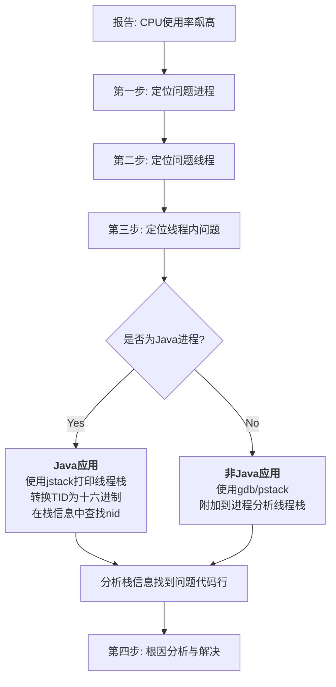

CPU 使用率飙高是线上系统最常见的故障之一，它会导致服务响应变慢、超时，甚至雪崩。本文将带你一步步揭开谜底，精准定位到导致问题的具体代码行。
<!-- more -->

## 核心排查思路：层层递进

整个排查过程遵循一个清晰的链条，如下图所示，它展示了从发现问题到定位根因的完整路径：



---

## 第一步：定位问题进程（System Level -> Process）

当监控系统报警或用户反馈系统变卡时，我们首先需要确定是哪个进程在消耗大量的 CPU 资源。

### 1. 使用 `top` 命令

登录服务器，执行 `top` 命令。这是最基础、最强大的系统监控工具。

*   **操作**：
    1.  在命令行输入 `top`，然后按回车。
    2.  看显示结果的第一部分（摘要信息）：`%Cpu(s)` 行会显示总的 CPU 使用情况（us-用户, sy-系统, id-空闲）。
    3.  **看列表的左上角**：`PID`（进程ID）、`USER`（用户）、`%CPU`（CPU使用率）、`%MEM`（内存使用率）、`COMMAND`（命令）。
*   **技巧**：
    *   按下 **`Shift + P`**（大写P），让进程列表按 **CPU 使用率降序**排列。消耗 CPU 最高的进程会排在第一行。
    *   按下 **`1`**（数字1），可以展开显示所有 CPU 核心的单独使用情况，看看是否是单核跑满。

**目标**：找到 `%CPU` 异常高的进程，并记下它的 **PID**（例如：`PID 12345`）。

### 2. 使用 `htop` 或 `atop`（增强版）

如果系统安装了 `htop`，它提供了比 `top` 更直观的视图（支持颜色、树状结构、鼠标操作等），用法类似。

---

## 第二步：定位问题线程（Process -> Thread）

一个进程由多个线程组成。现在我们知道是哪个进程有问题了，接下来需要深入这个进程内部，找到是哪个**线程**在疯狂占用 CPU。

### 1. 使用 `top -Hp <PID>` 命令

*   **操作**：在上一步找到问题进程的 PID 后，执行 `top -Hp 12345`。
    *   `-H`：表示显示线程（Threads）。
    *   `-p`：指定特定的进程 ID。
*   **技巧**：同样，在 `top -Hp` 的界面中，按下 **`Shift + P`** 按 CPU 使用率排序。

**目标**：找到这个进程下 `%CPU` 异常高的线程，并记下它的 **线程ID（TID）**。例如，我们发现 `TID 12346` 的线程占用了 99% 的 CPU。

---

## 第三步：定位具体问题（Thread -> Code）

这是最关键的一步，我们需要查看这个高负载线程到底在执行什么代码。

### 情况A：如果是 Java 应用

Java 应用是线上 CPU 飙高的重灾区，通常是因为死循环、频繁 GC、锁竞争等。

#### 1. 将线程 ID (TID) 转换为十六进制

操作系统看到的 TID 是十进制，而 Java 线程栈中的 `nid`（原生ID）是十六进制。我们需要转换一下。

*   **操作**：使用 `printf` 命令进行转换。
    ```bash
    printf "%x\n" 12346  # 输出：303a
    ```
    记下这个十六进制值 `303a`。

#### 2. 打印 Java 线程栈并分析

*   **操作**：使用 `jstack` 命令打印进程的线程快照。
    ```bash
    jstack -l 12345 > jstack_dump.log  # 将输出重定向到文件
    ```
*   **分析**：
    1.  用 `vim`、`cat` 或 `less` 打开 `jstack_dump.log` 文件。
    2.  在文件中搜索我们刚才转换得到的十六进制 `nid`：`/0x303a`。
    3.  找到对应的线程栈信息，这就会直接告诉你**正在执行的代码行**。

**示例分析**：
假设搜索后找到如下栈信息：
```java
"http-nio-8080-exec-1" #32 daemon prio=5 os_prio=0 tid=0x00007fc1d414e000 nid=0x303a runnable [0x00007fc1c5dd7000]
   java.lang.Thread.State: RUNNABLE
        at com.example.app.ExpensiveService.calculate(ExpensiveService.java:25) <-- 问题在这里！
        at com.example.app.ExpensiveController.getData(ExpensiveController.java:15)
        ...
```
这清晰地指出，问题出现在 `ExpensiveService.java` 文件的第 `25` 行。可能是一个计算密集型的循环、一个死循环、或者一个阻塞操作。

#### 3. 使用阿里 Arthas（神器推荐）

如果你觉得上面步骤麻烦，强烈推荐使用阿里开源的 **Arthas**。它可以在不中断服务的情况下进行动态诊断。

*   **操作**：
    1.  `arthas-boot.jar` 启动 Arthas，并附加到目标 Java 进程。
    2.  执行 `thread` 命令查看所有线程的 CPU 使用率。
        ```bash
        thread          # 查看所有线程信息
        thread -n 3     # 查看最忙的3个线程
        thread <TID>    # 查看指定线程的栈
        ```
    3.  它可以**直接显示消耗 CPU 最高的线程及其栈信息**，无需手动转换十六进制，非常高效。

### 情况B：如果是 C/C++、Golang 等原生应用

对于非 Java 应用，我们使用其他工具来查看线程栈。

#### 1. 使用 `pstack <PID>` 命令

`pstack` 可以打印一个进程的栈信息。
```bash
pstack 12345
```
它会输出所有线程的调用栈。你需要从一大堆栈信息中找到与之前 `top -Hp` 中找到的高 CPU 线程 TID 相对应的那个栈。这可能需要一些眼力。

#### 2. 使用 `gdb` 调试器（高级）

`gdb` 功能强大，但使用时需谨慎，因为它会挂起进程。

*   **操作**：
    ```bash
    gdb -p 12345          # 附加到进程
    (gdb) thread          # 查看所有线程
    (gdb) thread apply all bt  # 打印所有线程的栈信息
    (gdb) thread 2        # 切换到 TID 为 2 的线程
    (gdb) bt              # 打印该线程的栈
    (gdb) detach          # 脱离进程，让进程继续运行
    (gdb) quit            # 退出
    ```

#### 3. 使用 `perf`（性能分析神器）

Linux 的 `perf` 工具可以同时对系统和进程进行性能分析。

*   **操作**：
    ```bash
    # 采样系统所有进程的 CPU 使用情况
    perf top

    # 采样特定进程的 CPU 使用情况，并显示调用链
    perf top -p 12345 -g

    # 记录分析数据到文件，便于详细分析
    perf record -p 12345 -g -- sleep 30  # 采样30秒
    perf report -n                         # 查看报告
    ```
    `perf` 的输出会直接显示哪些**函数**占用了最高的 CPU 周期，非常直观。

---

## 第四步：根因分析与解决

找到具体的代码行后，剩下的就是具体的业务逻辑分析了。常见的 CPU 飙高原因包括：

1.  **无限循环/死循环**：检查循环条件和终止条件。
2.  **算法复杂度高**：是否存在未优化的 `O(n^2)`、`O(2^n)` 复杂度的算法？
3.  **频繁的 GC**：对于 Java，如果是因为频繁 Full GC，那么 `%CPU` 高可能只是表象，根源是内存问题。需要用 `jstat -gcutil <PID>` 命令进一步确认 GC 情况。
4.  **锁竞争激烈**：线程处于 `BLOCKED` 状态，疯狂自旋尝试获取锁，也会导致 CPU 飙高。查看线程栈中是否有大量的 `locked <0x0000000712345abc>` 等信息。
5.  **IO 操作变为同步阻塞**：比如网络调用超时时间设置过长，导致大量线程阻塞在 IO 上（但这种情况通常 CPU 不高，如果是网络轮询则可能高）。

## 总结与排查清单

下次遇到线上 CPU 飙高，按照这个清单操作，你就能从容应对：

1.  **`top`** -> 按 **`Shift+P`** -> 找到高 CPU 的 **PID**。
2.  **`top -Hp <PID>`** -> 按 **`Shift+P`** -> 找到高 CPU 的 **TID**。
3.  **判断应用类型**：
    *   **Java**：`printf "%x\n" <TID>` -> `jstack <PID> | grep -A 20 <nid>` 或直接使用 **Arthas** (`thread` 命令)。
    *   **非Java**：`pstack <PID>` 或 `gdb -p <PID>` 或 `perf top -p <PID> -g`。
4.  **分析线程栈**，定位到具体代码行，结合业务逻辑解决问题。

记住，预防优于治疗。在开发阶段做好代码审查、性能测试和压测，并建立完善的监控系统（如 APM 应用性能监控），才能在问题出现前或出现初期就及时发现和解决。