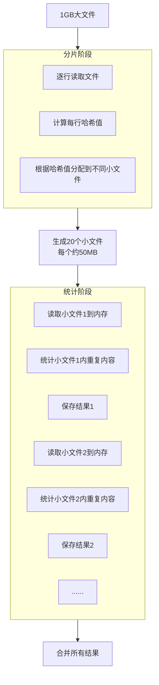

内存只有200M，如何读取1G文件并统计重复内容？一道经典的大数据面试题，考察的是对内存限制下数据处理思路的理解
<!-- more -->

## 场景分析

这是一道非常经典的大数据处理面试题，考察的核心是：**当数据量远大于内存容量时，如何通过算法设计来解决问题**。

**关键约束条件：**

- 内存限制：200MB
- 文件大小：1GB
- 任务：统计文件中内容的重复次数（假设文件由多行文本组成）

## 为什么不能简单读取？

首先需要明白的是，**不能**使用简单的一次性读取方式：

```python
# 这是错误做法！会导致内存溢出
with open('large_file.txt', 'r') as f:
    content = f.read()  # 1GB文件会占用1GB内存！
    # 处理内容...
```

即使是逐行读取，如果尝试在内存中维护所有行的计数，同样可能超出内存限制：

```python
count_dict = {}
with open('large_file.txt', 'r') as f:
    for line in f:
        if line in count_dict:
            count_dict[line] += 1
        else:
            count_dict[line] = 1  # 可能包含太多不重复行，导致内存不足
```

## 解决方案：分而治之（外部排序与归并）

### 核心思路：哈希分片

解决方案的核心思想是：**将大文件分割成多个小文件，确保相同内容总是出现在同一个文件中，然后分别处理每个小文件**。



### 详细步骤

#### 1. 哈希分片阶段

```python
import hashlib

def split_file_by_hash(input_file, n_shards=20):
    """将大文件根据哈希值分片到多个小文件中"""
    # 创建分片文件
    shard_files = [open(f'shard_{i}.txt', 'w') for i in range(n_shards)]
    
    with open(input_file, 'r') as f:
        for line in f:
            # 计算行的哈希值
            hash_value = hashlib.md5(line.strip().encode()).hexdigest()
            # 将哈希值转换为分片索引
            shard_index = int(hash_value, 16) % n_shards
            # 将行写入对应的分片文件
            shard_files[shard_index].write(line)
    
    # 关闭所有分片文件
    for file in shard_files:
        file.close()
```

#### 2. 统计每个分片

```python
def process_shards(n_shards=20):
    """处理每个分片文件，统计重复内容"""
    results = {}
    
    for i in range(n_shards):
        shard_filename = f'shard_{i}.txt'
        shard_counts = {}
        
        # 读取单个分片文件（每个约50MB，远小于200MB内存限制）
        with open(shard_filename, 'r') as f:
            for line in f:
                line = line.strip()
                shard_counts[line] = shard_counts.get(line, 0) + 1
        
        # 将当前分片的结果合并到总结果中
        for content, count in shard_counts.items():
            if count > 1:  # 只关注重复内容
                results[content] = results.get(content, 0) + count
        
        # 及时清理内存
        del shard_counts
    
    return results
```

#### 3. 清理临时文件（可选）

```python
def cleanup_shards(n_shards=20):
    """清理分片产生的临时文件"""
    for i in range(n_shards):
        filename = f'shard_{i}.txt'
        if os.path.exists(filename):
            os.remove(filename)
```

## 关键考虑因素

### 1. 如何确定分片数量？

分片数量的选择很重要：

- **太少**：每个分片可能仍然太大，超过内存限制
- **太多**：产生大量小文件，增加I/O开销

**经验法则**：分片后每个文件的大小应该是可用内存的 1/3 到 1/2。对于200MB内存，每个分片50-100MB是安全的，所以10-20个分片是合理的。

### 2. 哈希函数的选择

选择哈希函数时需要考虑：

- **均匀性**：确保数据均匀分布到各个分片
- **性能**：计算速度不能太慢
- **一致性**：相同内容必须始终映射到同一分片

MD5是常用选择，但也可以考虑更简单的哈希函数如CRC32。

### 3. 处理哈希冲突

即使有良好的哈希函数，也可能出现某些分片过大的情况。

**解决方案**：

- 监控每个分片的大小
- 如果某个分片过大，可以对其进行二次分片

## 优化策略

### 1. 多阶段处理

对于极端情况，可以采用多阶段分片：

1. 第一轮：将文件分为大分片
2. 第二轮：对过大的分片进行再次分片

### 2. 磁盘-内存平衡

- 使用缓冲区减少磁盘I/O次数
- 合理安排读写顺序，减少磁盘寻道时间

### 3. 并行处理

如果可以使用多线程/多进程：

- 不同分片可以并行处理
- 需要确保线程安全和资源管理