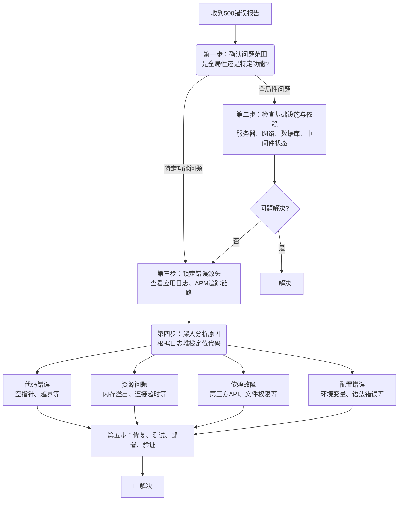

作为用户，你在浏览网页时最不想看到的就是一个冰冷的 **“500 Internal Server Error”** 页面。作为开发者或运维人员，这个错误则是一个明确的信号：**应用程序内部出错了**。与4xx错误（客户端问题）不同，500错误是服务器端的“锅”。

这篇文章将带你深入幕后，提供一个清晰、系统化的排查框架，让你能高效地定位并解决这个令人头疼的问题。
<!-- more -->

## **一、 什么是500错误？**

500错误是HTTP状态码的一种，意味着服务器遇到了一个未曾预料的状况，导致它无法完成客户端的请求。它是一个**笼统的“抓狂”信号**，背后的具体原因可能千差万别，从一行代码的笔误到整个数据库的崩溃都有可能。

## **二、 核心排查思路：由表及里，层层递进**

排查500错误就像医生诊断病人，需要遵循一个从外到内、从宏观到微观的逻辑流程。下图清晰地展示了一套高效的排查策略：

上图为我们勾勒出了排查的整体路径，接下来我们对每个步骤进行深入解读。

### **第一步：确认问题现象与范围（快速定位方向）**

首先，你需要像一个侦探一样收集线索，回答以下几个关键问题：

1.  **影响范围是全局还是局部？**
    *   **所有用户、所有页面都报500？** -> 很可能是**基础设施**（服务器、网络、数据库）或**全局配置/代码**出了问题。
    *   **只有特定功能的页面报500？** -> 问题很可能出在**处理该功能的特定代码或服务**上。
    *   **只有个别用户报500？** -> 可能是该用户的数据（如账户信息、缓存数据）发生了损坏或异常。

2.  **何时开始的？**
    *   错误是**刚刚突然出现**的吗？最近是否有代码部署、配置变更、服务器重启等操作？**变更和问题出现的时间点关联性极强**。

3.  **能否稳定复现？**
    *   能否在测试环境或本地环境复现这个问题？稳定复现的问题最容易解决。

### **第二步：检查服务器基础设施与依赖（排除外部因素）**

如果问题是全局性的，首先应该检查应用程序所依赖的外部环境。

1.  **服务器资源是否耗尽？**
    *   **CPU/内存/磁盘**：使用 `top`, `htop`, `df -h` 等命令检查服务器资源使用情况。磁盘写满是一个常见的导致500错误的原因。
2.  **关键依赖服务是否正常？**
    *   **数据库**：数据库连接池是否耗尽？数据库服务是否宕机？是否有慢查询拖垮了服务？
    *   **缓存/中间件**：Redis、Elasticsearch、消息队列等服务是否可访问？
    *   **第三方API**：你的应用是否调用了第三方服务？该服务是否超时或返回了异常数据？
3.  **网络连接是否通畅？**
    *   检查服务器之间的防火墙、安全组策略是否阻止了必要的端口通信。

### **第三步：查看应用日志（获取直接证据）**

**这是排查500错误最重要、最直接的一步！** 现代应用通常都有日志系统（如ELK、Splunk、Loki），你需要立刻去查看错误日志。

1.  **寻找错误堆栈跟踪（Stack Trace）**：
    *   在日志中搜索 `"ERROR"`, `"Exception"`, 或 `"500"` 等关键字。一个标准的Web应用框架（如Spring Boot、Django、Express）在遇到500错误时，通常会在日志中记录完整的异常堆栈信息。
    *   **堆栈信息就是“犯罪现场”**，它会精确地告诉你错误发生在哪个类的哪一行代码，以及错误的类型是什么。

2.  **常见的异常类型（从堆栈信息中识别）**：
    *   **`NullPointerException`**： 试图调用一个`null`对象的方法或属性。**最常见的原因之一**。
    *   **`SQLException` / `SyntaxError`**： 数据库查询错误，可能是SQL语法错误、表不存在、连接超时等。
    *   **`ClassCastException`**： 试图将一个对象强制转换为不是其类型的类型。
    *   **`ArrayIndexOutOfBoundsException`**： 数组越界。
    *   **`IOException`**： 文件读写失败，可能是权限不足或路径错误。
    *   **`OutOfMemoryError`**： 内存溢出，JVM已无法分配更多内存。

### **第四步：基于日志，深入分析具体原因**

拿到堆栈信息后，你就可以针对性地分析深层原因了。它们大致可以分为以下几类：

*   **代码逻辑错误（Bug）**：
    *   未进行空值判断、循环逻辑错误、边界条件处理不当等。根据堆栈信息指明的代码行，去检查相关逻辑。
*   **资源问题**：
    *   **数据库连接池耗尽**：应用无法获取到数据库连接，导致请求失败。
    *   **内存溢出（OOM）**：应用占用内存过多，被系统杀死。
    *   **文件句柄耗尽**：打开文件或网络连接后未正确关闭。
*   **配置错误**：
    *   **环境变量/配置文件未正确加载**：如数据库连接字符串、第三方API密钥配错。
    *   **文件/目录权限错误**：Web服务器进程没有权限读写某个目录或文件。
    *   **依赖项版本冲突**：尤其是在发布新版本后出现。
*   **依赖服务故障**：
    *   所依赖的第三方API返回了非预期的数据格式或直接超时，而代码中没有做好兼容和异常处理。

### **第五步：复现、修复与验证**

1.  **在测试环境复现**：尝试在非生产环境复现问题，这是安全修复的前提。
2.  **代码修复**：根据找到的根本原因修复代码。如果是资源问题，可能需要进行优化或扩容。
3.  **编写测试用例**：为这个bug编写一个测试用例，确保它未来不会再次发生。
4.  **部署与监控**：将修复部署到生产环境，并密切监控错误率、性能等指标，确认问题已解决。

## **三、 如何预防500错误？**

1.  **完善的日志记录**：确保应用日志详细、清晰，并集中管理，方便查询。
2.  **全面的异常处理**：在代码中使用 `try-catch` 块妥善处理异常，不要将 raw exception 直接抛给用户。
3.  **代码审查（Code Review）**：多人协作检查代码，能有效发现潜在问题。
4.  **自动化测试**：建立单元测试、集成测试 pipeline，捕获回归错误。
5.  **灰度发布与监控**：新功能先面向一小部分用户发布，观察错误率和性能指标，稳定后再全量发布。
6.  **建立监控告警体系**：对错误率、服务器资源、依赖服务健康状态设置告警，做到主动发现，而非用户投诉。

## **总结**

排查500错误是一个系统性的工程，其核心流程可以概括为：

**确认范围 -> 检查基础设施 -> 查看日志（获取堆栈） -> 分析具体原因 -> 修复验证**。